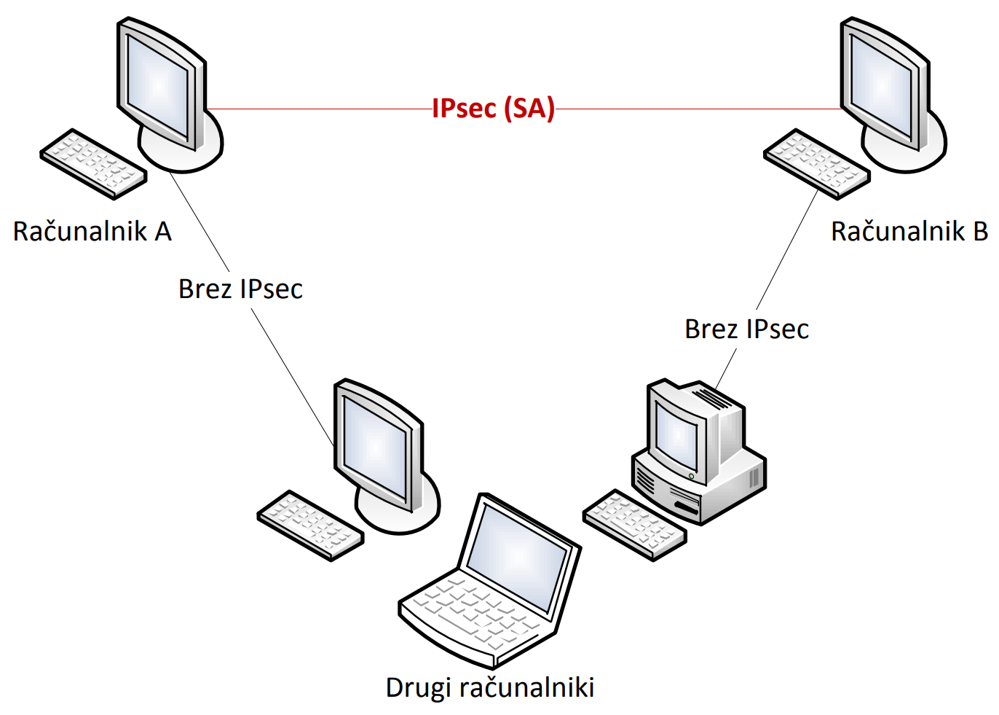
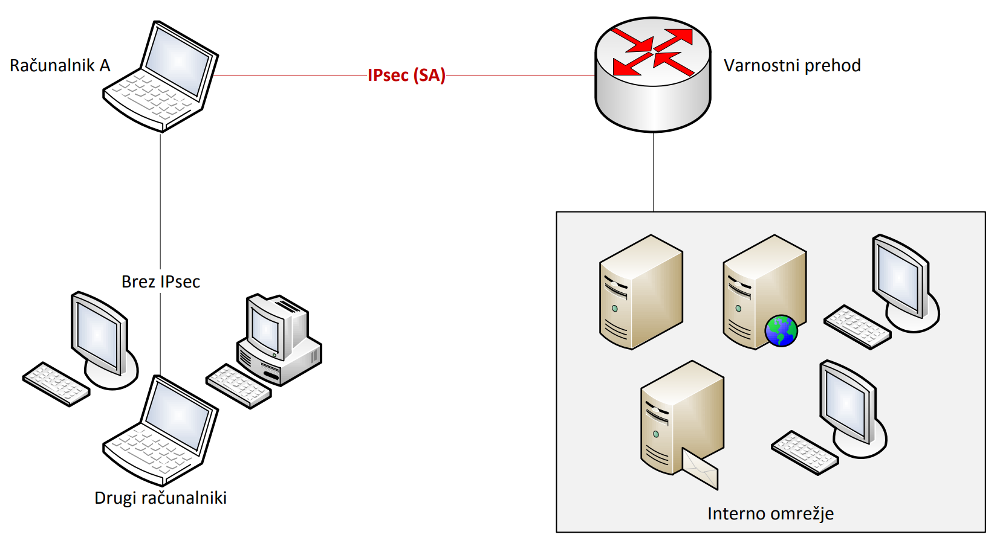
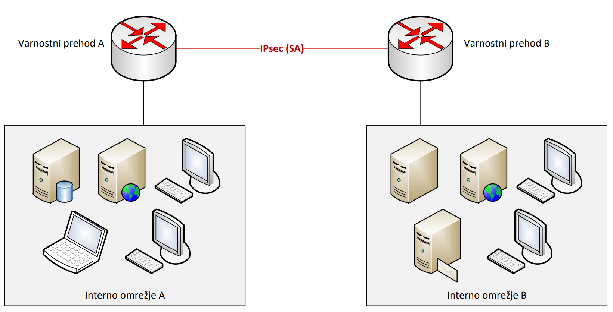
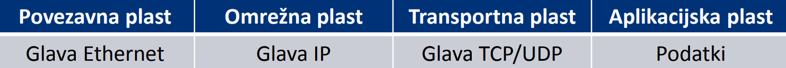
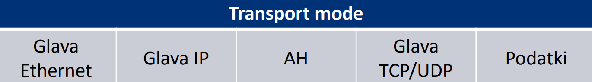
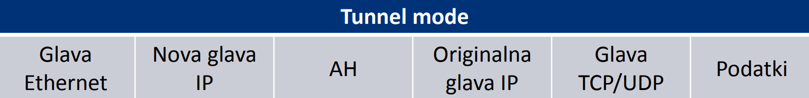
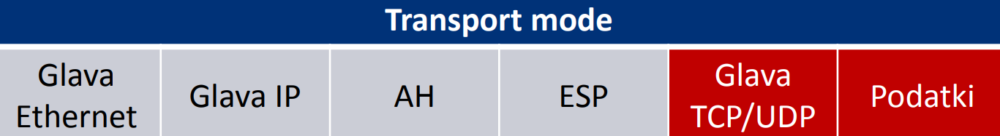
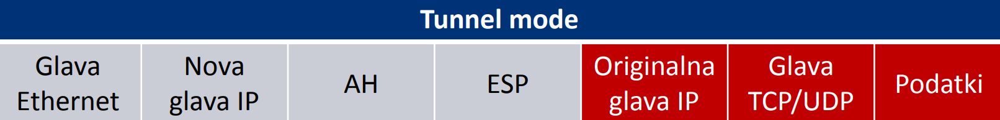

# IPSec
Dogajanje se nahaja na **omrežni plasti**

## VPN
**Virtual private network** - navidezno zasebno omrežje omogoča varno komunikacjo med **dvema računalnikoma** oz. med **dvemi omrežji**

**IPSec** je ena od najbolj razširjenih tehnologij za izvedbo VPN. omgoča nam:
- avtentikacijo
- integriteto
- nadzor dostopa
- zaupnost
- delno zaščito pred napadom s ponovitvijo (*replay attack*)

Komunikacija prehaja čez **varnostni prehod**, ponavadi požarni zid, usmerjevalnik...

Zgled: računalnik z računalnikom

## Seje IPsec
seje so shranjene v **zbirki varnostnih politik** (SPD - Security Policy Database) in so **enolično označene** z:
- **enolično številko oz. identifikatorjem** seje (SPI - Security Parameter Index)
- **ciljnim/ponornim** naslovom IP
- **varnostnim protokolom** (AH ali ESP)

Zgled: računalnik z varnostnim prehodom

Zgled: varnostni prehod z varnostnim prehodom

## Tipi povezav IPsec
### Transport mode
- ne šifrira celotnega paketa
- uporablja glavo IP originalnega paketa
- hitrejši
### Tunnel mode
- šifrira celotni paket skupaj z glavo IP (ESP)
- ustvari novo glavo IP
- počasnejši

## Paket TCP/IP

## AH (Authentication Header)
Zagotavlja avtentikacijo paketov in ne šifrira podatkov
### AH v transport mode

### AH v tunnel mode

## ESP (*Encapsulating Security Payload*)
šifrira podatke in zagotavlja avtentikacijo
### ESP v transport mode

### ESP v tunnel mode

## Protokol IKE (*Internet Key Exchange*)
uporablja se pri **usklajevanju parametrov povezave** in komunicira preko vrat *500/udp*.

parametre povezave se usklajuje v dveh fazah:
1. Usklajevanje sej v obe smeri
    - digitalna potrdila ali skupno geslo
    - *Main mode* ali *Aggresive mode*
    - trajanje seje
2. Usklajevanje parametrov IPSEC
    - AH, ESP, Tunnel, Transport
    - kako se šifrirajo podatki?
    - nikoli DES!

## Prednosti in slabosti IPsec glede na SSL/TLS
| slabosti | prednosti |
|-|-|
|kompliciran|šifrira celoten paket, skupaj z glavo IP|
|veliko različnih načinov za konfiguracijo|lahko šifrira poljuben protokol|
|lahko ga nastavimo **ne**varno|nevidno uporabniku (*omrežje z omrežem*)|
|hitrost delovanja v implementacijah IPv4|neodvisen od naslova IP|

## Dobre prakse pri uporabi IPsec
Dobro je, da je algoritem, ki ga uporabljamo vsaj **3DES** ali **močnejši**. Načeloma ne uporabljamo algoritma *SHA*,*MD5* in **nikoli DES**.

Priporočena uporaba **tunnel mode**, kjer se podatki šifrirajo, pri usklajevanju sej pa uporabljamo **main mode**.

AH in ESP vedno uporabljamo skupaj.

Uporabljamo **digitalna potrdila**

