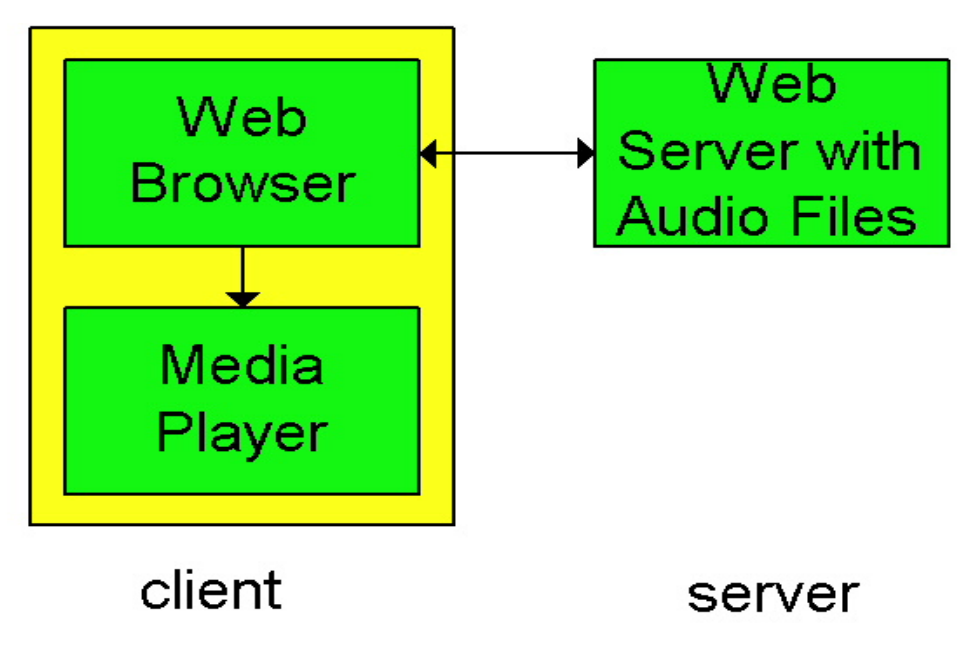
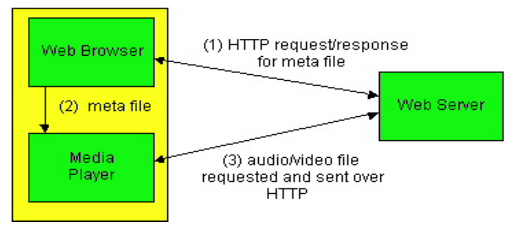
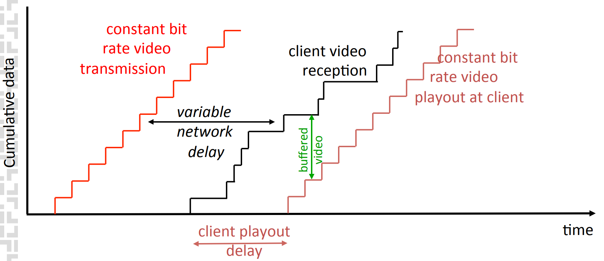
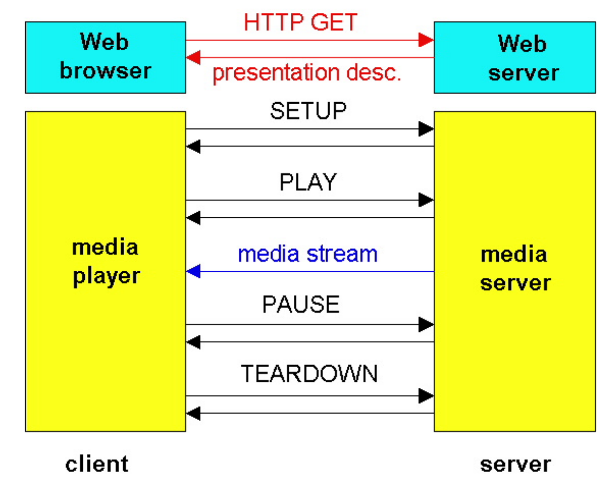
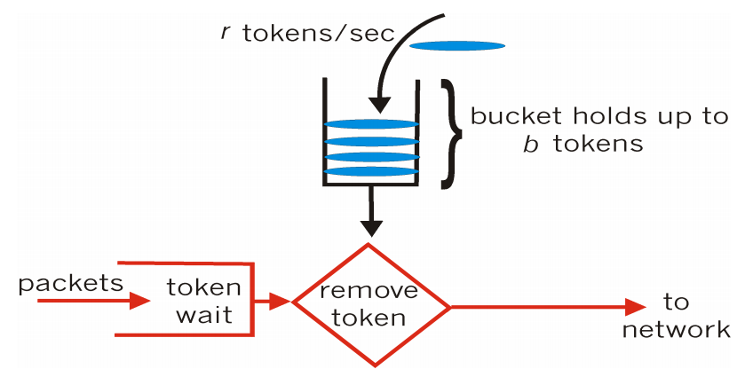

# Multimedija in večpredstavnost v omrežju
## Multimedija in kvaliteta storitev (QoS)
multimedijske aplikacije servirajo zvok ali sliko preko omrežja. Omrežje nudi aplikacijam **določen nivo zmogljivosti, ki jih potrebujejo za delovanje** - **Kvaliteta storitev**.

## Multimedijske (MM) aplikacije
poznamo več različnih **razredov** multimedijskih aplikacij:
- Pretakanje shranjenih zapisov (stored streaming)
- Živo pretakanje (live streaming)
- Interaktivno pretakanje (realno časovno "*real-time*")

MM aplikacije so lahko 
- **občutljive na zakasnitve** (*delay sensitive*)
    - izvor-ponor (*end-to-end delay*)
    - trepetanje (*dely jitter*)
- **tolerantne do izgub** (*loss tolerant*)

### Pretakanje shranjenih podatkov (*stored streaming*)
podatki so **shranjeni na izvoru** in se **pošiljajo odjemalcu**-

*def*: **Pretakanje** (*streaming*) je aktivnost, kjer odjemalec začne predvajati podatke **že preden se vsi prenesejo**
> Netflix, YouTube...

### Pretakanje živih podatkov (*live stream*)
pri pretakanju se uporablja **predpomnilnik** za predvajanje. Slednje lahko za oddajanjem za ostaja nekaj 10 sekund, še vedno pa veljajo časovne omejitve.

Nemogoče je previjanje naprej (*fast-forward*), mogoče pa je **previjanje nazaj** in **pavza**
> radio, športni prenos dogodkov

### Interaktivno pretakanje (*real-time*)
Idealno je brez zakasnitev, a to je mogoče le v teoriji, idealno je zakasnitev zvoka **manjša od 150ms do 400ms**, večje zakasnitve pa se že opazijo.
> IP telefonija, video konference...

## MM preko interneta
protokoli TCP/UDP/IP so najbolša mo
na storitev (*best-effort service*), ki **ne garantira zakasnitev in izgub**.

MM aplikacije preko interneta zahtevajo **garancijo kvalitete** (**QoS**), zagotovimo jih lahko z različnimi tehnikami, uporabljenimi na *aplikacijskem nivoju*

## Različni načini garancije storitev
### Sedanje stanje (*best-effort services*)
kompleksnost uvedbe je **minimalna**, kjer moramo po potrebi *povečevati pasovno širino*, *dodati podporo na aplikacijskem nivoju*, *CDN*, *multicasting*, ...
### Diferencirane storitve (*differentiated services - Differential QoS*)
kompleksnost uvedbe je **srednja**, kjer je potrebno *krmiljenje* in *razvrščanje*, potrebna pa so tudi že manjše spremembe v infrastrukturi omrežja
### Integrirane storitve (*integrated services - Guaranteed QoS*)
kompleksnost uvedbe je **visoka**, saj so potrebne velike spremembe v internetni infrastrukturi, kjer morajo biti aplikacije sposobne rezervirati pasovno širino od izvora do ponora. 

Uporabljajo se mehanizmi za *razvrščanje*, *krmiljenje*, *dopuščanje klica* in *signalizacije*

## Kompresija
Kompresija podatkov se uporablja za hitrejši prenos od strežnika do odjemalca. Kompresiramo lahko video vsebine, zvok, statične datoteke, ...

## Pretakanje shranjenih MM vsebin
Za zagotavljanje kar najboljše možne storitve se uporabljajo različne tehnike:
- medpomnenje pri odjemalcu (*client buffering*)
- uporaba **UDP** namesto **TCP**
- več kodiranj za isti posnetek
- kompresijo

**predvajalnik** MM vsebin naj omogoča
- odstranjevanje trepetanja
- dekompresija
- kompenziranje napak
- GUI s kontorlami

## Pristopi k pretakanju
### najprerostejši pristop
zvoka in videa **ne pretakamo**, ampak se shranjene datoteke na strežniku preko HTTP povezave prenesejo do odjemalčevega brskalnika, ki jih šele nato pošlje v predvajalnik

> posledica je dolga zakasnitev pred predvajanjem
### pristop s pretakanjem
Brskalnik dobi **metapodatke** preko HTTP zahteve, ter jih posreduje predvajalniku, ki nato kontaktira strežnik. Po uspešni vzopostavljeni povezavi predvajalnika in strežnika lahko MM aplikacija predvaja podatke direktno v predvajalnik

### pristop s pretočnimi strežniki
Podatki se hranijo na ločenem strežniku, od katerega jih potem predvajalnik prenaša. Med tem strežnikom in predvajalnikom je možna uprava tudi drugih protokolov. uporabljamo lahko tudi UDP in TCP.

## Medpomnenje pri odjemalcu
**Medpomnenje (*buffering*)** pri odjemalcu prinese zakasnitev predvajanja zaradi **kompenziranja zakasnitev omrežja** in **trepetanja zakasnitev**.

## UDP ali TCP?
### UDP
strežnik pošilja podatke s hitrostjo, ki je primerna za dojemalca (*drain rate*) in tako ponuja **krajšo začetno zakasnitev predvajanja**. 

Napake se pri uprabi protokola UDP popravljajo le, če je za to dovolj časa.
### TCP
strežnik pošilja z **max** hitrostjo za TCP, kjer hitrost polnenja medpomnilnika (*fill rate*) niha zaradi TCP kontrole zamašitev.

Da zagotovimo pretok brez težav, naj bo povprečen TCP pretok približno 2x večji kot je potrebna bitna hitrost MM vsebine.

> HTTP/TCP lažje prehaja preko požarnih zidov

## RTSP (*Real-Time Streaming Protocol*)
to je protokol **aplikacijske plasti**, ki se upravlja pri komunikaciji *odjemalec-strežnik* in poleg podatkovnega kanala uporablja tudi posebni kontrolni kanal (*tako kot FTP*).

Uporabnik lahko kontrolira predvajanje (*stop, start, pavza, fast-forward, prevrti nazaj, ...*).

## Internetna telefonija
### Izguba paketov in zakasnitve
V internetni telefoniji se lahko pojavijo izgube paketov primarno zaradi 2 vzrokov:
- **izgube zaradi omrežja**, kjer se IP datagrami izgubijo zaradi zamašitev v omrežju
- **izgube zaradi zakasnitev**, kjer IP datagrami prispejo prepozno
> tipično se lahko tolerira izguba od 1% do 10%
### Fiksna zakasnitev predvajanja
paket pošiljamo v določenih periodah (*npr na 20ms*), kjer pride prvi paket do odjemalca šele po določenem času. 

Predvajanje se ne začne takoj, ampak šele po **določeni fiksni zakasnitvi**, saj se tako efektivno izognemo izgubam, a je cena slabša uporabnika izkušnja.
### Adaptivna zakasnitev predvajanja
Pri tem pristopu je cilj **minimizirati zakasnitve pri čim manjših izgubah**, kjer *adaptivno določumo zakasnitev predvajanja* samo na začetku govornega dela (*vsakič ko sogovornik utihne za nekaj sekund*).

## okrevanje po izgubah paketov
### FEC (*Forward Error Correction*)
Princip FEC odjemalcu pošulja tudi **redundantne podatke**, iz katerih lahko rekonstruiramo izgubljene pakete.

Pri zvoku naprimer lahko dodamo zvok *slabše ločljivosti*, ki se uporabi pri morebitni izgubi boljše ločljivosti.

### Prepletanje
Koščke **razdelimo na manjše enote**, s katerimi nato tvorimo pakete iz različnih kosov.

V primeru, da se paket izgubi, imamo še vedno večino posameznega kosa.

Metoda **izniči redundančnost**, a poveča zakasnitev predvajanja.

### Popravljanje pri odjemalcu
Napake lahko na odjemalcu poskušamo popraviti z raličnimi algoritmi za rekonstrukicjo, kjer poskušamo **manjkajoči paket nadomestiti z njemu podobnim nadomestkom.**

Metoda deluje dobro le, če so izgube **res majhne in redke**.

## Protokoli za podporo realnočasovnih interaktivnih aplikacij
- RTP - *Real Time Protocol*
- RTCP - *Real Time Control Protocol*
- SIB - *Session Initiation Protocol*

## Diferencirane storitve
Uvedba **razredov storitev**, kjer pakete razdelimo v razrede in posledično omrežje obravnava promet glede na razred.

**Granularnost**: storitve razlikujemo le med razredi, ne pa tudi med posameznimi povezavami znotraj istega razreda.

## Principi zagotavljanja kvalitete storitev
### 1. Označitev paketov
Z označevanjem paketov omogočumo, da usmerjevalnik razlikuje pateke, ki pripadajo različnim razredom. Potrebna je uvedba **politike** (*policy*).

### 2. Zagotovitev izolacije razreda
Potrebno je zagotoviti zaščito enega razreda pred drugim kot tudi tokov znotraj razreda. 

Potrebno je alocirati **fiksno** pasovno širino za posamezen tok.

## Mehanizmi in politika razvrščanja
**Razvrščanje** pomeni *izbor naslednjega paketa, ki ga pošljemo na povezavo*.

**FIFO razvrščanje**: drži politiko zavrženja paketa, če paket pride do polne vrste. poznamo več politik zavračanja:
- zavrži na koncu (*tail drop*) - zavržemo prispeli paket
- prioritetno - zavrži najbolj nepomemben paket
- naključno - zavržemo naključen paket

**Prednostno razvrščanje**: pošljemo paket z najvišjo prioriteto (imamo več razredov, z različnimi prioritetami)

**Krožno razvrščanje** (*round robin*): ciklično obdelujemo vrste in v vsakem obhodu iz vsake vrste obdelamo po en paket

**Uteženo nepristransko razvrščanje** (*Weighter Fair Queueing - WFQ*): to je posplošeno ciklično razvrščanje, ki uteženo obdeluje pakete iz vrst

## Krmiljenje (policing)
Cilj krmiljenja je **omejiti promet tako, da ne preseže dogovorjenih parametrov**.

upoštevamo pogoste kriterije:
- povprečna hitrost (*avg rate*) - koliko paketov lahko pošljemo v časovni enoti (*gledano dolgoročno*)
- špica (*peak rate*) - max število paketov v kratkem obdoboju
- velikost rafala (*burst size*) - št paketov, ki jih pošljemo zaporedno

## Mehanizmi krmiljenja
### Puščajoče vedro (*leaky bucket*)
mehanizem omeji vhod glede na **določeno velikost rafala** (*burst-size*) in **povprečno hitrost** (*avg rate*).

Vedro vsebuje neko določeno število žetonov, kjer so novi žetoni generirani z neko določeno hitrostjo (*žetoni/sekunda*)

kombinacija *puščajoče vedro + uteženo nepristransko razvrščanje* zagotovi **zgornjo mejo zakasnitve v vrsti** (QoS guarantee)

## IETF Intserv (Integrated Services)
Uporablja arhitekturo, ki ponuja garancijo QoS za posamezne aplikacije v IP omrežjih

uporablja metodo **rezervacije virov**

uporablja **RSVP (Resource ReSerVation Protocol)**
