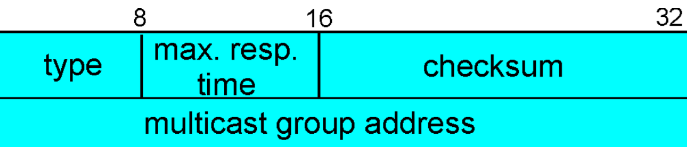
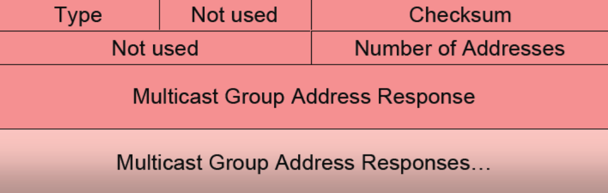

# Multicast
Multicast naslavlanje (*razpošiljanje*) omogoča dostavo skupinam ne glede na meje podomrežij

pri multicast načinu naslavljanja pošljemo sporočilo "posebnemu naslovu", ki predstavlja **skupino prejemnikov**, ki posluša pakete, naslovljene na ta naslov.

Filtriranje paketov se izvede na omrežnem nivoju.

## Usmerjanje paketov
pri multicastu en sam paket usmerjevalniki **razmnožijo** in **posredujejo** preko tistih vmesnikov, na katerih so poslušatelji paketa.

nekaj izzivov protokola:
- odkrivanje, kje so prejemniki
- zahteva dodatnih usmerjevalnih protokolov in posredovanja info o poslušalcih
- multicast naslovi nimajo prefixov, zato so v usmerjevalnih tabelah predstavljeni kot posebni vnosi
- varnost: prisluškovalec se lahko naroči in postane legitimni prejemnik

## Uporaba multicasta
- data streaming (*npr. pošiljanje podatkov o delnicah vsem finančnim družbam*)
- audio/video streaming
- video na zahtevo
- audio/video konference
- aplikaije v realnem času s protokolom RTP

## Naslavlanje
### IPv4
imena multicast skupin so posebni IPv4 naslovi v razredu D ( **244.0.0.0 - 239.255.255.255** ).

Znotraj tega so še posebni naslovi:
1. od ```224.0.0.0``` do ```244.0.0.255``` - rezervirano za **znane** (*well-known*) multicast naslove
2. od ```224.0.1.0``` do ```238.255.255.255``` - **Globalni** multicast naslovi
3. od ```239.0.0.0``` do ```239.255.255.255``` - **Lokalni** multicast naslovi

### IPv6
ime multicast skupine predstavlja 128-bitni IPv6 naslov, ki se prične na **FF**.
- ```FF02::1``` - link local: vsi **vmesniki**
- ```FF02::2``` - link local: vsi **usmerjevalniki**

## Preslikava v povezavne naslove
V ethernet-u imamo 48 bitne MAC naslove, kjer so naslovi od ```01-00-5e-00-00-00``` do ```01-00-5e-ff-ff-ff``` rezervirani za multicast.
***

## Prijava na multicast promet
## Protokol IGMP (*Internet Group Management Protocol*)
Skrbi za upravljanje s prejemniki multicast in omogoča:
- pridružitev skupini
- izstop iz skupine
- ugotavljanje drugih vmesnikov v skupini

komunikacija poteka **med odjemalcem in najbližjim multicast usmerjevalnikom**. Na podlagi protokola IGMP usmerjevalniki dobijo nalogo, da se povežejo v strukturo multicast drevesa.
#### Verzije IGMP protokola
- v1 - **vmesniki se lahko pridružujejo skupinam. Sporočila za izstop še ne obstajajo.** Usmerjevalniki uporabljajo timeout mehanizem za odkrivanje skupin.
- v2 - **dodana so sporočila za izstop iz skupine**. Usmerjevalnik lahko hitro prekine povezavo nepotrebnega prometa.
- v3 - zgodijo se večje spremembe v protokolu, kjer med drugim lahko **vmesniki določijo seznam drugih vmesnikov, od koder želijo prejemati promet.**

IGMP sporočilo je skupno dolgo 8 bytov (64 bitov)



- **type** določa tip sporočila 
    - 0x11 - group membership query (*odkrivanje članov skupine*)
    - 0x12,0x16,0x22 - group membership report (*objava prejemnika*) (v1,v2,v3)
    - 0x17 - leave group report (*obajva, da je prejemnik zapustil skupino*)
- **response time** določa čas, v katerem se mora *prejemnik* klica IGMP s tipom *Group Membership Query* (*odkrivanje članov*) odzvati
- **checksum** predstavlja *kontrolno vsoto*
- **multicast group address** je IPv4 naslov skupine

poznamo posebno vrsto sporočila **Group membership report** (tip 0x22)



### Prijava na vir
1. za pridružitev skupini se pošlje GMR sporočilo z vrednostjo TTL=1 (dostava samo najbližjemu usmerjevalniku)
2. Usmerjevalnik sporoči sosednjim usmerjevalnikom, da ima novega naročnika.
    - uporablja se **RPL** (*Reverse Path Lookup*) algoritem, ki nam omogoči, da zavržemo vse pakete, ki pridejo od usmerjevalnikov, ki *se ne povezujejo* z izvorom paketa *po najbližji poti*
    - usmerjevalniki uporabljajo posebne usmerjevalne protokole za multicast promet (PIM-SM *Protocol Independet Multicast - Sparse Mode*)

## Protokol MDP (*Multicast Listener Discovery*) 
To je protokol za **IPv6** multicast promet in ima enako funckionalnost kot IGMP
***
## Multicast drevesa
multicast paketi se gibljejo po drevesu, kjer drevo lahko optimizira potovanje na z različnimi ***kriteriji***:
- skupna dolžina poti (*število hopov*) vseh datagramov
- najkrajša pot za vsak datagram posebej (*minimalno vpeto drevo*)

Naloga usmerjanja je **najti drevo povezav**, ki povezuje vse usmerjevalnike v **isti multicast skupini**. 

Za komunikacijo med usmerjevalniki potrebujemo multicast usmerjevalne algoritme, ki delujejo na **omrežni plasti**.
- PIM
- DVMRP
- MOSFP
- BGP

## Rešitve iskanja razpoložljivega drevesa
### Določanje skupnega drevesa (*group-shared tree*)
lahko:
- iščemo drevo z **minimalno skupno ceno** 

*ali*
- določimo **centralno vozliče (*rende-vouz point*)**
### Določanje dreves posameznih pošiljateljev (*source-based*)
lahko:
- iščemo **drevo najkrajših poti v grafu** - Dijsktra - kjer morajo usmerjevalniki poznati stanja vseh povezav (*link-state*)

*ali*
- uporaba **RPL (*Reverse Path Lookup*)** algoritma, kjer ne sprejmemo sporočil od usmerjevalnikov, ki niso na najbližji poti do izvora sporočila

***
## Usmerjevalni protokoli
usmerjevalni protokoli skrbijo za oglaševanje skupin v omrežju in jih delimo glede na 2 **kriterija** (*skupaj 4 skupine*)
- **razpršeno / gosto** (*sparse-mode / dense-mode*)
    - *sparse-mode* - posamezna vozlišča zahtevajo vključitev v drevo (*pull princip*)
    - *dense-mode* - multicast pakete razpošljemo po vsem omrežju, usmerjevalniki se odjavljajo, če so nepotrebni (*push princip*)
- **znotraj domene / med domenami** (*intradomain / interdomain*)

## Protokol PIM (*Protocol Independent Multicast*)
poznamo **PIM - DM** (*PIM - Dense Mode*), kjer se gradi posamezno drevo in **PIM - SM** (*PIM - Sparse Mode*), kjer imamo skupno drevo in včasih posamezno.

Obe različici protokola sta primerni za usmerjevalnike, ki že izvajajo unicast usmerjanje, saj je PIM **neodvisen** od unicast protokola.
