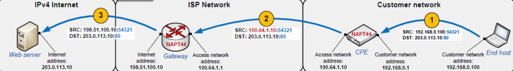
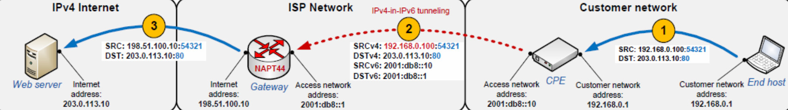
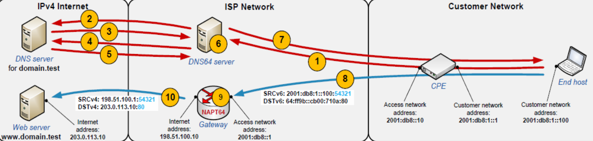
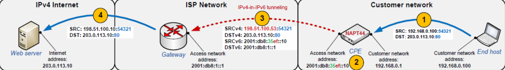
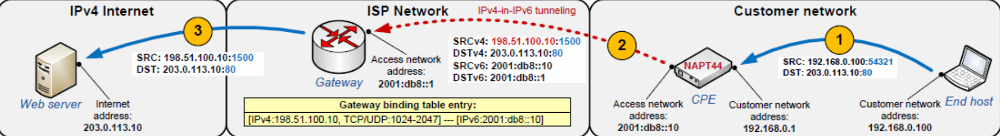
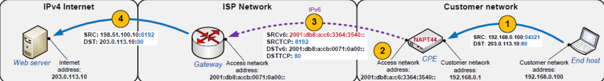

# Mehanizmi prehoda na IPv6
uporabljajo se splošno znane metode
- **dvojni sklad**
- **tuneliranje**
- **prevajanje**

## Deljenje IPv4 naslovov
Ker je potreba po naslovnem prostoru večja, kolikor je na voljo dejanskih različni IPv4 Naslovov, si lahko več računalnikov deli **isti javni IPv4 naslov**.

ISP uporabljajo CGN, ki pomeni *Carrier Grade NAT*.

način **A+P** (*Address Plus Port*) je omejevanje številk vrat za posamezen računalnik, tako, da se številke vrat ne prekrivajo z različnimi računalniki.

## NAPT44
skrbi za prevajanje naslovov IPv4 v IPv4, zaradi **souporabe** le teh in je dobro znan protokol v omrežjih strank. 

Ponudnik za to, da bo naslovil vse stranke, potrebuje dovolj velik **blok zasebnih naslovov** v svojem omrežju.

NAPT44 je protokol s stanji, kjer je potrebno veliko prostora za veliko strank.

## Pomembne lastnosti mehanizmov
*Kdaj se izvaja funkcionalnost določanja preslikovanja naslovov?*
> pri stranki, na prehodu, oboje

*Ali na prehodu shranjujemo stanje ali ne?*
> za vsako dodelitev številke vrat in IP naslova shranimo stanje. Prav tako shranimo stanje za vsak tok.

*Kakšni so načini prehoda skozi dostopovno omrežje?*
> - usmerjanje
> - tuneliranje
> - dvojno prevajanje naslovov
> - reverzibilno prevajanje glave

*Potrebuje IPv4?*
> Da, ne, delno

*Kakšen je način določanja IP naslova in št vrat?*
> Lahko statično, lahko dinamično.

***
## Mehanizmi, ki uporabljajo CGN (Carrier Grade NAT)
### Razred1: Dvojni NAT44
izvaja se:
- **pri uporabniku** za uporabnikove naprave
- **pri ponudniku** za uporabnike

ISP-ju je dodeljen poseben blok zasebnih naslovov (*preprečevanje konflikotv*)

### Razred2: Tunel pri uporabniku
Tukaj je IPv4 promet **tuneliran** v pakete IPv6 od CPE (customer-premises equipment) do prehoda, ki izvaja NAPT44.

Cilj je odpraviti dvojni NAT, tako da je NAT samo pri ponudniku, hkrati pa preprečimo konflikt v naslovih.

**Razred3** je enak, le da je tunel lahko kakršen koli, ne nujno IPv6 (*PPP, ethernet, ...*).

**Razred9** je podoben, le da je namenjen za direktno povezane IPv6 naprave (brez CPE)

### Razred4: NAT64 z DNS64
Uporabno, če se v omrežju strank uporablja IPv6.

Naprava stranke od *DNS64* dobi **umetni naslov IPv6**, ki predstavlja **ciljno IPv4** napravo.

Prehod med omrežjem v6 in v4 izvaja NAPT64

## Mehanizmi, ki uporabljajo A+P (Address Plus Port)
### Razred5: Tuneliranje brez stanj
Se uporablja za prenos prometa IPv4 preko omrežja IPv6, kjer hranjenje stanja na prehodu *ni potrebno*!

Informacije za usmerjanje se pridobi *algoritmično* - zakodirano v IPv6 naslov

NAPT je v CPE, kar omogoča **lahek prehod**.

### Razred6: Tuneliranje s stanji
za vsako dodelitev naslova CPE-ju je potrebno na prehodu **vzdrževati stanje**.

Potrebujemo protokol za obveščanje CPE o naslovih (DHCP, PCP, TR69)

Princip je podoben **razredu 5**, le da se informacija o naslovih IPv4 in št. vrat ne zakodira v IPv6 naslov, ampak zato prehod **vzdržuje tabelo povezav (*binding table*)**

### Razred 7: Dvojno prevajanje brez stanj
Navadno tuneliranje nadomestimo z dvojnim prevajanjem naslovov.
> najprej v4->v6 nato v6->v4

Samo prevajanje je *algoritmično*, **zato ne potrebujemo vzdrževati stanj**.

Ta princip preprečuje klasične tunelske težave (*npr MTU in fragmentacijo*).

**Razred 8**: zelo podoben, le da dopušča različne metode prevajanja.

***
## Težave z NAT
ko uporabljamo dvojni NAPT, nastane problem z **port-forwarding**-om, ki ga *UPnP* in *NAT-PNP* ne podpirata.

Če je NAT na prehodu, uporabnik nima nobenega vpliva nanj, hkrati pa je zadeva bolj kompleksna

## Težave s hranjenjem stanja
Če imamo **veliko stranj**, to pomeni tudi **veliko prehodov** - pojavi se problem sinhronizacij stanj in usklajevanje.

Po legalnih zahtevah **mora ISP znati identificirati uporabnika iz omrežnega naslova in časovnega žiga** - to je težko, ker si veliko uporabnikov deli isti naslov.

Problem **skalabilnosti** - veliko imamo podatkov o stanju, povzroča počasnost.

## Težave mehanizmov brez stanj
IPv4 naslov mora biti zakodiran v IPv6 naslov, kjer je potrebno vzdrževati pravila o preslikavah, **vsaka mala sprememba v teh pravilih pa se mora propagirati**.

Mehanizem **ne podpira raztresenega dodeljevanja** IPv4 naslovov

## Težave s tuneliranjem
Pri tuneliranju se pojavi težava pri MTU in fragmentacij. 

Naprave kot so IDS in IPS morajo **izvajati dekapsulacijo**

## Težave z dvojnim prevajanjem
Potreben **ponoven izračun kontrolnih vost** IPv4, ICMP, TCP, UDP

Nekateri IPv4 **podatki se lahko izgubijo** ker IPv4 in IPv6 ne uporabljata enakih polj.

## Težave z dodeljevanjem naslovov (NAT)
Če NAT podpira stanja, je potrebno stanje *shranjevati*: problem skalabilnosti, prostora, sinhronizacije stanj med napravami...

če je dodeljevanje *statično*, to pomeni **slabo izrabo naslovnega prostora** in posledično manj učinkovito deljenje naslovov.

NAT predstavlja ranljivost za **vrivanje paketov** (*spoofed packet injecton*), še posebej pri *statičnem dodeljevanju*.
