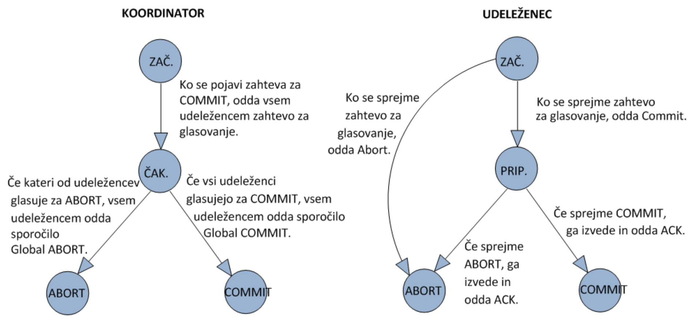
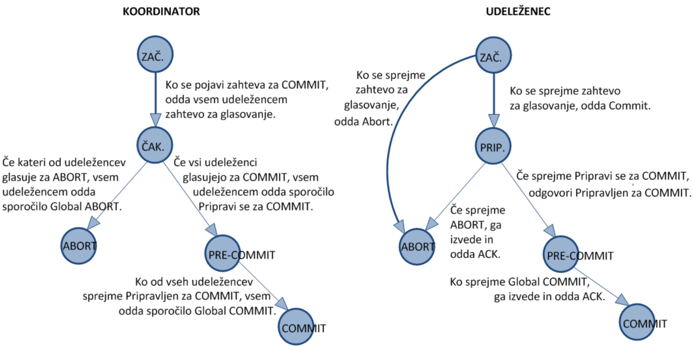

# Usklajevanje podatkov
## Izvajanje poizvedb v porazdeljenem okolju
cena poizvedb do podatkovnih baz v porazdeljenem okolju je vsota
- procesiranja
- vhodno-izhodnih operacij
- komuniciranja

## Optimizacija poizvedb
Poizvedbe lahko optimiziramo z **zmanjševanjem vmesnih relacij (kardinalnost)** ter z **izvajanjem po naraščajoči zahtevnosti**.

Zahtevnost različnih opercij:
- selekcija, projekcija - **O(n)**
- projekcija z izločanjem duplikatov - **O(n logn)**
- kartezični produkt - **O(n<sup>2</sup>)**

## Optimizacija porazdeljenih poizvedb
- dekompozicija - semantilna analiza, poenostavitev
- lokalizacija - določimo, na katerih lokacijah so sploh potrebni podatki
- globalna optimizacija - zagotovimo optimalne prenose
- lokalna optimizacija - optimiziramo na vsaki lokaciji

## Podatkovna baza
podatkovne baze so lahko
- **KONSISTENTNE** - *zadošča vsem integritetnim omejitvam*
- **VZAJEMNO KONSISTENTNE** - *vse kopije repliciranih podatkov imajo iste vrednosti*

## Transakcija
Do podatkov (sploh v podatkovnih bazah) praviloma dostopamo v obliki **transakcije** 

Pomembne lastnosti transakcije:
- **Atomarnost** (*nedeljivost*) - zaporedje ukazov, ki se more zgodit v celoti ali pa sploh ne zgoditi
- **Konsistentnost** - podatki so konsistentni z poslovnimi pravili podatkovne baze
- **Izolacija** - ko se transakcija izvaja, je ta "edina", ki dostopa do podatkov (preprečevanje konfliktov).
- **Trajnost**

## Anomalije podatkov
> T je Transakcija
- **branje umazanih podatkov** (*beri nepotrjeno*) - T1 bere nepotrjen podatek, ki ga je spremenila T2
- **neponovljivo branje** (*beri potrjeno*) - T1 2x bere isti podatek, ki ga vmes spremeni T2
- **fantomsko branje** (*ponovljivo branje*) - T1 2x izvede poizvedbo s pogojem P, T2 vmes vstavi podatek, ki ustreza pogoju P

## Stopnje konsistentnosti (izolacije) podatkov 
Umazani podatki (*dirty data*):
- "beri nepotrjeno" - T ne prepisuje umazanih podatkov drugih transakcij
- "beri potrjeno" - T ne potrdi, dokler ne izvede vseh sprememb
- "ponovljivo branje" - najprej bere, potem spremeni - T ne bere umazanih podatkov drugih transakcij
- "zaporedniška" - druge transakcije na umažejo podatkov, ki jih je brala T, dokler se T ne potrdi

## Porazdeljena transakcija
- koordinator
- udeleženci
- dvofazno potrjevanje
- trofazno potrjevanje
### Dvofazno potrjevanje



pojavi se problem odpovedi, kjer se zgodi blokada sistema. Za preprečevanje napak so potrebne časovne kontrole.

Odpovedi rešujemo s **trofaznim potrjevanjem**
### Trofazno potrjevanje



Po signalu koordinatorja za commit bodo udeleženci počakal na "pre-commit", če pre-commit ne bo nikol priše (pomeni da je nekaj odpovedalo), bodo tudi sami šli na abort.

## Replikacija podatkov
Z replikacijo podatkov pridobimo na
- zanesljivosti
- zmogljivosti

> podatke lahko naprimer repliciramo na več lokacij, da so bližje določenim uporabnikom.ž

Pojavijo se **težave z usklajevanjem**, ki jih rešujemo z
- striktna konsistentnost (*hkrati se morajo spremeniti vse kopije podatkov*)
- sekvenčna konsistentnost (*podatki se morajo na vseh kopiranih lokacijah spreminjati v istem zaporedju*)

Replkacija se lahko razpošilja z
- le obvestilom o spremembi podatka - ko bomo prvič potrebovali podatek bomo poslali zahtevo po vrednosti
- direktno novo vrednostjo
- operacijami (nad določenimi podatki izvedemo neko operacijo, da jih tako učinkvoito posodobimo)

## Protokoli za usklajevanje replikacij
- protokoli s primarno kopijo
    - oddaljeno pisanje (določena **statična** primarna lokacij)
    - lokalno pisanje (primarna lokacija se **spreminja**)
- protokoli z repliciranim pisanjem
    - aktivna replikacija (Zahteva gre na vse lokacije hkrati)
    - Quorum protokoli (bralno in pisalno število kopij - določita se 2 števili:
        - **N<sub>b</sub>** (bralni quorum) - število podatkov potrebnih za uspešno branje 
            > če je N<sub>b</sub> = 3 to pomeni, da moramo uspešno dostopati uspešno do 3 lokacij in spremenit kopije.
        - **N<sub>p</sub>** (pisalni quorum) -  število podatkov potrebnih za uspešno pisanje
        - veljati morata 2 pogoja:
            - **N<sub>b</sub> + N<sub>p</sub> > N** (bralni in pisalni quorum morata biti skupaj več kot število vseh lokacij podatka) - *s tem zagotovimo, da se vsaka bralna in vsaka pisalna transakcija križata na vsaj eni lokaciji*
            - **N<sub>p</sub> > N/2** (zapisovat moramo podatek na več kot polovico lokacij)

## Sočasen dostop do podatkov
Protkoli omogočajo **izolacijo**
- optimistično - šele na koncu izvajanja preverimo za konflikte
- pesimistično - sproti preverjamo za konflikte

## Protokoli za nadzor sočasnosti
### zaklepanje
zaklepanje je pri branju šibko in pri pisanju močno. To predstavlja konflikt
- **2PL - dvofazno zaklepanje**
    1. faza zaklepanja podatkov (*ko se transakcija izvaja, postopoma zaklepa podatke, ki jih uporablja*)
    2. faza sproščanja - ne sme več zaklepati (*transakcija postopoma sprošča podatke, ki jih ne potrebuje več*)
- **Dosledno 2PL**
    - vse se sprosti šele **ob koncu transakcije**
    - ni fantomskih branj
- **Smrtni objem**
    - detekcija ciklov
    - časovne kontrole
    - vrstni red zaseganja
## časovno označevanje
Vsak podatek ima dve oznaki:
- čas rojstva transakcije, ki ga je brala
- čas rojstva transakcije, ki ga je pisala

pojavijo se lahko konflikti:
- branje - podatek je po začetku transakcije prepisala druga, mlajša transakcija
- pisanje - podatek je brala ali pisala mlajša transakijca

## sočasen dostop v porazdeljenem sistemu
pri porazdeljenem sistemu imamo več možnosti sočasnega dostopa.
- Centralizirano dvofazno zaklepanje, kjer zaklepanje izvaja **le ena lokacija**
- Primarno dvofazno zaklepanje, kjer je **za vsak podatek** določena **neka primarna lokacija**.

# Usklajevanje procesov
## Porazdeljeno vzajemno izključevanje
### Osrednji strežnik
nek osrednji strežnik ima nadzor nad virom, do katerega ni možen deljen dostop (**centralni nadzor**)

Odjemalci za dostop do prosijo strežnik, ta pa jim ob odobritvi dostopa poda žeton.

Strežnik vodi neko **vrsto** za žetone
### Obroč z žetonom
pri tej metodi **ni centralnega nadzora**. 

Odjemalci si v krogu izmenjujejo žeton. Dokler ima odjemalec žeton, lahko uporablja vir, potem žeton posreduje naprej.
### Večtočkovno oddajanje sporočil
pri tej metodi **odjemalci pred dostopom prosijo** vse druge odjemalce **za** **dovoljenje**, kjer vsak odjemalec pri sebi vodi vrsto in glede na to dodeljuje dovoljenje, če sam takrat ne uporablja vira.

Šele ko ima odjemalec **vsa** dovoljenja, lahko uporablja vir.
### Usklajevanje fizične ure
odjemalci lahko uporabljajo radijski signal ali internet, da si nastavijo skupno usklajeno uro.

Pri tem principu se lahko uporablja:
- **Christianovo usklajevanje** - zahteva, odgovor (strežnik)
- **Berkeleysko** - periodično poizvedovanje in razpošiljanje povprečja (strežnik)

Uporablja se **NTP - Newtork Time Protocol**, katerega namen je sinhronizacija ur prek interneta z natančnostjo milisekund glede na UTC

Protokol **NTP** predstavlja **varnostne težave**:
- MITM - ponarejena NTP sporočila lahko povzročijo premik ure na odjemalcu
- Občutljivost na DoS, DDoS
- Strežnik se lahko zlorabi kot DDoS "ojačevalec" (amplification attack)

Pri usklajevanju fizične ure imamo problem, da **niti dve uri ne tečeta enako hitro**, hkrati pa tudi sporočila za prenos **potrebujejo določen čas**.

### Usklajevanje logične ure
Uporablja se **Lamportovo časovno označevanje**
- pomembna je urejenost prej/kasneje - vsak dogodek dobi časovni žig.
- Tik pred vsakim dogodkom se čas poveča za 1
- ob prejemu sporočila proces najprej poveča lokalni čas na časovni žig, če je ta večji in nato poveča lokalni čas za 1 ter šele nato *časovno žigosa* prejem sporočila

**Vektorsko časovno označevanje** odpravlja slabost Lamporta, in sicer če je časovni žig A manjši od žiga B, vseeno ni nujno, da se je A res zgodil prej kot B. 

Pri vektorksem časovnem označevanju se dogaja **primerjava dveh vektorjev**, kjer lahko dobimo naslednje rezultate:
- isti čas
- manjši čas (*prej*)
- sicer (niti isti niti manjši)

## Globalno stanje porazdeljenega sistema
Globalno stanje si lahko predstavljamo na enank način kot tisto iz prvih predavanj, kjer poznamo
- stanja vseh procesov
- vsebino vseh vrst

Globalno stanje oz. **Snapshot** nam pove, v kakšnem globalnem stanju je bil sistem v danem časovnem trenutku.

### Algoritem Chandy in Lamport za izdelavo porazdeljenega posnetka
Eden od procesov sproži zahtevo za izdelavo posnetka (*snapshot*) tako, da **odda marker** - sporočilo **M** na vse svoje izhodne povezave.

Pravilo ob sprejemu markerja po povezavi **c**:
- če še nismo zabeležili svojega stanja - zabeleži stanje
    1. zabeleži svoje stanje
    2. zabeležimo stanje povezave **c** kot *prazno*
    3. začnemo beležiti prejeta sporočila na vseh ostalih povezavah
- sicer - zaključi beleženje sporočil na povezavi **c**

pravilo za oddajo markerja:
- ko **p** zabeleži svoje stanje, pošlje **M** na vsako svojo izhodno povezavo, preden pošilja kakšna druga sporočila

Ob zaključku beleženja se pošljejo podatki na dogovorjeno lokacijo.

## Volitve ("agreement" protokoli)
Ko je potrebno določiti en proces za neko nalogo, se morajo vsi ostali procesi o tem *"strinjati"*. 
> ponavadi se določi proces s trenutnim najvišjim PID-om

### pravica močnejšega (*bully*)
Izbrati je potrebno enega od enakih procesov, kjer se morajo vsi procesi o tem *strinjati*.

Če uporabljamo metodo obroča, lahko to povzroči izpade.

Ko uporabljamo pravico močnejšega (*bully*), lahko izpade toleriramo.
- zahteva za volitve
- odgovorimo s tistim z nižjo številko
- kdor je brez odgovora - **zmagovalec**

# Problem bizantinskih generalov
Problem govori o bizantinskih generalih, ki včasih govorijo resnico oz. ubogajo ukaze, včasih pa tudi **ne**.

Pri Bizantinskem procesu ni pomembno samo to, ali deluje al ne, ampak tudi, ali deluje **pravilno**.

Problem: Kako lahko dosežemo zanesljivo delovanje z asinhronim sistemom z bizantinskimi procesi.
> pomagati si moramo z **hevrsitičnim** reševanjem

## Motivacija
Zakaj bi se ubadali s tem problemom?
> V računalniškh sistemih se pogosto srečujemo in soočamo z napakami. V P2P omrežjih dobra vozlišča soglašajo, da bodo delovala *pravilno*, a lahko vozlišča z napako generirajo *zavajajoča*, *napačna* sporočila, ki pa niso posledica zlonamernega vzroka, ampak napake v programu/strojni opremi...

## Definicija problema
```
Generali := procesi | rač. komponente // | pomeni "ali"
```
**Abstraktni problem**:
- Vsako divizijo bizantinske armade usmerja **njen general**
- skupaj imamo **n** generalov, a so nekateri izmed njih **izdajalci**
- vsa vosjka je razporejena okoli sovražnikove utrdbe
- zahtevamo:
    - ```G1``` : Vsi zvesti generali se odločijo enako (*po načrtu akcij*)
    - ```G2``` : Majhno število izdajalcev ne more povzročiti, da bi zvesti generali sprejeli slab načrt
> ni potrebno, da vemo kdo so izdajalci...

## Reševanje problema in napadanje
S problemom se lahko spopadamo na različne načine, kjer probamo med generali komunicirtai z uporabo sporočil, pisnih, ustnih, z režijo (*draga komunikacija*), s podpisanimi sporočili...

## Praktična uporaba BGP?
- Vsako sporočilo, ki ga pošlje konkreten proces, je pravilno dostavljeno
- Proces lahko ugotovi izvor sporočila
- Možno je ugotoviti odsotnost sporočil
- Podpisa ni moč ponarediti. Vsak ga lahko preveri

## Zaključek
BGP rešitve so **potratne** (*režija, podpisi*), hkrati pa se porablja **redundanco**, glasovanje, podpise. Težava nastane, če je več kot 1/3 nekorektnih.

Predstavlja pa **kompromis med zanesljivostjo in zmogljivostjo**-


