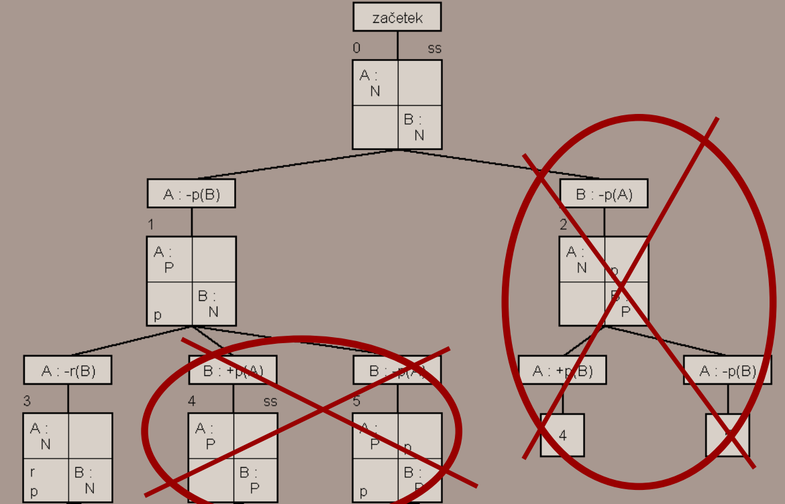

# Komunikacijski protokoli: načrtovanje, analiza, testiranje
## Protokoli
**Protokol** je zbirka pravil za komuniciranje, kjer je določeno
- kdo lahko nekaj reče,
- kaj lahko reče,
- komu to reče,
- v katerem primeru lahko to reče in
- kaj mora storiti prej ali potem.

Različni procesi med sabo komunicirajo po nekih protokolih s pomočjo **komunikacijskih kanalov**, ki so lahko:
- dvosmerni (kolizijski/nekolizijski)
- izmenično dvosmerni
- enosmerni

Vsak proces je v vsakem trenutku v nekem stanju in ima vrsto, v kateri se vrstijo sporočila, ki so mu bila poslana.

### Protokoli formalno
#### Dogodek
Dogodek se zgodi, ko proces **A** v stanju **X** sprejme sporočilo **p** od procesa **B** in preide v stanje **Y**

*formalni zapis*:  **A(** X, +p(B), Y **)**

dogodki so lahko **sprejemni** "+p(?)", **oddajni** "-p(?)" ter **lokalni** "#".

Model protokola predstavimo s **končnimi avtomati**, kjer ima vsak proces svoj avtomat

#### Primer avtomata za nek proces

V tem primeru je stanje X **začetno stanje**, stanje **Y** pa še eno dodatno stanje v avtomatu, dogodek **+p(B)** pa predstavlja možen **prehod** med stanji, ki se zgodi, ko bo proces na sliki **prejel** (+) sporočilo **p** od nekega drugega proces **B**.

##### Naloga (nadaljevanje zgornjega primera)

Imamo procesa A in B, kjer lahko oba zahtevata povezavo, ruši pa jo lahko le proces A.

Vsak proces ima po 2 stanji, kjer sta stanji označeni z **P** (povezan) in **N** (nepovezan)

Procesa si lahko izmenjujeta dve vrsti sporočil in sicer **p** (poveži) in **r** (ruši). 

**NALOGA: nariši oba avtomata in naredi vse možne dogodke**

Risba obeh avtomatov:

### Protokoli - testiranje
Za testiranje protokolov se uporavlja metoda PGSS - **P**ertrubiranje **G**lobalnih **S**tanj **S**istema, kjer je
- N: število procesov
- Globalno stanje: matrika NxN, kjer je
    - [i,i]: **trenutno stanje** procesa i
    - [i,j]: **vsebina sprejemne vrste** od procesa i k procesu j ( i->j )
- Začetno globalno stanje: vsi procesi so v začetnih stanjih in vse vrste so prazne
    
    

- Listi drevesa: so "že videna" globalna stanja, ki so lahko označena kot napake:
    - **PV** - polna vrsta
    - **NS** - nedefiniran sprejem
    - **SO** - smrtni objem

Podan je primer dogodka polne vrste:

Imamo matriko stanj, kjer je proces A v stanju *Povezan* in proces B v stanju *Povezan*, v vrsti za sprejem pri procesu B (*A je dosedaj do B-ja poslal sporočilo p in sporočilo r*) pa sta 2 sporočili.
> B še ni sprejel teh dveh sporočil!!

 

Ko hoče A do B-ja znova poslati sporočilo ( A: -r(B) ), se zgodi izjema **polne vrste** ( očitno je dožina vrste max 2).

#### Primer: razvitje drevesa za komunikacijo prejšnjih dveh procesov A in B

Na začetku imamo oba protokola v začetnih stanjih (Nepovezan). Iz tega stanja sta možna dva dogodka, in sicer
- **A: -p(B)** *(A pošlje sporočilo za vzpostavitev povezave do B)*
- **B: -p(A)** *(B pošlje sporočilo za vzpostavitev povezave do A)*

Po vsakem globalna matrika stanj preide v novo globalno stanje.

V tem primeru po dogodku **A: -p(B)***, kjer A odda sporočilo p do procesa B, pride to sporočilo **p** v vrsto od B
> to, da ga B sprejme je tudi svoj dogodek, ki je opredeljen kot en od možnih kandidatov za naslednji dogodek!

V naslednjem koraku se lahko zgodijo glede na **trenutno globalno matriko stanj**, kjer je **A** v stanju **P** po oddaji **p**, **B** pa je še vedno v stanju **N**, ker sporočila **p** *še ni sprejel*.

V primeru, da iz začetnega stanja obravnavamo drugega možnega kandidata, in sicer dogodek, kjer **B** odda sporočilo **p** do procesa **A**, lahko opazimo, da je moženo da pridemo v že znano stanje (stanji 4 in 5, ki se pojavita že v levem podrevesu - glej prejšno sliko)

Pisajnu nepotrebnih cikolv se izognemo tako, da napišemo številko stanja, ki bi sledilo po dogodku in tako ne potrebujemo nadaljevati tega poddrevesa.

Če se podamo naprej razvijanju levega poddrevesa, lahko vidimo razlišne primere napak in nadaljevanj stanj. Stanji 7 in 8 se nadaljujeta še naprej, ampak jih zaradi namena konzervativne razlage primera ne bomo obravnavali, povemo pa lahko, da se razivjeta po istem principu kot ostali.

##### Analiza zanimivih prehodov:
**Stanje 3** po dogodku **A: -p(B)** preide v *napačno stanje polne vrste (PV)*, saj sta v sprejemni vrsti procesa **B** že dve sporočili, kar je (očtno za ta primer) maximum.

**Stanje 5** po dogodkih **A: +(B)** in **B: +(A)** preide v *napačno stanje nedefiniranega sprejema (NS)*.

### Primer protokolov med 3 procesi
Imamo procese A, B, in C, kjer velja naslednje:
- vsak je lahko:
    - povezan z le enim,
    - povezan z obema ali
    - nepovezan.
- vsi lahko:
    - vzpostavljajo povezavo
- samo A in B lahko:
    - rušita povezavo
- uporabljamo sporočila **p**, **r**.

Sedaj lahko na podalgi uspešno definiranih modelov procesov zgradimo drevo možnih stanj, kjer bo začetno globalno stanje (in vsa nadaljna stanja) sedaj matrika **3x3** namesto 2x2 kot v prejšnem primeru. Vsi procesi bodo na začetku (kot je razvidno iz modelov) v stanju **N** (Nepovezan):

Posledično imamo zaradi večjega števila procesov tudi več možnih prehodov. 

> vsi prehodi so trivialni, vsak lahko drugima dvemo oddaj sporočilo p, ki je namenjeno vzpostavitvi povezave s prejemnikom

### Bolj kompleksen primer 2 procesov
Recimo da imamo procesa A in B, kjer sta oba avtomata **simetrična**, komunikacija pa poteka na tak način:
- prvi pokliče drugega s sporočilom **c** ("call")
- drugi nato pošlje neko poljubno število prvemo s sporočilom **n** ("number")
- prvi nato potrdi, da je sprejel sporočilo tako, da pošlje drugemo nazaj sporočilo **a** ("accept")

izjema hrtane vzpostavitve:

če pride do tega, da procesa zahtevo vzpostavita "naenkrat", do tega stanja je možno priti v drevesu globalnih stanj, prevlada tisti, ki je poslal večje število. Če sta števili enaki, se celotna zveza poruši.

1.korak je definiranje enostavnega modela avtomata za A in C (ker sta simetrična bomo podali le avtomat za A)

V enostavnem modelu trenutno še nimamo definiranega pojava hkratne vzpostavitve.

Dodati je potrebno možnost sprejema **c** sporočila s strani procesa B, potem ko smo sami poslali sporočilo **c** procesu B, se pravi po dogodku **-c(B)** moramo dodati možnost dogodka **+c(B)** (sprejmemo sporočilo **c** od procesa **B**).

Ustavirmo novo stanje **s5**, kjer bomo izpeljeli reševanje konflikta z preprosto izmenjavo števil

> izmenjava števil se lahko zgodi na dva (trivialna) načina.
> - -n(B) , +n(B) (A pošlje svoje število do B in nato sprejme število od B)
> - +n(B) , -n(B) (A sprejme število od B in nato pošlje svoje število do B)

Po končani uspešni izmenjavi sporočil preidemo v stanje **s8**, kjer moramo nato število **lokalno obdelati**, da lahko ustrezno nadaljujemo.

Osvežimo spomin: Ob hkratni vzpostavitvi povezave (c):
- prevlada tisti, ki je **poslal** večje število n
- se povezava poruši, če sta števili enaki

lokalni dogodek **#moj**: *Torej, če bo prevladalo število, ki ga je posal A, potem se bo avtomat nadaljeval v stanju **s4**, ker bo prevladal klic od **A** do **B**, ki ga je začel **A**.* 

lokalni dogodek **#njegov**: *V nasprotnem primeru, torej da je večje število, ki ga je poslal **B**, se bo izvajanje nadaljevalo v stanju **s2**, ki je posledica klica **B** do **A**, kjer je **B** vzpostavitelj povezave.*

lokalni dogodek **#enak**: *V primeru, da imata števili enako vrednost, se bo povezava porušila ( nadaljevanje izvajanje v začetnem stanju **s0** ).*

Ker sta modela procesov simetrična, lahko trdimo, da je vsak lokalni dogodek enega procesa **vezan** z enim lokalnim dogodkom drugega procesa:
- **A:#moj** je vezan na **B:#njegov**
- **A:#enak** je vezan na **B:#enak**
- **A:#njegov** je vezan na **B:#moj**

#### Gradnja drevesa globalnih stanj
Za praktični prikaz grajenja drevesa stanj pri lokalnih prehodih bomo za začetno stanje vzeli globalno stanje, kjer sta oba procesa A in B v stanju **s8** (*ne pozabimo, da sta procesa simetrična*)

Zaradi vezanosti lokalnih dogodkov lahko efektivno zapišemo cikle v drevesu.

## Posebne lastnosti protokola

### Prioriteta sprejema ali oddaje
Protokol lahko:
- raje sprejema kot oddaja **(Prioriteta sprejema)**
- raje oddaja kot sprejema **(Prioriteta oddaje)**

Omenjeno lastnost lahko definiramo za sistem kot celoto  ali pa le za posamezen proces v sistemu

Primer nastavljene prioritete sprejema za **celoten sistem**

V primeru dogodka A: -p(B), kjer **A** odda sporočilo **p** procesu **B**, se bo v naslednjem koraku **MORAL** zgoditi dogodek sprejema, ker je v vsaj eni vrsti sistema (v tem primeru sprejemni vrsti procesa B) čakajoče sporočilo. 

Poanta je v tem, da v nadaljevanju pridemo do stanja, kjer so vse sprejemne vrste procesov sproščene (cilj prioritete sprejemanja).

S tem se uporabo prioritete sprejema izničimo možnost **napake polne vrste**.

### Hierarhija procesov
Če uporabljamo sistem, kjer je določena neka hierarhija procesov, lahko le-to definiramo na dva načina:
- Hierarhija izvajanja - raje imamo da akcije izvaja A kot B - deluje le na nivoju **sistema kot celote** (potreben nadzornik)

    

        
    

- Hierarhija komuniciranja - raje komuniciramo z A kot z B - deluje lahko na nivoju sistema kot celote (definiramo neko lestvico npr. A B C ) ali pa le na nivoju posameznega procesa

    

        
    

    > v tem primeru določimo na nivoju procesa C, da raje komunicira z A kot pa z B, tako bomo izključili kakršnekoli interakcije s strani **C** proti **B**, torej **C: -x(B)** in **C: +x(B)**

    

        
    

    > v tem primeru določimo lestvico komuniciranja C B A, ki določa da lahko **C** izvaja dogodke le proti **B**, torej **C: -x(B)** in **C: +x(B)**, da lahko **A** izvaja dogodke le proti **C**, torej **A: -x(C)** in **A: +x(C)** ter da lahko **B** izvaja le dogodke protu **C**

    >***nism fix ce je ta tazadna razlaga pravilna, ne dojamem tega koncepta da je lestvica C-B-A, in pol se tko črta. Treba prašat profesorico.*** 
    > \- avtor zapiskov

