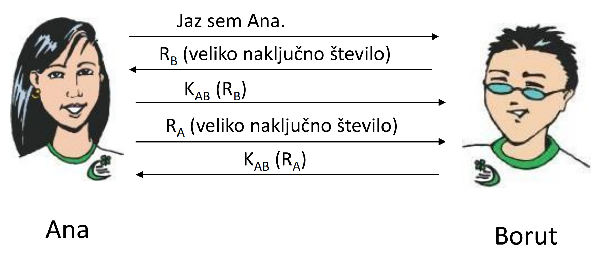
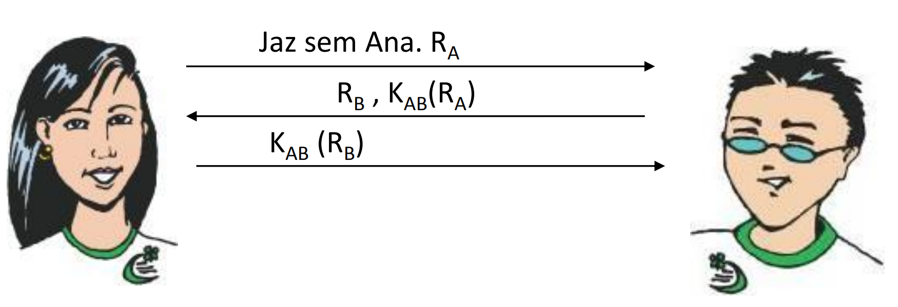
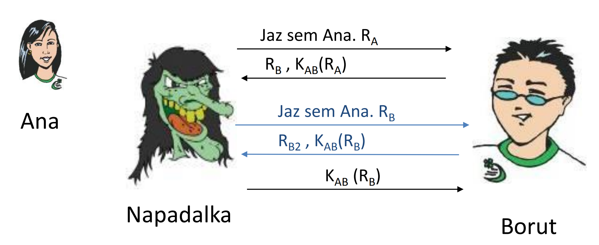
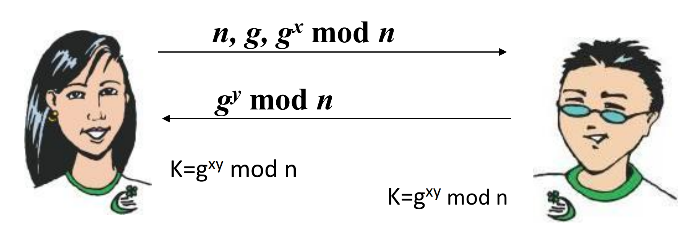
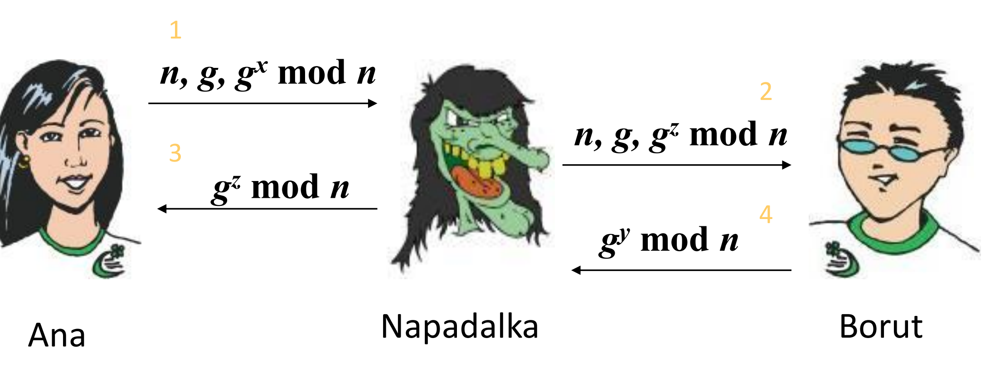
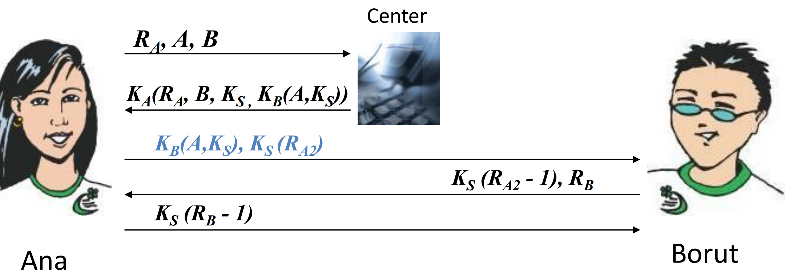
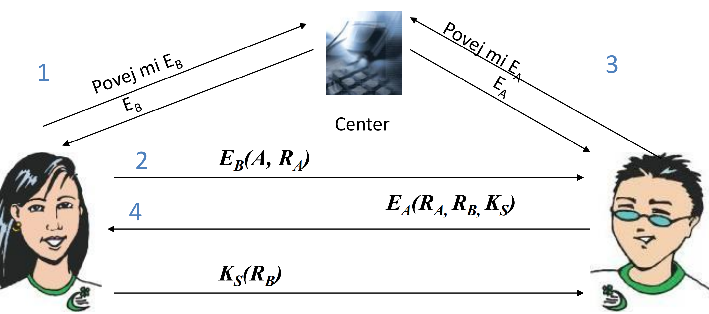
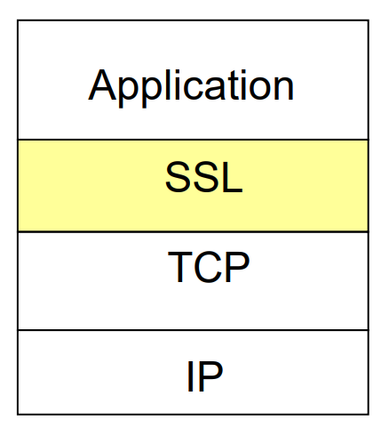
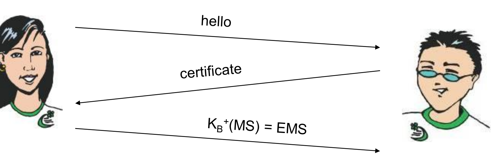

# Avtentikacija in SSL
v glavnem imamo dve področji varnosti:
- zanesljivost - zagotavljane razmer za delovanje storitev in normalno delo uporabnikov
- zaščita - onemogočanje ilegalne uporabe sistema

### Zagotavljanje zanesljivosti
Zanesljivost lahko zagotavljamo z **ustreznim nadzorom** (*zbiranje podatkov o delovanju, logganje*), z **upravljanjem** (*ukrepanje na podalgi varnostnih informacij*), z raznimi **orodji** (SNMP) ter **razpršeno zaščito**, kjer gre za *integriteto povezav, virov, vsebine, sporočil, ...*

## Kriptografkse metode
Kriptografkse metode ločimo po **načinu** zapisa in **lastnostni ključa**

**načini**:
- substitucijski - posamezne črke/dele besedila nadomestimo z drugimi
- transpozicijskim - spreminjamo vrstni red znakov

**lastnosti kluča**:
- simetrični: E=D, ključ mora biti tajen
- asimetrični: E!=D, E je lahko javen, D mora biti tajen

### Razbijanje kriptograma:
#### Napad na kritpirano sporočilo
napadalec poskuša z metodo brute force, kjer poskuša dekriptirati z uporabo vseh možnih ključev. (*napad z statistkio jezika*)
#### Napad na neko nekriptirano sporočilo (known plaintext attack)
v tem primeru ima napadalec text, in tudi zanj primeren kriptogram
#### Napad na neko izbrano nekriptirano sporočilo (chosen plaintext attack)
V tej situaciji napadalec lahko pridobi kriptirano besedilo za poljuben iz  besedila

## Varna komunikacija
terminologija varne komunikacije:
- **zaupnost** - kdo sme prebrati sporočilo? (*enkripcija*)
- **avtentikacija** - dokaži, da si res ti
- **identifikacija** - avtentikacija brez potrebnega dokazila
- **integritega sporočila** - podatki med prenosom niso bili spremenjeni
- **preprečevanje zanikanja** - res si poslal/res si prejel
- **razpoložljivost in nadzor dostopa** - preprečevanje ilegalne/nelegitimne uporabe virov

pomembno vlogo igra tudi **beleženje** vseh dogodkov

## Avtentikacija
Cilj avtentikacije je prepričati se, da je sogovornik res tisti, za katerega se izdaja.

V sodobnih praksah se za namen avtentikacije večinoma uporabljajo 3 različni principi:
- izziv-odgovor (vnaprej dogovorjena skupna skrivnost)
- zaupanje tretji osebi
- avtentikacija z javnim ključem
### Izziv - odgovor (*challenge - response* , *shared secret*)
To je **dvosmerna avtentikacija**, kjer sogovornika za avtentikacijo drugega uprabite v naprej dogovorjen tajni ključ **Kab**.

skrajšamo na

#### Napad zarcaljenja (*reflection attack*)
Na princip izziv-odgovor lahko napadalec vpliva z **napadom zarcaljenja** (**reflection attack**), ki se lahko zgodi v primeru, da borut dovoli več odprtih sej naenkrat

potek napada:
1. napadalec se v prvi seji predstavi kot Ana, in pošlje borutu izziv **Ra**
2. Borut kriptira **Ra** z tajnim ključem in pošlje nazaj napadalcu ("Ani") kriptiran **Ra** in svoj izziv **Rb**
3. napadalec odpre **drugo sejo** in se predstavi še enkrat kot Ana, a tokrat Borutu pošlje "nakjlučno generiran" izziv, *ki pa je v resnici Borutov izziv iz prve seje (**Rb**).*
4. Borut, nevedoč kaj se dogaja v ozadju, kirptira svoj lasten izziv **Kab(Rb)** in ga pošlje nazaj napadalcu vključno z izzivom za drugo sejo.
5. Napadalec se lahko tako s kriptiranim izzivom **Kab(Rb)**, ki mu ga je Borut ravnokar poslal v drugi seji, avtenticira v prvi seji in tako uspešno prelisiči Boruta

Da lahko protokol izziv-odgovor naredimo *varen* moramo upoštevati naslednja pravila:
- iniciator naj **prvi** pokaže svojo identiteto
- uporabljata naj se 2 različna tajna ključa (**Kab** in **Kba**)
- izziva Ra in Rb naj bosta **vedno različna** (sodo-liho št)
- informacija v eni seji naj bo **nekoristna** v drugi seji

varnost protokola avtentikacije se poveča signifikantno ko se uporablja **zgoščevalna funkcija** oz *digitalni izvlečki*

#### Diffie-Hellman izmenjava ključev
Problem: kako si lahko sogovornika pred komunikacijo varno izmenjata tajni ključ **Kab**?

Postopek:
1. izberemo javna **n** in **g**
2. nato eden izbere svoj tajni **x** in drugi izbere svoj tajni **y**
3. izvedba izmenjave:

    

##### Napad z vrivanjem
Na Diffie-Hellman izmenjavo lahko napadalec vpliva z **napadom vrivanja** (*man in the middle attack*)

### Avtentikacija z distribucijo ključev
Imamo nek **center**, ki ima shranjene vse ključe. Pomembno je da centru **zaupamo**.

Princip **Needham-Schroeder**
> Možen je **replay attack** - napad s posneto sejo

### Avtentikacija v PKI
Način je varen, **če zaupamo centru**

### Kerberos
Uporablja avtentikacijo s pomočjo **simetričnih ključev** ter **strežnika za hranjenje, distribucijo in nadzor dostopa.**

**Avtentikacijski Strežnik (AS)** je center za distribucijo ključev

primer:
1. A želi uporabljati storitve na strežniku B, ki je zavarovan z avtentikacijskim strežnikom AS.
2. A in AS se dogovorita za kriptiranje seje
3. AS preveri, če A sploh sme uporabljati storitve strežnika B
4. Če A sme uporabljati, mu AS izda  **vstopnico** = (**A,B, sejni ključ Ks, veljavnost**)  in jo kriptira s ključem **Kb**
5. A pošlje B-ju vstopnico in svoj izziv, kriptiran s ključem **Ks**
6. B dekriptira vstopnico, in nato odgovori na izziv, kjer odgovor spet kriptira z **Ks**.

### Radius
Uporablja se AAA strežnik (Avtentikacija, Avtorizacija, zaračunavanje).

Uporabnike se lahko preverja v zunanjem imenuku (AD, LDAP, Kerberos...)

Strežnik lahko **zavrne dostop**, **zahteva izziv** ali pa enostavno **sprejme zahtevo**.

# Protokola SSL (Secure Sockets Layer) in TLS (Transport Layer Security)
Aplikacija nudi:
- **varen komuikacijski kanal**
- **overjanje strežnika**
- **izmenjavo sejnih ključev**

SSL/TLS leži nad **transportno plastjo**
> SSL/TLS se tipično uporablja na aplikacijski plasti za HTTP, FTP, SMTP, NNTP, SIP...

## SSL
to je široko uporabljen **varnostni protokol**

TLS je **vrsta** SSL protokola.

Zagotavlja:
- **zaupnost**
- **integriteto**
- **avtentikacijo**

### Delovanje SSL/TLS
1. odjemalec: **ClientHello**
2. TLS strežnik: **ServerHello**
3. TLS strežnik: pošlje svoje **Digitalno potrdilo**
4. odjemalec: lahko preveri potrdilo
5. na podlagi **naključnih števil** izračunata ključe
6. komunicirata preko **simetrično kriptiranih sporočil** kjer je dodan MAC (odtis sporočila)

### SSL in TCP/IP

### Zasnova SSL
- želimo pošiljati tokove bytov v interaktivne podatke, ne pa statičnih sporočil
- za eno povezavo želimo imeti **množico** ključev, ki se spreminjajo
- (pri rokovanju) želimo uporabljati **certifikate**

### Poenostavljen SSL
poenostavljena ideja protokola SSL zajema 4 faze:
1. **rokovanje** - Sogovornika med sabo uporabita certifikate, da se predstavita en drugemu in izmenjata ključ
2. **izpeljava ključa** - Sogovornika uporabita izmenjani ključ, da izpeljeta množico ključev
3. **prenos podatkov** - podatki, ki se prenašajo, so združeni v **zapise**
4. **zaključek povezave** - varno rušenje povezave

#### Rokovanje

- **MS** = glavni ključ (*master secret*) za to sejo
- **EMS** = kriptirani glavni ključ (*encrypted master secret*)
- **Kb+** = javni ključ prejemnika B

#### SSL: poenostavljena izpeljava ključa

za izpeljavo ključa so potrebni 4 ločeni ključi za enkripcijo in preverjanje integritete (MAC)!
- **Kc** - ključ za **zakrivanje** podatkov, poslanih od **odjemalca** strežniku
- **Mc** - ključ za **zgoščevanje** podatkov, poslanih od **odjemalca** strežniku
- **Ks** - ključ za **zakrivanje** podatkov, poslanih od **strežnika** odjemalcu
- **Ms** - ključ za **zgoščevanje** podatkov,
poslanih od **strežnika** odjemlacu

Vsi ključi se izpeljejo z uporabo **posebne funckije**. Ta funkcija uporablja **glavni ključ (*master secret*)** in dodatne *naključne* podatke za generiranje novih ključev.

#### Pošiljajne podatkov
tok podatkov razivjemo v **zapise**, kjer v vsakem zapisu pripnemo MAC (*Message Authentication Code*). Prejemnik lahko reagira na (ne)veljavnost integritete posameznega zapisa.

##### problem 1: številka segmenta se nahaja nekriptirana v glavi TCP
Pri računanju MAC je potrebno upoštevati **številko segmenta**!
>MAC = MAC(ključ Mx, zaporedna_št || podatki)

za zaščito proti ponovitvi komunikacije uporabljamo **enkratni žeton**

##### problem 2: napadalec predčasno zaključi sejo
potrebno je uvesti posebe "tip zapisa", ki nosi posebno vrednost, če gre za zaključni paket, zopet uporabimo vrednost pri izračunu MAC.
> MAC = MAC(ključ Mx, zaporedna_št || tip || podatki)

## SSL: prava (kompleksna) izpeljava ključev
1. žetona odjemalca in strežnika ter PMS se uprabijo v funckiji, ki izračunava psevdo-naključna števila. Na tak način dobimo **MS (*Master Secret*)**.
2. MS in novi žetoni se vstavijo v drug naključni generator, dobimo **BLOK**. **BLOK* se razreže na 6 delov, da se dobi:
- MAC odjemalca
- MAC strežnika
- enkripcijski ključ odjemalca
- enkripcijski ključ strežnika
- inicializacijski vektor (IV) odjemalca
- inicializacijski vektor (IV) strežnika

