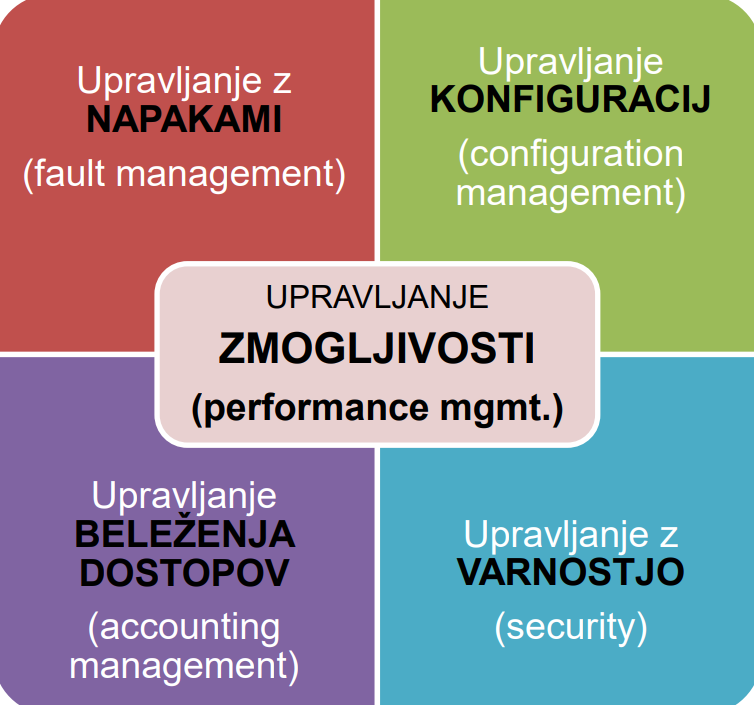
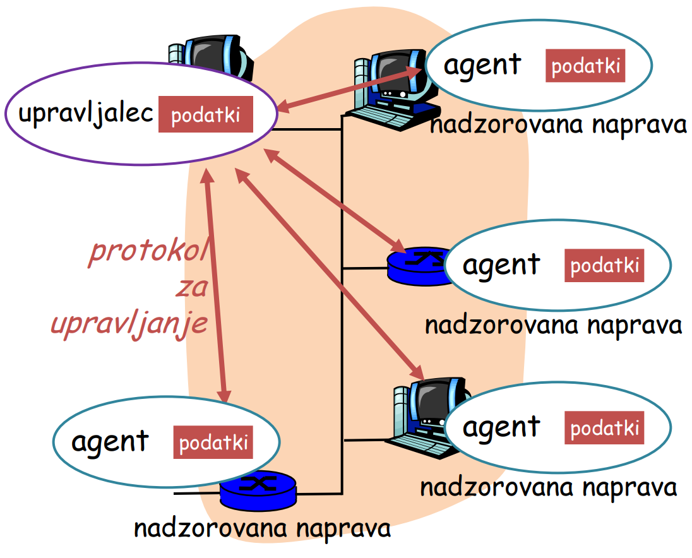
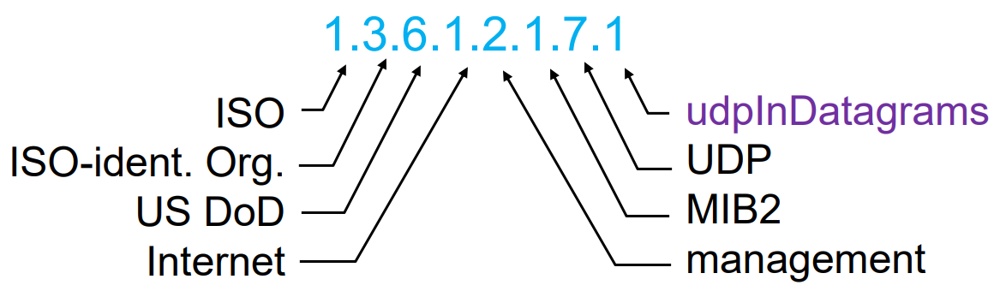
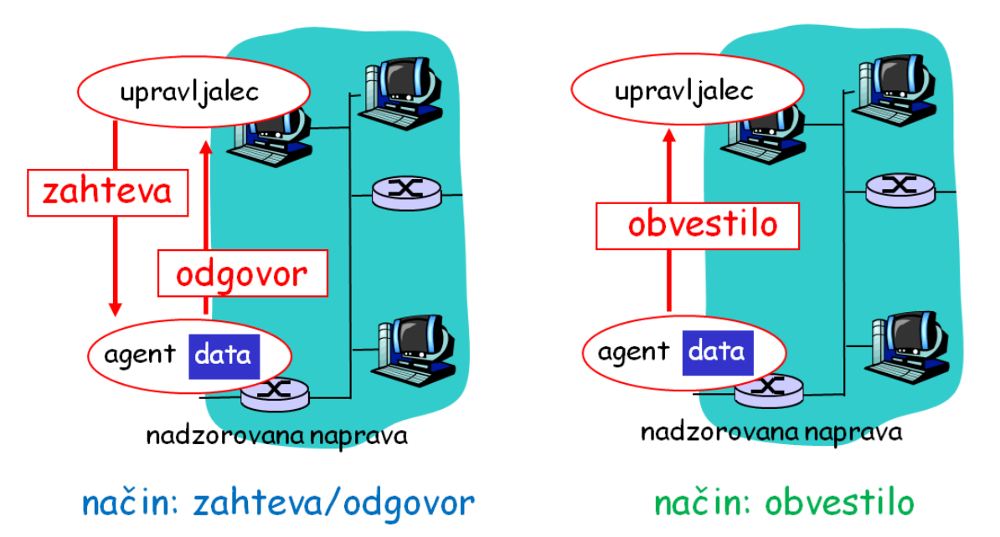
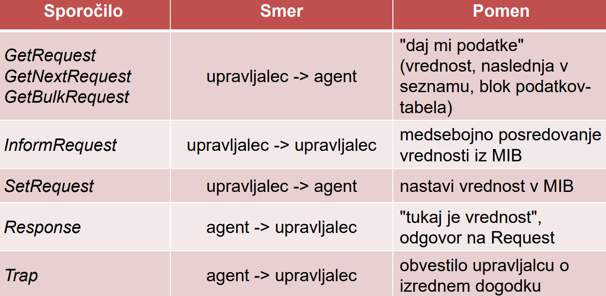
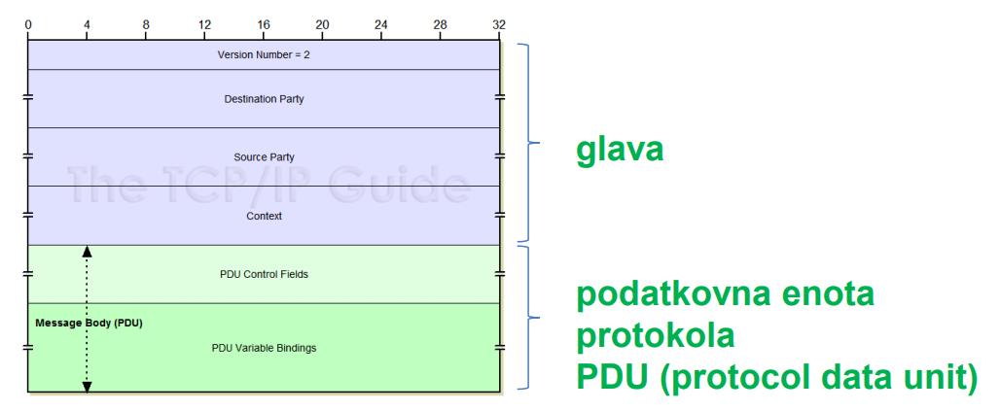
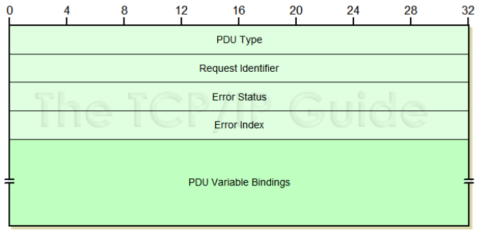
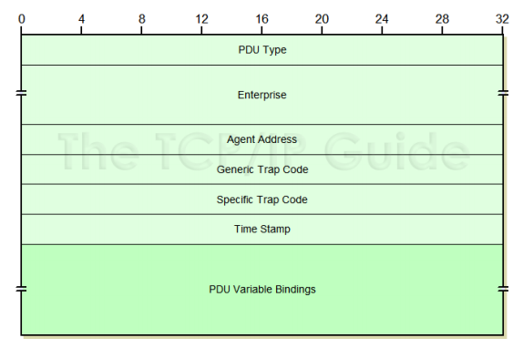

# Nadzor in upravljanje omrežja

Upravljanje omrežja je **proces nadzora kompleksnega omrežja, da bi dosegli čim večjo učinkovitost**.

cilj: uporabnikom omogočiti podatke čim hitreje in ne da bi morali poznati podrobnosti omrežja.

## Definicija upravljanja omrežja
Upravljanje z omrežjem vključuje
- vpeljavo,
- integracijo *in*
- koordinacijo

s strojno in programsko opremo ter človeškimi viri.

namen je:
- opazovanje,
- testiranje,
- konfiguriranje,
- analiziranje *in*
- nadzorovanje

omrežnih virov, pri katerih želimo zagotoviti **delovanje** v realnem času za sprejemljivo ceno ( **QoS** - **Q**uality **o**f **S**ervice)

## Primeri upravljanja
Poznamo različne pristope k upravljanju nekega omrežja, ki zajemajo *nadzor starševskih sredstev (naprav)*, *nadzor kompleksnosti samega omrežja* ali pa *izboljševanje storitev omrežja*. 

Ponavadi želimo zagotoviti *ravnovesje različnih potreb*, kot npr:
- zmogljivost,
- razpoložljivost,
- varnost,
- stroški,
- ...

Pogosto je treba skrbeti za **zaznavanje napak na vmesniku računalnika ali usmerjevalnika**, prav tako sta potrebna **nadzorovanje delovanja računalnikov** in pa podrobna **analiza omrežja**. 

Pomembno vlogo igra **nadzor omrežnega prometa** v našem omrežju, kjer se lahko naprimer pojavijo ozka grla.

Potrebno je zaznavati **hitre spremembe v usmerjevalnih tableah**, saj lahko to povzoči težave z usmerjanjem ali pa napake v usmerjevalniku.

Kot zadnje je potrebno **nadzorovanje in preverjanje nivoja storitev** in pa seveda **zaznavanje vdorov**, kjer lahko sledimo določenemu tipu prometa, ali pa prometu, ki prihaja iz sumljivih virov.

## Področja upravljanja



### Upravljanje z napakami
Proces iskanja napak v omrežju
1. zaznavanje napak
2. določanje mesta napake
3. izolacija dela omrežja, kjer se je pojavila napaka
4. rekonfiguracija omrežja, da se učinek napake zmanjša
5. popravilo napake
### Upravljanje konfiguracij
Upravljanje konfiguracij na določenih omrežnih napravah, ki določajo obnašanje omrežja, lahko prakticiramo na različne načine:
- namestitev novih naprav ali programov
- spremljanje sprememb v konfiguraciji (kdo, kdaj, zakaj spreminja)
- razveljavanje sprememb konfiguracije
- uprabljanje sprememb konfigurcaije
### Upravljanje varnosti
To je proces nadzora dostopa do internih podatkov na omrežju. Izvajamo naslednje storitve:
- upravljanje s skrivnimi ključi
- opozarjanje ob izjemah z nastavljenimi alarmi (detekcija težav)
- poenoten nadzor dostopanja do virov
- redne varnostne kopije (back-up)
- varnostno beleženje (security log)

### Upravljanje beleženja
Pomembno je sledenje uporabnikovi aktivnosti v omrežju, kjer je cilj, da bi imeli uporabniki dovolj virov.
Zajema:
- identificiranje uporabnikov
- dajanje ali odvzem dostopa do virov
- povezovanje porabe virov z odgovornimi uporabniki
- zaračunavanje

### Upravljanje zmogljivosti
Zajema merjenje zmogljivosti **omrežne opreme**, **programov** in **prenosnih medijev** v omrežju.


## Protokoli za upravljanje omrežij
- preprost protokol - enostavno pridobivanje podatkov o omrežju
- kompleksen protokol - spremembe in nastavljanje nekaterih varnostnih konf.
- napreden protkol - oddaljeno izvajanje upravljalskih nalog
- **upravljalni objekt** - storitve/funkcije, ki jih nudi omrežje

## Upravljanje z SNMP
Arhitektura protokola določa **agente** in **upravitelje**, kjer **agent** teče na *upravljalnem objektu*, **upravitelj** pa teče na *delovni postaji*, ki zahteva podatke od naprave, kjer teče agent.

upravljamo lahko z CLI, ali pa z modernimi GUI programi (cacti)



## Struktura podatkov o upravljanih objektiv (MIB)
MIB - Management Information Base je zbirka podatkov o vsebinsko sorodnih objektih.

MIB nam pove, katere podatke lahko dobimo o posamezni napravi

Poznamo 3 različne vrste MIB-ov:
- Standardni MIB - najpomembnejše naprave/funckije
- Eksperimentalni MIB -
- Proizvajalčev MIB - dodatne funkcionalnosti in specifične naprave

### Skupine MIB
- **System** - *splošne info o sistemu*
- **Interfaces** - *info o vseh posameznih vmesnikih*
- **ip, icmp** - *info o delovanju IP in ICMP na sistemu*
- **smmp** - *info o delovanju SNMP*
- **tcp, udp** - *info o delovanju TCP in UDP na sistemu*
- ...
#### MIB -System
- sysDescr
- sysObjectID
- sysUpTime
- sysName
- sysLocation
- sysServices
#### MIB -Interfaces:
zapise vsebuje tabela **ifTable**:
- ifDescr, ifType - *opis in tip*
- ifMtu, ifPhysAddres, ifSpeed - *MTU, strojni naslvo in hitrost*
- ifInUcastPkts, ifOutUcastPkts - *unicast paketi*
- IfInNUcastPkts, ifOutNUcastPkts - *ne-unicast paketi*
- ifInDiscards, ifOutDiscrads - *zavrženi paketi*
- ifInErrors, ifOutErrors - *paketi z napakami*

Na vmesnikih imamo **števce**, ki štejejo promet (pakete/byte) in se po določenem času spet obrnejo na 0 (nek časovni interval).
#### MIB - IP
vsebuje števce za spremljanje prometa **v** in **iz** omrežne (IP) plasti
- ipAddrTable - nadzor in konf IP naslovov
- ipRouteTable - nadzor usmerjanja
- ipNetToMediaTable - preslikave omrežnih naslovov v fizične

| sprejeti datagrami | oddani datagrami |
|--|--|
| ipInDelivers<br>ipUnknownProtos<br>ipInDiscards<br>ipReasmReqds<br>ipInAddrErrors<br>ipInHdrErrors<br>ipInReceives|ipOutRequests<br>ipOutDiscards<br>ipOutNoRoutes<br>ipFragFails<br>ipFragOKs<br>ipForwDatagrams|
#### MIB - ICMP
upravlja števce za vhodna in izhodna ICMP sporočila
- IcmpInMsgs, icmpOutMsgs
- icmpErrors, icmpOutErrors
- icmpInEchos, icmpOutEchos
- icmpInDestUnreachs, icmpOutDestUnreachs
- ...
#### MIB - TCP
- tabela tcpConnTable
- tcpRtoAlgorithm
- tcpRtoMin, tcpRtoMax
- tcpMaxConn
- tcpCurrEstb
- tcpInSegs, tcpOutSegs
- tcpRetranSegs
- ...
#### MIB - UDP
- tabela udpTable
- udpInDatagrams, udpOutDatagrams
- udpNoPorts
- udpErrors

## Podatki za upravljanje
Vsaka vrsta nadzorovane naprave ima *svoj MIB*, kjer so podatki o **upravljalnih objektih** in njihovih **parametrih**.

Upravljalec ima svoj **MDB (Management Database)**, kjer za vsako napravo hrani konkretne vrednosti za njene MIB objekte in parametre.

Potrebujemo **jezik**, ki definira zapis **objektov** in **parametrov** - **SMI (Structure of Management Information)**.

## SMI - jezik za definicijo objektov v MIB
Imamo sestavljene podatkovne tipe, in sicer **objekte** (OBJECT-TYPE) in **module** (MODULE-TYPE).

definicija objekta vsebuje podatkovni tip, status in opis pomena
```
ipSystemStatsInDelivers OBJECT TYPE
    SYNTAX Counter32
    MAX-ACCESS read-only
    STATUS current
    DESCRIPTION
        “The total number of input datagrams successfully
        delivered to IP user-protocols (including ICMP)”
::= { ip 9 }
```
primer definicije modula:
```
ipMIB MODULE-IDENTITY
        LAST-UPDATED “941101000Z”
        ORGANZATION “IETF SNPv2 Working Group”
        CONTACT-INFO “ Keith McCloghrie ……”
    DESCRIPTION
        “The MIB module for managing IP 
        and ICMP implementations, but excluding 
        their management of IP routes.”
    REVISION “019331000Z”
::= {mib-2 48}
```
### MIB moduli
MIB skupine oz. objekti so lahko grupirani v module. Celotni zajem podatkov naprave lahko gledamo kot en modul, kjer velja **hierarhična urejenost MIB objektov z drevesom identifikatorjev**.

Vsak objekt MIB objekt ima ime sestavljen iz zaporedja številčnih identifikatorjev od korena do lista
> primer:
> - 1.3.6.1.2.1.7 določa protokol UDP
> - 1.3.6.1.2.1.7.* določa **množico** opazovanih parametrov UDP protokola



# Protokol SNMP - Simple Network Management Protocol
skrbi za izmenjavo nadzornih podatkov med upravljalcem in nadzorovanimi objekti, kjer so podatki oblikovani po **MIB**.
poznamo dva načina izvajanja protokola:
- zahteva-odgovor (request-response) - branje in nastavljanje vrednosti - **"polling"**
    - ponavadi upravljalska aplikacija periodično pošilja poizvedbe do agenta.
- obvestila (trap message) - obvestila o dogodkih - **"trap"**
    - agent pošlje obvestila upravilteju, brez da bi ta to zahteval. Past sprejme upravljalksa aplikacija, ki se lahko odzove na različne načine:
        - dodatni polling
        - sprejem in zapis
        - ignoriranje




## SNMP tipi sporočil
<div style="padding:1rem">

</div>

## Splošno
protokol snmp uporablja transportni protokol **UDP** in sicer vrata
- 161, ki so "splošna" udp vrata
- 162, ki so vrata namenjena obestilom "traps"

Implementacija SNMP protokola mora reševati težave
- velikosti paketov
- ponovnega pošiljanja
- problema z izgubljenimi obvestili

## Oblika SNMP sporočila

<div style="padding:1rem">

</div>

Version - verzija SNMP protokola
Destination party - identifikator pošiljatelja
Source Party - identifikator prejemnika
Context - definira množico MIB, ki je dosegljiva
PDU polja - glavna vsebina sporočila (odvisno od tipa sporočila)

### zahteva-odgovor (*request-response*)

<div style="padding:1rem">

</div>

### zahteva-odgovor (*request-response*)

<div style="padding:1rem">

</div>

## Varnostni mehanizmi 
### Kriptiranje vsebine paketov (PDU)
uporablja se **DES** (ključ je predhodno potrebno izmenjati)
### Integriteta
uporablja se zgoščanje sporočila s ključem, ki ga poznata pošiljatelj in prejemnik.
### Zaščita proti ponovitvi že opravljene komunikacije (replay attack)
uporaba **enkratnih žetonov**, kjer mora pošiljatelj kodirati sporočilo glede na žeton, ki ga definira **prejemnik**.
### Nadzor dostopa
Nadzor dostopa se izvaja na osnovi **uporabniških imen**, kjer pravice določajo, kateri uporabniki lahko berejo/nastavjajo katere konfiguracije.

## Kodiranje vsebine PPE
cilj je kodirati vsebino tako, da bo **razumljiva na vseh platformah**. Za to potrebujemo enotni način ali nek **predstavitveni nivo** teh podatkov.

### Možne rešitve predstavitvenega nivoja
1. pošiljatelj uporablja tako obliko, kot jo uporablja prejemnik
2. pošiljatelj pošlje podatke o svoji obliki, da jo lahko prejemnik pretvori v lastno obliko
3. pošiljatelj pred pošiljanjem podatke pretvori v **neodvisno** obliko, ki jo lahko potem prejemnik pretvori v svojo obliko

