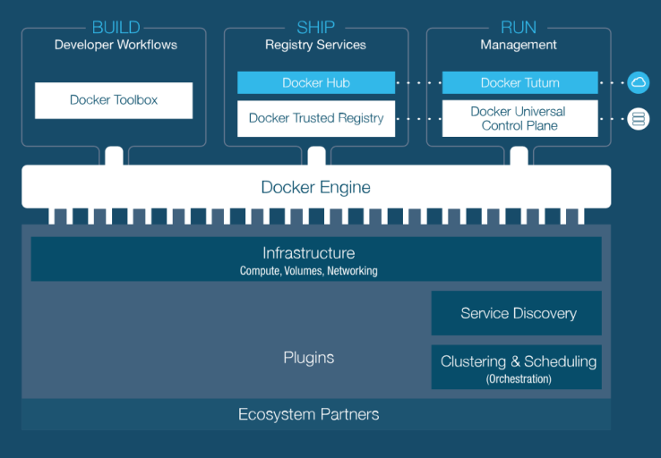

# Docker
Docker je odprtokodna rešitev za uporabo **vsebniške tehnologije**, ki nam omogoča:
- prenos rešitev iz razvojnega v produkcijsko okolje, brez da bi pri tem prihajalo do neskladnosti.
- neodvisnost



## Arhitektura
Docker uporablja arhitekturo *client-server*, kjer *client* komunicira z daemonom *daemon*, ki izvaja gradnjo, izvajanje in distribucijo **Docker vsebnikov**. 
> Docker *client* in Docker *daemon* lahko tečeta na istem **ali** ločenem sistemu, kjer komunikacija poteka preko vtičnikov ali *REST API-ja*.


> docker *client* je primarni uporabniški vmesnik z Docker-jem

## Docker Container ( Docker Vsebnik )

**Container** (*vsebnik*) je standardizirana enota za pakiranje programske opreme


Container-ji nudijo **popolno izolacijo** med *aplikacijimi* in *nižje ležečo strukturo*. Lahko bi jih opisali kot "virtualne stroje", ki zo zaradi drugačnega arhitekturnega pristopa veliko bolj **učinkoviti in prenosljivi**.

Vsebnike lahko **zaganjamo**, **ugašamo**, **premikamo** in **brišemo**

### Kreiranje docker vsebnika
Docker container zaženemo z ukazom ```run```
```docker
docker run my-image
```
Ob izvedbi ukaza se bo kreiral nov ```docker container```, ki bo temeljil na podani sliki ```my-image```, katero moramo (*preden jo uporabimo*) še zgraditi

Docker sliko definiramo z datoteko `Dockerfile`
```dockerfile
FROM docker/whalesay:latest
RUN apt-get -y update && apt-get install -y fortunes
CMD /usr/games/fortune -a | cowsay
```
> slika bazira na zadnji verziji slike *whalesey*, ki je morda že dostopna na mašini ali na Docker Hub-u, iz koder se bo prenesla, v primeru da še ne obstaja na naši mašini.

## Docker Image
Container-je gradimo iz **Docker Slik** (Docker Images), ki uporabljajo skupne datotečne sisteme in si delijo nivoje slik.


### Gradnja slke
#### Dockerfile
Dockerfile je tekstovni dokument, ki vsebuje vse ukaze, ki jih uporabnik lahko kliče v ukazni vrstici za izgradnjo slike.

direktive v Dockerfile-u imajo format ```INSTRUCTION arguments``` in **niso** case-sensitive.

Za pisanje komentarjev se porablja znak ```#```

##### Sklicevanje na okoljske spremenljivke
V datoteki *Dockerfile* se lahko sklicujemo na okoljske spremenljivke z ```$variable_name``` ali ```${variable_name}, določimo pa jih z *direktivo* ```ENV```
```Docker
ENV myPort 8080
EXPOSE ${myPort}
```
Okoljske spremenljivke lahko uporabimo v različnih direktivah ````ADD, COPY, ENV, EXPOSE, LABEL, USER, WORKDIR, VOLUME, STOPSIGNAL in ONBUILD```

#### Dockerfile direktive
##### FROM
Prva direktiva v Dockerfile je vedno **FROM**, s katero določimo osnovno sliko nad katero gradimo
```Docker
FROM <image>
FROM <image>:<tag> # :<tag> opcijsko, default: 'latest'
FROM <image>@<digest> # @<digest> opcijsko, default: 'latest'
```
V primeru, da želimo zgraditi več slik, se direktiva *FROM* lahko pojavi **večkrat**.
##### MAINTAINER, RUN
Direktiva **MAINTAINER** označuje *avtorja generirane slike*
```Docker
MAINTAINER <name>
```
Direktiva **RUN** pa zažene katerkoli ukaz nad obstoječo sliko
```Docker
RUN <command> # zažene ukaz v lupini (privzeto: /bin/sh -c)
RUN ["executable","param1","param2"] # format/vzorec
```
##### CMD
Direktiva **CMD** se lahko v Dockerfile datoteki pojavi **le enkrat** in se uporablja za *določanje privezih nastavitev izvajajočega vsebnika*.
```Docker
CMD ["executable","param1","param2"] # format exec
CMD ["param1","param2"] # privzeti parametri za direktivo ENTRYPOINT
CMD command param1 param2 # format shell
```
##### LABEL
Z direktivo **LABEL** dodamo sliki **metapodatke** v formatu ```key-value```
```Docker
LABEL <key>=<value> <key>=<value> <key>=<value> ...
```
##### EXPOSE, ENV
Direktiva **EXPOSE** Dockerju sporoči na katerih vratih naj posluša vsebnik
```Docker
EXPOSE <port> [<port> ...]
```
Z direktivo **END** pa lahko določimo okoljske spremenljivke
```Docker
ENV <key>=<value>
ENV <key>=<value>
...
```
##### ADD
Direktiva **ADD** kopira vse nove datoteke, direktorije in **URL-je* iz **\<src\>** ( če je datoteka \<src\> arhiv, se razpakira ).
```Docker
ADD <src> <dest>
```
##### COPY, ENTRYPOINT
Direktiva **COPY** kopira nove datoteke in direktorije na \<src\> (lokacija na trenutni mašini) in jih prekopira v datotečni sistem vsebnika na lokacijo \<dest\> (lokcaija na docker sliki)
```Docker
COPY <src> <dest>
```
Direktiva **ENTRYPOINT** pa omogoča konfiguracijo vsebnika, ki bo zagnan kot izvajajoč se ukaz (*kot executable*)
```Docker
ENTRYPOINT ["executable","param1","param2"] # format exec
ENTRYPINT command param1 param2 # format shell
```
##### VOLUME
Direktiva **VOLUME** ustari **priklopno točko** (*mount point*) s specificiranim imenom in jo označi kot točko priklopa zunanjega gostitelja ali nosilca drugega vsebnika
```Docker
VOLUME ["/data"]
```
Primer:
```Docker
FROM ubuntu
RUN mkdir /myvol
RUN echo "hello world" > /myvol/gretting
VOLUME /myvol
```
##### USER, WORKDIR
Direktiva **USER** določi ime uporabnika ali UID, ki se uporabi ob zagonu slike in za izvedbo ukazov RUN, CMD in ENTRYPOINT.
```Docker
USER daemon
```
Direktiva **WORKDIR** pa nastavi delovni direktorij za katerokoli izmed direktiv RUN, CMD, ENTRYPINT, COPY in ADD.
```Docker
WORKDIR /path/to/workdir # če direktorij ne obstaja, se ustvari
```
##### ARG, ONBUILD
Direktiva **ARG** definira spremenljivko, ki jo lahko uporabniki podajo v času gradnje z ukazom ```docker build```
```Docker
ARG <name>[=<default value>]
```
Direktiva **ONBUILD** sliki doda *trigger*, ki se sproži, ko se slika uporabi kot osnovna slika za neko drugo izgradnjo
```Docker
ONBUILD [INSTRUCTION]
```
##### STOPSIGNAL, HEALTHCHECK
Direktiva **STOPSIGNAL** določi *signal*, ki bo poslan vsebniko za izhod.
```Docker
STOPSIGNAL signal
```
Direktiva **HEALTHCHECK** pa Docker-ju pove, kako testirati vsebnik, da preveri njegovo delovanje
```Docker
HEALTHCHECK [OPTIONS] CMD command
HEALTHCHECK NONE
```
##### SHELL
Direktiva **SHELL** omogoča spremembo privzete lupine, ki se uporabi pri direktivah v formatu *shell*
```Docker
SHELL ["executable","parameters"]
```


#### Docker Compose
Orodje **Docker Compose** omogoča in poenostavlja zagon aplikacij, ki so sestavljene iz več vsebnikov. Ko gradimo slike posameznega vsebnika, moramo definirati datoteko s storitvami, pomnilniki, povezavami, ...

Primer ```docker-compose.yml``` datoteke za efektivno strežbo *WordPress-a* z uporabo slike ```wordpress:latest```, ki za nemoteno delovanje potrebuje tudi podatkovno bazo, ki jo poganjamo s pomočjo slike ```mysql:5.7```.
```yaml
version: '3.3'

services:
   db:
     image: mysql:5.7
     volumes:
       - db_data:/var/lib/mysql
     restart: always
     environment:
       MYSQL_ROOT_PASSWORD: somewordpress
       MYSQL_DATABASE: wordpress
       MYSQL_USER: wordpress
       MYSQL_PASSWORD: wordpress

   wordpress:
     depends_on:
       - db
     image: wordpress:latest
     ports:
       - "8000:80"
     restart: always
     environment:
       WORDPRESS_DB_HOST: db:3306
       WORDPRESS_DB_USER: wordpress
       WORDPRESS_DB_PASSWORD: wordpress
       WORDPRESS_DB_NAME: wordpress
volumes:
    db_data: {}
```


## Docker Hub
Predstavlja oblačni repozitorij za **shranjevanje** in **deljenje** docker slik. Omogoča tudi upravljanje z verzijami in *kolaboracije*.
> uporabniki: Canonical, Oracle, Red Hat ...

Razvijalcem omogoča, da svoje slike gradijo na množici obstoječih.

```bash
docker run [OPTIONS] IMAGE [COMMAND] [ARG...] # prenese sliko iz repozitorija in zažene
docker login [OPTIONS] [SERVER] # prijava v repozitorij
docker push [OPTIONS] NAME[:TAG] # naloži sliko na repozitorij
docker pull [OPTIONS] NAME[:TAG|@DIGEST] # prenese sliko iz repozitorija
```

