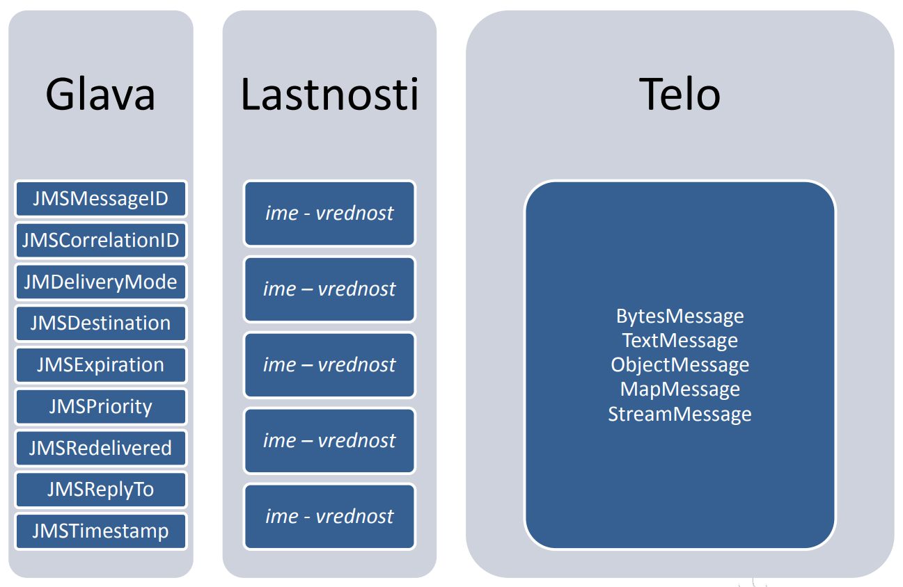
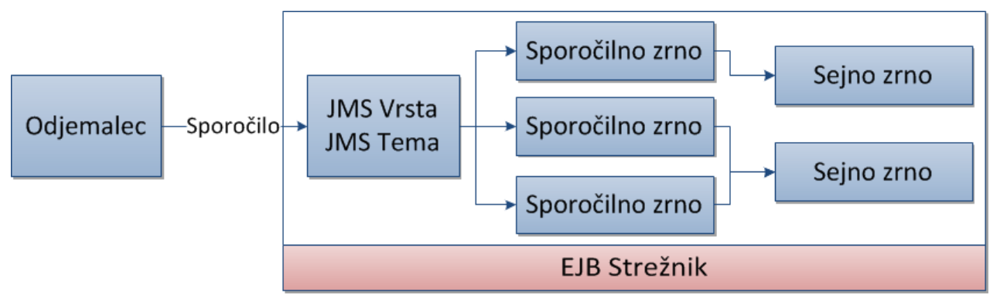
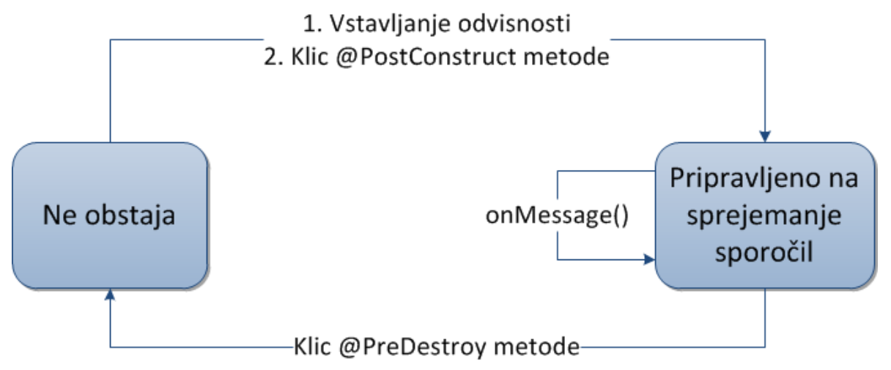

# Sporočilni sistemi, JMS in MDB

> če nimaš prov preveč časa je čistno na dnu strani spisan kratek povezetek. lp :)

## Sporočilni sistemi
Sporočilni sistemi omogočajo **asinhorn** način komunikacije med enotami sistema, kjer za *posredovanje* sporočil skrbijo ločeni sistemi, in sicer ***Message-oriented Middleware*** (**MOM**).
> popularnejši MOM sistemi so *IBM Websphere MQ*, *Oracle Tuxedo*, *Microsoft MSMQ*

**Java Message Service (JMS)** je Java EE API, ki skrbi za *komunikacijo s sistemi MOM*.

## Java Message Service (JMS)
JMS sestavljajo:
- **JMS ponudnik (*provider*)** - *skrbi za povezavo z ustreznim MOM sistemom*
- **JMS odjemalci** - *programi/komponente, ki sprejemajo ali pošiljajo sporočila (katerakoli JavaEE komponenta je lahko JMS odjemalec)*
- **Sporočilo** - *objekt, ki se prenaša med JMS odjemalci*
- **Administriran objekt** - objekt, ki jih administrator ustvari za  uporabo odjemalcev (cilji za sporočila, tovarne povezav...)

### Načini pošiljanja sporočil
JMS podpira dve glavni vrsti pošiljanja sporočil
- **Point-To-Pint (PPP)** - vsako sporočilo ima 1 naslovnika, prejemnik mora potrditi prejem sporočila (za čakanje na dostavo se uporablja **FIFO** vrsta)

- **Publish/Subscribe** - sporočilo je dostavljeno večim prejemnikom, kjer se mora prejemnik *naročiti (subscribe)* na **temo** in ne dobi sporočil, ki so bila poslana *pred* njegovo prijavo.


### Prejemanje sporočil
JMS implementira dva načina sprejemanja sporočil, in sicer:
- **Sinhrono** - prejemnik eksplicitno zahteva prejemanje sporočil s klicem metode ```recieve()```, ki ustavi ivajanje, dokler ne prispe novo sporočilo ali pa poteče nek določen čas
- **Asinhrono** - prejemnik registrira ```message listener``` metodo, ki se avtomatsko pokliče, ko prispe novo sporočilo.

### JMS Arhitektura
Osnovna JMS aplikacija je sestavljena iz
- Administriranih objektov
- Povezav
- Sej
- Pošiljateljev
- Prejemnikov.

#### Administrativni objekti
**Tovarne povezav** so objekti, s katerimi JMS odjemalec ustvari povezavo do ponudnika *MOM* in so *del* administrativnih objektov, ker obsegajo **konfiguracijo parametrov povezave do ponudnika sporočilnih sotirtev.**

Vir tovarn objektov navadno vstavimo v ojekt tipa ```ConnectionFactory```

```Java
//pridobimo tovarno povezav iz JNDI
ConnectionFactory connectionFactory = 
    (ConnectionFactory)context.lookup("jms/tovarnapovezav");
private static ConnectionFactory connectionFactory;
```

#### Cilji
To so objekti, s katerimi JMS odjemalci 
- določijo prejemnika, če so pošiljatelji
- določijo vir, če so prejemniki

Pri **PPP** načinnu se cilji imenujejo "**vrste**" (*queues*), pri **Publish/Subscribe** pa se imenujejo "**teme**" (*topics*).

Enako kot tovarne povezav, cilje vstavimo v objekte pri zagonu aplikacije
```Java
Topic tema = (Topic)context.lookup("jms/tema");
Queue vrsta = (Queue)context.lookupt("jms/vrsta");
```

#### Povezave
Komunikacija z JMS ponudnikom je predstavljena s *povezavami*, ki jih uporabimo, da *ustvarimo novo sejo*.

V JMS so povezave predstavljene kot instance razreda ```Connection```. Pred zaključkom aplikacije jih je treba ustrezno zapreti z ```close()``` in pred začetkom prejemanja jih je treba inicializirati z ```start()```. Ko želimo poslušanje končati, moremo izvesti ```stop()```.
```Java
Connection conn = ConnectionFactory.createConnection();
conn.start();
...
conn.stop();
...
conn.close();
```

#### Seje
**Seja** je *enoten kontekst za sprejemanje in pošiljanje sporočil*. Uporabimo jo, da ustvarimo
- pošiljatelje
- prejemnike
- sporočila
- pregledovalne vrste
- zaćasne vrste in teme

implementira jo vmesnik ```Session```
```Java
Session session = conn.createSession(false, Session.AUTO_ACKNOWLEDGE); //brez transakcij, avtomatska potrditev
Session session = conn.createSession(true, Session.SESSION_TRANSACTED) //s transakcijami
```

#### Pošiljatelj
Pošiljatelj se uporablja za (*le kdo bi uganil*) pošiljanje sporočil, predstavlja pa ga razred ```MessageProducer```. Pri ustvarjanju lahko navedemo *vrsto* ali *temo* na katero se bodo sporočila pošiljala. Če vrste ali teme ne navedemo pri kreaciji, moramo to določiti pri samem pošiljanju sporočila.
```java
//pošiljatelj z določeno temo
MessageProducer posiljatelj = session.createProducer(tema);
//pošiljatelj brez določenega cilja
MessageProducer posiljatelj = session.createProducer(null);
```

#### Prejemniki
prejemnika predstavlja objekt razreda ```MessageConsumer```, ki se poveže na določen *cilj* (temo ali vrsto) in potem z njega prejema sporočila

Tako kot pošiljatelja ga ustvarimo s pomočjo seje

Pred začetkom sprejemanja je potrebno poklicati ```start()``` na objektu ```Connection```

Sporočilo prejmemo s klicem ```recieve()```, ki mu lahko podamu tudi omejitev časa čakanja na sporočilo
```Java
MessageConsumer prejemnik = session.createConsumer(tema);
```

#### Sporočila
Predstavjleno z vmesnikom ```Message``` in se prenaša med pošiljateljem in prejemnikom

Sestavljno je iz 3 delov:
- **Glava** - vsebuje podatke za **identifikacijo** in **usmerjanje** sporočila
- **Lastnosti** - dodatne lastnosti, ki jih nastavimo pri pošiljanju. Shranjene so kot preslikava parov imen in vrednosti (tko kot v headerju pri http)

    ```java
    sporocilo.setFloatProperty("znesek",55.0f);
    ```
- **Telo** - nosi **vsebino sporočila**

Zgled:
```Java
//ustvarimo sporočilo s tekstom
TextMessage sporocilo = session.createTextMessage();
sporocilo.setText("vsebina");

//ustvarimo sporočilo z objektom
ObjectMessage objektnoSporocilo = session.createObjectMessage();
objektnoSporocilo.setObject(objekt);
```
##### Shema sporočila



### Pošiljanje sporočil
Pri **point-to-point** kličemo metodo ```send()```, pri **publish-subscribe** pa metodo ```publish()```.
```java
MessageProducer posiljatelj = seja.createProducer(cilj);
TextMessage sporocilo = seja.createTextMessage();

sporocilo.setFloatProperty("znesek", 55.0f);
sporocilo.setText("Nova transakcija");

//ppp
posiljatelj.send(sporočilo)
```

### Sinhrono prejemanje
Sinhrono prejemanje sporočila lahko implementiramo s pomočjo instance objekta ```MessageConsumer```, kjer moramo, preden lahko sporočila sprejemamo, na objektu ```Connection``` izvesti metodo ```start()```.

Čakajoče sporočilo prejmemo s klicem ```receive()```, ki pripada objektu ```MessageConsumer```.
> ```MessageConsumer.receive()``` se izvaja dokler ne prispe novo sporočilo oz. poteče nek določen čas.

Če na neko novo sporočilo ne želimo čakati, lahko preko metode ```receiveNoWait()``` prejmemo morebitno že obstoječe sporočilo v čakalni vrsti.
```java
//Ustvarimo prejemnika iz vrste/teme - cilja
MessageConsumer prejemnik = seja.createConsumer(cilj);

//začni prejemanje sporočil
conn.start();

/* Počakaj na sporočilo in ga prejmi, pri tem počakaj največ 5 sekund */
Message sporocilo = prejemnik.receive(5000);
```

### Asinhrono prejemanje
Spročila sprejemamo asinhrono tako, da določimo poslušalca, ki bo poklican, ko prispe sporočilo. 

Poslušalec je **Razred**, ki implementira ```MessageListener``` ter metodo ```onMessage()```

Nekemu objektu ```MessageConsumer``` lahko določimo poslušalca z metodo ```setMessageListener()```
```java
class Poslusalec implements MessageListener{
    /* onMessage se bo samodejno poklicalo, ko bo prispelo novo sporočilo */
    public void onMessage(Message sporocilo){
        System.out.println("Sporočilo prejeto");
    }
}
//ustvarimo prejemnika
MessageConsumer prejemnik = seja.createConsumer(cilj);
//določimo poslušalca
prejemnik.setMessageListener(new Poslusalec());
//začni prejemanje sporočil
conn.start();
```

### Selektorji
Sporočila lahko *filtriramo* še pred prejemom z uporabo **selektorjev**, ki ga specificiramo pri ustvarjanju prejemnika.

Selektorji so **izrazi** tipa ```String```, ki je osnovan na jeziku SQL92.
```SQL
Posiljatelj = "bankomat" OR Posiljatelj = "POS"
```

### Trajni sprejemniki
v primeru *publish-subscribe* komunikacije lahko ustvarimo **trajnega** naročnika, kjer sporočila *počakajo* na dosegljivost prejemnika.

Slabosti trajnih naročnin:
- trajni naročnik je lahko **edini** naročnik na temo, kar pomeni, da drugi prejemniki potem ne morejo sprejemati sporočil iz teme
- čakajočih sporočil v temi ne moremo pregledovati
- opažano se poveča obremenitev MOM strežnika

Pri ustvarjanju naročnine ji moramo podati **ime**. Trajnega prejemnika ustvarimo s pomočjo metode ```createDurableSubscribe()``` objekta ```Session```. Ko trajne naročnine ne želimo več vzdrževati, zadnji prejemnik pokliče metodo ```unsubscribe()``` na povezavi.
```java
String imeNarocnine = "moja_narocnina";
// prijava na narocnino
MessageConsumer narocnik = seja.createDurableSubscriber(tema, imeNarocnine);
//prejemanje sporočil
...
// zaključek prejemanja
/* 
na prosojnicah ma Jurič napisan:
narocnik.close() //semizdi da je to napaka
*/
conn.unsubscribe(); //pomoje more bit tko
conn.close(); //pomoje more bit tko
```

### Pregledovalniki vrste
V primeru **point-to-point** komunikacije sporočila čakajo na prevzem prejemnika v vrsti.

Pregledovalnik ustvarimo z pomočjo objekta ```Session```
```java
//ustvarimo pregledovalnik
QueueBrowser pregledovalnik = session.createBowser(vrsta);
//pridobimo seznam sporočil
Enumeration<Message> sporocila = pregledovalnik.getEnumeration()
```
> pregledujemo lahko samo *vrste* in ne *tem*!

### JMS izjeme
To je seznam tipičnih izjem, ki lahko nastanejo pri pošiljanju in sprejemanju sporočil z JMS
- ```InvalidClientIDException```
- ```InvalidDestinationException```
- ```InvalidSelectorException```
- ```JMSSecurityException```
- ```MessageEOFException```
- ```MessageFormatException```
- ```MessageNotReadableException```
- ```MessageNotWriteableException```

## Sporočilna zrna
To so posebna vrsta zrn, ki sprejemajo sporočila iz vrst ali tem in so del specifikacije strežniških zrn (EJB) od 2.0 dalje.

V njih tipično *ne poganjamo poslovne logike* ampak zgolj **obdelujemo sporočila**.


> zrna ne zadržujejo podatkov in transakcijskega stanja, niti niso povezana z odjemalcem. So **medseboj ekvivalentne**, kjer lahko **eno zrno obdeluje sporočila večih odjemalcev**, izvede pa se **ob vsakem prejetem sporočilu**.

S sporočilnimi zrni lahko predstavljamo tako *trajne (durable)* in *ne-trajne (non-durable)* naročnike.

Sestavljena so samo iz **razreda** in se prijavljajo na teme s pomočjo **vstavljanja odvisnosti** - anotacija **@Resource**.

Razred sporočilnega zrna je označen z anotacijo **@MessageDriven*** in implementira metodo ```onMessage()``` razreda ```MessageListener```

```java
@MessageDriven(mappedName = "jms/novaTransakcija")
public class SprejemnikTransakcij implements MessageListenre{
    /* Medota onMessage se pokliče ko prispe novo sporočilo na temo */
    public void onMessage(Message sporocilo){
        //obdelava sporočila
    }
}
```

### Kdaj uporabljati sporočilna zrna
Sejna zrna **ne morejo** sprejemati sporočila **asinhrono**, uporaba sinhronega sprejemanja v sejnih zrnih pa bi predstavljalo veliko porabo sredstev na strežniku, saj morajo biti ustvarjena celoten čas.

Sporočilna zrna zato lahko uporabljamo vedno, kadar hočemo **sprejemati sporočila brez velike porabe virov na strežniku**

### Življenksi ciklej sporočilnih zrn
EJB vsebnik ustvari *skupino* instanc sporočilnega zrna in pri vsakem:
1. Vstavi reference, če zrno uporablja vstavljanje referenc za svoje vire
2. Pokliče metodo anotirano z **@PostConstruct**
3. Začne s poslušanjem sporočil

Sporočilno zrno ima (tako kot sejno) samo dve stanji:
- Neobstoječe
- Pripravljeno na sprejemanje sporočil

Po koncu življenskega cikla se pokliče metoda anotirana z **@PreDestroy**, nato pa se izvede še *garbage collection*.



## JMS povzetek
- Sporočila prenašajo sporočilni (MOM) sistemi
- Vmesnik za delo z MOM sistemi v Javi se imenuje **Java Messaging Service (JMS)**
- Poznamo dve vrsti pošiljanja sporočil
    - **Point-to-Point** - od pošiljatelja k enemu naslovniku, kjer sporočila čakajo na sprejem v **vrstah**.
    - **Publish-Subscribe** - od pošiljatelja k večim sprejemnikom, kjer se sprejemniki **prijavijo na teme** in sporočila na sprejem **načeloma ne čakajo**.
- Vse potrjene objekte za sprejemanje ali pošiljanje ustvarimo iz seje ```Session```, ki jo ustvarimo s povezavo ```Connection```, ki jo ustvarimo s tovarno povezav ```ConnectionFactory```.
- Ustvarimo lahko sporočilna zrna, v katerih se sprejemajo in obdelujejo sporočila