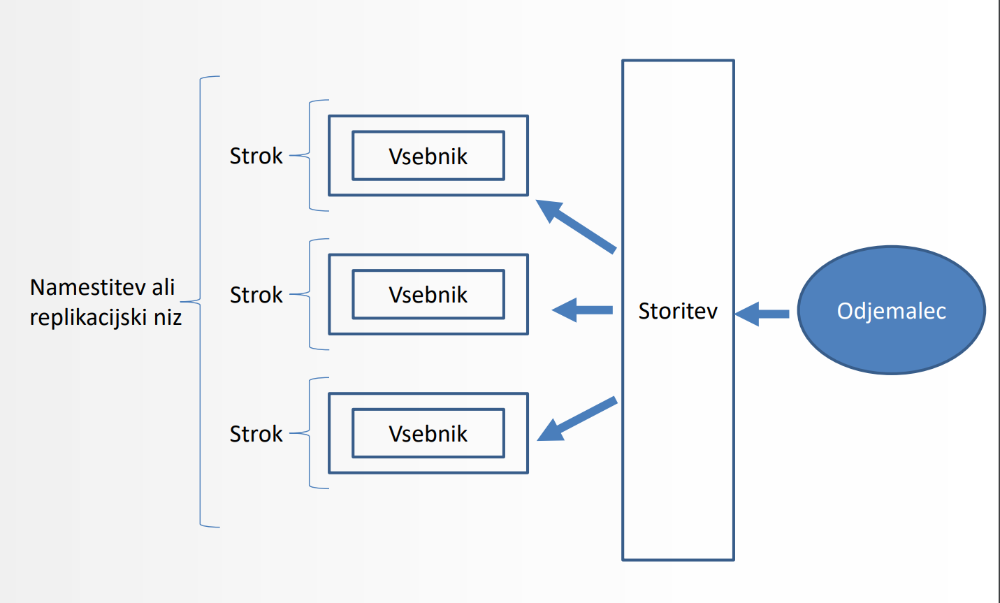
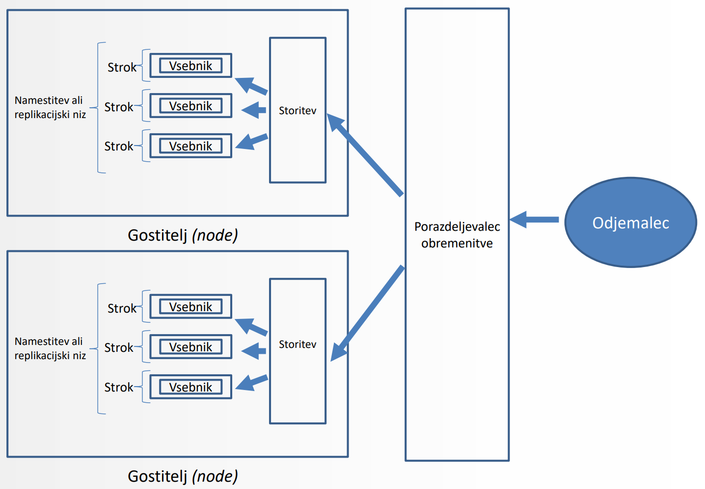
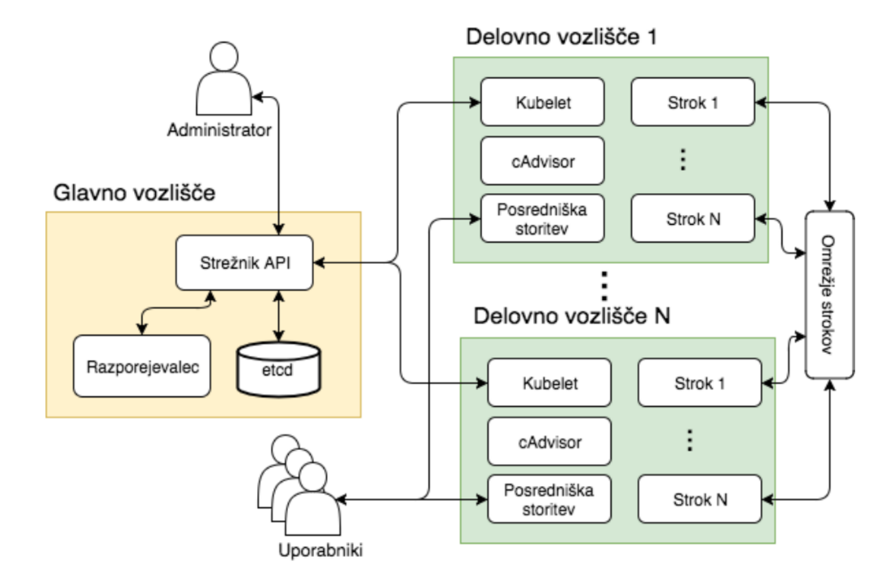

# Kubernetes
To je odprtokodna platforma za avtomatizirano nameščanje, skaliranje in upravljanje z vsebniki.

Platforma omogoča izvajanje **vsebnikov** (*containers*) na **gruči gostiteljev** (*nodes*).

Ustvarjen je bil za interno uporabo v *Google*, trenutno pa razvoj poteka pod okriljem *Cloud Native Computing Foundation*.


## Osnovni koncepti

### Gostitelj (*Node*)
Vozlišče v gruči, na katerem se izvajajo stroki. Praviloma ima Kubernetes gruča *več* gostiteljev.
### Strok (*Pod*)
Skupina enega ali več vsebnikov. Strok predstavlja atomarno enoto - vsi vsebniki v podu se izvajajo na istem gostitelju
### Označbe (*Labels*)
Oznake, s katerimi identificiramo stroke in jih enostavno grupiramo
### Namestitev (*Deployment*)
Definira predlogo za kreiranje želenega števila replik stroka. Namestitev omogoča varno nadgradnjo izvajajočih strokov.
### Storitev (*Serivce*)
Abstrakcija, ki izpostavi večje število replik stroka
### Preverjanje zdravja (*Health checking*)
Sistem za periodično preverjanje dostopnosti aplikacije in za samodejno nadomeščanje nedelujočih replik
### Replikacijski niz (*Replica Set*)
Zagotavlja, da v nekem času teče zahtevano število replik stroka
### Replikacijski nadzornik (*Replication Controller*)
Zagotavlja, da v nekem času teče zahtevano število replik stroka.
### Nosilec podatkov (*Volume*)
Imenik v vsebniku, ki se preslika v imenik na gostiteljevem datotečnem sistemu
### Skrivnosti (*Secrets*)
Hrani občutljive podatke, kot npr. žetone za avtentikacijo ali podatke za dostop do privatnega Docker repozitorija
### Imenski prostor (*Namespace*)
Predpona imen virov, ki omogoča deljenje gruč in organizacijo projektov. *Kubernetes podpira tudi omejevanje virov - virtualne gruče*.

## Shema osnovnih konceptov




## Strok (*Pod*)
To je najmanjša namestitvena enota, sestavljena iz **1 ali več vsebnikov** in **deljene shrambe** med vsebniki znotraj stroka.
Vsebniki znotraj stroka si delijo IP naslov in PORT, med sabo pa lahko komunicirajo preko *localhost*. 

Stroki **niso** odporni na:
- napake v času razporejanja
- izpad gostitelja
- napak zaradi *vzdrževanja* ali *pomankanja virov*

> Ponavadi jih kreiramo z uporabo *namestitvenih enot* tipa ``Namestitev`` (```Deployment```), ki doprinese k zmožnosti **samodejne vzpostavitve** ob izpadu stroka. Tip je koristen za *upravljanje replik* ter *rollout namestitve in posodobitve*.
## Namestitvene enote
### Namestitvena enota tipa ```Namestitev``` (```Deployment```)
Tip omogoča ***deklarativno** posodabljanje* strokov in replikacijskih nizov.

Objektu tipa ```Namestitev``` določimo želeno stanje, nato pa bo ```DeploymentController``` poskrbel, da se bo stanje *ustrezno posodobilo*.

### Namestitvena enota ```Replikacijski Nadzornik``` (Replication Controller)
`Replikacijski nadzornik` (`Replication Controller`) zagotovi, da *v nekem trenutku teče **zahtevano število replik** nekega stroka*. 
- če bo replik preveč, bo `Replikacijski Nadzornik` *odstranil odvečne*.
- če bo replik premalo bo `Replikacijski Nadzornik` *poskrbel za zagon preostalih*.

Je uporaben, kadar želimo
- Zanesljivo delovanje strokov tudi v primeru izpadov - **self healing**
- **Podporo skaliranja** strokov
- Podporo za *rolling updates*

### Namestitvena enota `Replikacijski Niz` (`Replica Set`)
`Replikacijski Niz` (**RS**) nadomešča `Replikacijski Nadzornik` (**RC**). 
| `Replikacijski Niz` | `Replikacijski Nadzornik` |
| -- | -- |
| podpira *selector* na osnovi **set**-ov | podpira *selector* le na osnovi **enakosti** |

Če potrebujemo podporo za *rolling update*, pa raje uporabimo namestitveno enoto tipa `Namestitev`, ki omogoča *deklarativno* nadgradnjo.

## Konfiguracija
```yaml
apiVersion: apps/v1
kind: Deployment
metadata:
  name: zgodovina-deployment
spec:
  replicas: 1
  selector:
    matchLabels:
      app: zgodovina
  template:
    metadata:
      labels:
        app: zgodovina
    spec:
      containers:
        - image: mynameisgasper/prpo:zgodovina
          name: zgodovina
          ports:
            - containerPort: 8081
              name: server
              protocol: TCP
```
### Konfiguracija namestitvene enote
Konfiguracijo namestitvene enote je potrebno podati z namestitveno datoteke v *JSON* ali *YAML* formatu.
> zaradi enostavnosti se priporoča *YAML*
### Konfiguracija samodejnega skeliranja
Podobno kot namestitvene enote lahko konfiguriramo tudi `Horizontal Pod Autoscaler` (**HPA**).

HPA lahko definiramo za `Deployment`, `ReplicaSet` ali `ReplicationController`.

uporabni kubernetes ukazi:
```bash
kubectl get hpa #prikažemo obstoječe HPA-je
kubectl describe hpa #podrobnosti HPA-ja
kubectl autoscale deployment <deployment-name> --min=2 --max=10 #za namestitev (Deployment). Parameter *max* je obvezen
kubectl autoscale deployment <deployment-name> --min=2 --max=10
--cpu-percent=80 # določumo pri kateri porabi CPU se ustvari nova instanca. Predpogoj za delovanje je nameščen Heapster monitoring
```
### Progresivno posodablanje
```bash
kubectl set image deployment/customers-deployment customers=customers:1.01 #primer posodobitve slike
kubectl rollout status deployment/customers-deployment #status rollout operacije spremljamo z ukazom
kubectl rollout history deployment/customers-deployment #pregled zgodovine rollout za namestitev
kubectl rollout undo deployment/customers-deployment #prehod na prejšnjo verzijo
kubectl rollout undo deployment/customers-deployment --to-revision=2 #prehod na točno določeno verzijo
```
### Storitev
```yaml
apiVersion: v1
kind: Service
metadata:
  name: zgodovina
spec:
  type: LoadBalancer
  ports:
    - port: 8081
      protocol: TCP
      targetPort: server
  selector:
    app: zgodovina
```
Problem strokov je njihova **umrljivost** - ko umrejo, niso več dostopni:

**Problem:** `Če nek strok izpostavlja neko storitev drugemu stroku, lahko pride do tega, da strok izgubi naslov stroka, katerega storitve uporablja`

Ta problem rešujemo s storitvami (`service`) - Kubernetes **storitev** je abstrakcija, ki **denifira logičen nabor strokov in politiko dostopa**

Tipi storitev:
```yaml
spec:
    type: ClusterIP #storitev je na voljo na IP naslovu znotraj gruče. (default)
```
```yaml
spec:
    type: NodePort #storitev je izpostavljena na vratih na IP naslovu gostitelja (na vsakem gostitelju v gruči ločeno)
```
```yaml
spec:
    type: LoadBalancer #storitev je na voljo na ločenem porazdeljevalcu obremenitve (load balancer). Na voljo samo pri določenih ponudnikih kot npr. Google Cloud Platform
```

## Kubernetes gruča
`točno 1` - Kubernetes **master** - vozlišče, ki **vsebuje komponente za upravljanje gruče (*master components*)**.

`1 ali več` - Kubernetes **node** - vozlišče, ki **vsebuje le orodja z izvajalnim okoljem**

### Postavitev Kubernetes Gruče




## Orodje `kubectl`
To je orodje s katerim **upravljamo gručo**

nekaj priročnih ukazov:
```bash
kubectl config view #konfiguracija se nahaja v ~/.kube/config
kubectl create -f customers-deployment.yml #ustvari namestitev
kubectl create -f customers-rs.yml #ustvari repliakcijski niz
kubectl get pods #prikaži vse stroke
kubectl descripe pod customers-pod #prikaži opis stroka
kubectl prox #zaženi proxy dostop do grafičnega vmesnika
kubectl -help #pomoč in opis ostalih ukazov
```

