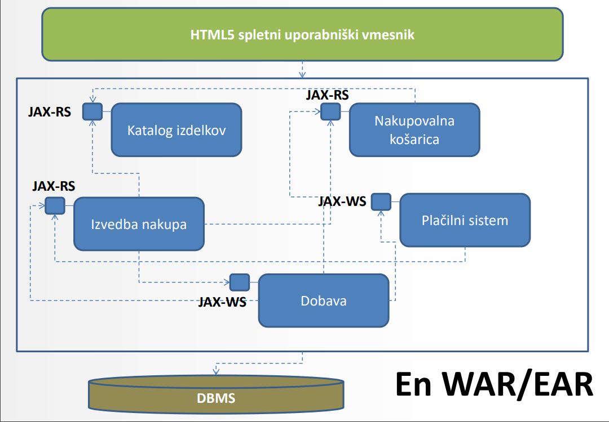

# Mikrostoritve

## O Mikrostoritvah
Načrtovane so okrog *poslovnih* področij in funkcij. Nameščamo jih lahko **neodvisno** in **automatizirano**.
## Arhitektura
Mikrostoritve so zasnovane na konceptu oblikovanja aplikacije s **samostojnimi, neodvisnimi gradniki** (komponente).

Ideja je izgradnja aplikacije kot *zbirke* majhnih storitev, kjer vsaka storitev deluje v svojem procesu, komunikacija med njimi pa poteka preko *vmesnikov*.

### Klasična **monolitna** arhitektura javanske EE aplikacije

Celotni app zapakiramo v en **WAR/EAR** in jo namestimo na aplikacijski strežnik, kjer se obnaša kot "**monolit**".

Skaliramo jo lahko samo kot celoto, tako da uporabljamo *gručo* strežnikov.

Pri posodobitvah je potrebna **ponovna namestitev celote**, kar predstavlja težko vrzdrževanje in oviro pri prehodu na nove tehnologije orodja.

### Pristop z mikrostoritvami

Vsaka storitev je nameščena ločeno, v svojem izvajalnem okolju (*vsebnik* ali *aplikacijski strežnik*), komunikacija med njimi pa poteka izključno preko vmesnikov. 

Pomembno je da so odvisnosti med sabo **minimizirane**

## Principi
- Storitve izpostavljajo vmesnike
- Storitve lahko neodvisno zamenjamo ali posodobimo
- Storitve so načrtovane tako, da so odporne na izpade
- Izmenjava sporočil med storitvami je lahko sinhrona ali asinhrona

### Princip ene odgovornosti

Ena mikrostoritev je namenjena izključno **eni funkcionalnosti**

## Prednosti
- Arhitektura apliakcij je **fleksibilna**
- Enostavno **skaliranje**
- **Neodvisen postopek razvoja**
- Lažje nadgradnje
- Enostavnejši prehodi na nove verzije

## Koncepti
- Zgradba komponent temelji na storitvah
- Storitve organiziramo okrog poslovnih zmožnosti (*enterprise*)
- **Dostopne na končnih točkah**
- Decentraliziran nadzor in upravljanje
- **Avtomatizacija infrastrukture** - mikrostoritve najbolje delujejo na oblačnih platformah ali v vsebnikih (*docker*)
- **Verzioniranje** in iterativni razvoj

