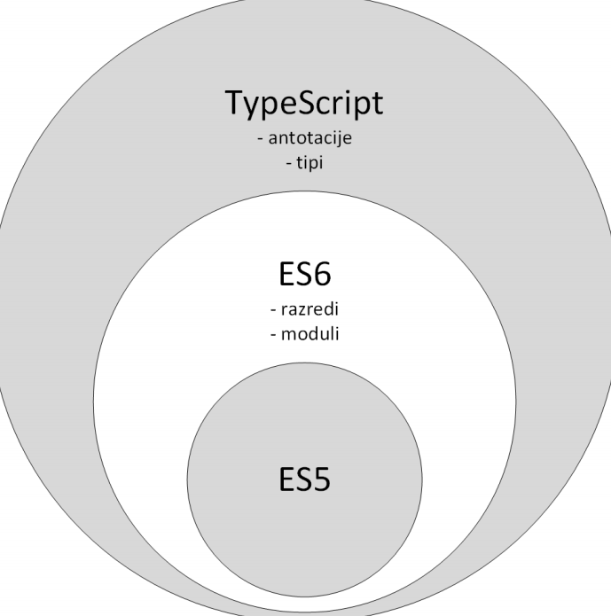
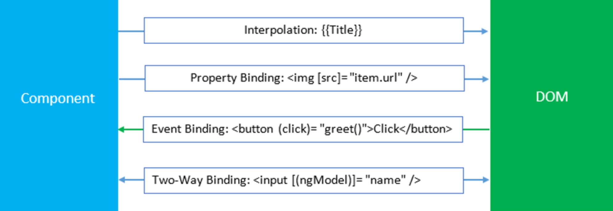

# Angular
## TypeScript
TypeScript je programski jezik, ki predstavlja **nadmnožico (*"super set"*)** programskega jezika JavaScript.

Vsa programska koda specifikacij ES5, ES6, E7, ES8 je združčjiva s TypeScript

<div style="display:flex;justify-content:center">

</div>

Ker brskalniki ne podpirajo direktnega izvajanje ES in TypeScript, je potrebno skripte v teh jezikih **transpilirati** v ES5
```TypeScript
class Util {
    niz: string;
    constructor(niz: string) {
        this.niz = niz;
    }
    pozdrav() {
        return "Zdravo " + this.niz;
    }
}  

let pozdrav = new
Util("Janez").pozdrav();
```
Se *transpilira* v
```JavaScript
var Util = (function () {
    function Util(niz) {
        this.niz = niz;
    }
    Util.prototype.pozdrav = function () {
        return "Zdravo " + this.niz;
    };
    return Util;
}());

var pozdrav = new
Util("Janez").pozdrav();
```
## Angular osnove
Angular je ogrodje za izdelavo odjemalskih aplikacij z uporabo **HTML** in **TypeScript** jezika. Prinaša dvakrat večjo moč z dvakrat manj kode.

### Angular Pristop


- **M** - model (*dejanski podatki, ki jih pridobimo iz strežnika*)
- **V** - view (*html5 dokument, ki prikaže podatke*)
- **C** - controller (*JavaScript funkcije, ki spreminjajo html5 in podatke*)

## Pojmi
- **Template/view** (*pogled*) - Predstavlja predlogo HTML dokumenta, ki ga uprablja neka **komponenta**
- **Component** (*komponenta*) - Koda, ki pripada nekemu HTML pogledu in ga upravlja. Med drugim upravlja tudi z *modelom* in *DOM drevesom*
- **Model** (*Model*) - Podatki, ki jih stran prikazuje (*ponavadi jih dobimo iz strežnika*)
- **Service** (*Storitev*) - Storitev, ki po navadi priskrbi podatke iz strežnika
- **Module** (*Modul*) - Vsebnik različnih delov aplikacij (*komponente, storitve,...*)

## Podpora brskalnikov
Angular ogrodje podpirajo skoraj vsi svetovno znani brskalniki: Chrome, Firefox, Edge, IE, Safari, iOS, Android, IE Mobile...

## Arhitektura


## Moduli (*modules*)
```JS
@NgModule({
    imports: [
        BrowserModule,
        HttpModule,
        AppRoutingModule,
        FormsModule
    ],
    declarations: [
        AppComponent,
        UporabnikiComponent,
        UporabnikPodrobnostiComponent
    ],
    providers: [UporabnikService],
    bootstrap: [AppComponent]
}) export class AppModule { }
```
## Komponente (*components*)
Upravlja z delom zaslona, imenovanega "pogled" (*view*).
```JS
@Component({
    selector: 'vsi-uporabniki',
    templateUrl: 'uporabniki.component.html'
})
export class UporabnikiComponent implements OnInit {
    uporabniki: Uporabnik[];
    uporabnik: Uporabnik;

    constructor(
        private uporabnikService: UporabnikService,
        private router: Router) { }
    
    getUporabniki(): void {
        this.uporabnikService
            .getUporabniki()
            .then(uporabniki => this.uporabniki = uporabniki);
    }
    
    ngOnInit(): void {
        this.getUporabniki();
    }
    
    gotoDetail(uporabnik: Uporabnik): void {
        this.uporabnik = uporabnik;
        this.router.navigate(['/uporabniki', this.uporabnik.id]);
    }
}
```
### Življenski cikelj komponent
1. `constructor()`
2. `ngOnChanges()` - *sproži se vsakič, ko se ponastavijo vhodi nastavljeni preko vezave podatkov*
3. `ngOnInit()` - *sproži se vsakič, ko se komponenta incializira in prvič prikaže lastnosti v predlogi*
4. `ngDoCheck()` - *sproži se vsakič, ko se izvaja zaznavanje spremv (`change detection`), takoj po `ngOnChanges` in `ngOnInit`*
    1. `ngAfterContentInit()` -  *sproži se vsakič, ko se vstavijo vse zunanje vsebine v pogled komponente.*
    2. `ngAfterContentChecked()` - *sproži se vsakič, ko se **preverijo** vse vsebine, ki so vključene v komponento*
    3. `ngAfterViewInit()` - *sproži se vsakič, ko se **inicializirajo** vsi pogledi komponente in otroci pogledov*
    4. `ngAfterViewChecked()` - *sproži se vsakič, ko se **preverijo** vsi pogledi in otroci pogledov.*
5. `ngOnDestroy()` - *sproži se preden se uniči komponenta. Namenjena je čiščenju*

## Angular direktive
Najbolj osnovne **Angular-core** direktive so `*ngIf`, `*ngFor`, `*ngClass` in `*ngStyle`
```html
<ul class="uporabniki" *ngIf="uporabniki">

    <li *ngFor="let uporabnik of uporabniki" 
        *ngClass="{'deleted': !uporabnik.isActive}" 
        (click)="gotoDetail(uporabnik)">

        <span *ngStyle="{'color': uporabnik.barva}">
        {{uporabnik.ime}} {{uporabnik.priimek}}
        </span>
    </li>
</ul>
```
Poznamo še *ngPlural,*ngPluralCase,*ngSwitch*,*ngSwitchCase,*ngSwitchDefault, ...

## Metapodatki razredov
Metapodatki **TS razreda** v Anglar ogrodju določajo njegovo **obnašanje**. Nastavimo jih z uporabo *Dekoratorjev* (`@<decorator>`)

Primer nastavitve metapodatkov za **komponento**
```js
@Component({
    selector: 'vsi-uporabniki',
    templateUrl: 'uporabniki.component.html'
}) export class UporabnikiComponent implements OnInit {
...
}
```
## Databinding
Poznamo 4 različne načine povezovanja podatkov med komponento in njenim pogledom



## Obrazci
Poznamo dva pristopa implementacije obrazcev
1. Predlogovno voden (*template-driven forms*)
2. Odzivni pristop (*reactive forms*)

Pridobimo iz `@angular/forms` modula.
```html
<!-- PREDLOGA HTML -->
<div *ngIf="uporabnik">
    <form (submit)="submitForm()">
        <table>
            <tr>
                <td><label for="ime">Ime</label></td>
                <td>
                <input [(ngModel)]="uporabnik.ime"
                    id="ime" 
                    name="ime" 
                    required />
                </td>
            </tr>
            <tr>
                <td><label for="priimek">Priimek</label></td>
                <td>
                <input [(ngModel)]="uporabnik.priimek" 
                    id="priimek" 
                    name="priimek" 
                    required />
                </td>
            </tr>
            <tr>
                <td><label for="uporabniskoIme">Uporabniško ime</label></td>
                <td>
                <input [(ngModel)]="uporabnik.uporabniskoIme"
                    id="uporabniskoIme"
                    name="uporabniskoIme" 
                    required />
                </td>
            </tr>
        </table>
        <button type="button" (click)="nazaj()">Nazaj</button>
        <button type="submit">Dodaj</button>
    </form>
</div>
```
```js
// KOMPONENTA POVEZANA Z ZGORNJO HTML PREDLOGO
export class UporabnikiDodajComponent {
    uporabnik: Uporabnik = new Uporabnik;

    constructor(
        private uporabnikService: UporabnikService,
        private router: Router) { }
    
    submitForm(): void {
        this.uporabnikService
            .create(this.uporabnik)
            .then(() => {
                this.router.navigate(['/uporabniki']);
            });
    }
    
    nazaj(): void {
        this.router.navigate(['/uporabniki']);
    }
}
```

### Validacija obrazcev
Za validacijo vnešenih podatkov v obrazec je moč uporabiti preproste **vgrajene validatorje**, lahko ustvarimo **validatorje po meri (*lastni validatorji*). Tudi Modul `Validators` nudo osnovne validatorje in fukncije za naprednejše delo z validacijami
```ts
myForm:FormGroup = new FormGroup({
    //uporaba enega validatorja
    let ime : new FormControl('',Validators.required), 
    //spaggheti zapis, razvidna je uporaba večih validatorjev
    let mail : new FormControl(
        '',
        [
            Validators.required,
            Validators.pattern(new RegExp('pattern')),
            ...
        ]
    )
})
//tako pridobimo vrednost polja v obrazcu
getNameVal():string{
    return this.myForm.get('ime').value;
}
```

## Direktive
**Direktiva (*directive*)** je zelo podoben koncept kot komponente
> vse komponente so na nek način "direktive s pogledom"

Direktiva sama po sebi ne zahteva pogleda, medtem ko ga komponente vedno.

Implementirane so v svojih razredih, kjer moramo uporabiti dekorator `@Directive`

poznamo 3 tipe direktiv:
- Direktive s predlogo (*directive with a tempalte*) - komponente.
- Strukturne direktive (*sturctural directives*) - direktive, ki spreminjajo strukturo DOM.
- Atributne direktive (*attrivute directives*) - spreminjajo izgled ali obnašanje elementa (*ngStyle*).

## Usmerjanje
Usmerjanje v Angular-ju omogoča prehanje med različnimi deli (*komponentami*) aplikacije, kjer ima vsaka aplikacija **eno** instanco usmerjevalnika `Router`, ki skrbi za prehode med pogledi.
```ts
/* DEFINIRAMO V SVOJEM LOČENEM MODULU, KI GA NATO VKLJUČIMO V GLAVNI APP MODUL */
import {NgModule} from '@angular/core';
import {RouterModule, Routes} from '@angular/router';
import {UporabnikiComponent} from './uporabniki.component';
import {UporabnikPodrobnostiComponent} from './uporabnik-podrobnosti.component';
import {UporabnikiDodajComponent} from './uporabniki-dodaj.component';

const routes: Routes = [
    { path: '', redirectTo: '/uporabniki', pathMatch: 'full' },
    { path: 'uporabniki', component: UporabnikiComponent },
    { path: 'uporabniki/:id', component:    UporabnikPodrobnostiComponent },
    { path: 'dodajuporabnika', component: UporabnikiDodajComponent },
    { path: '**', redirectTo: '/uporabniki', pathMatch: 'full' }
];

@NgModule({
imports: [RouterModule.forRoot(routes)],
exports: [RouterModule]
})

export class AppRoutingModule { }
```
```TS
/* VKLJUCIMO ROUTER MODUL V GLAVNI APP MODUL */
@NgModule({
    imports: [
        ...,
        AppRoutingModule,
        ...
    ],
    declarations: [
        ...
    ],
    providers: [ ... ],
    bootstrap: [ ... ]
})
export class AppModule { }
```
```ts
/* PRIMER UPORABE */
import {Router} from '@angular/router';

constructor(private router: Router) {}

naPodrobnosti(uporabnik: Uporabnik): void {
    this.uporabnik = uporabnik;
    this.router.navigate(['/uporabniki', this.uporabnik.id]);
}
```
## Storitve
Če želimo razred označiti kot **storitev**, ga je treba dekorirati z dekoratorjem `@Injectable`, ki pove, da je razred lahko uporabljen preko vstavljanja odvisnosti.
```ts
@Injectable() 
export class UporabnikService {
    private headers = new Headers({ 'Content-Type': 'application/   json' });
    private url = 'http://localhost:8081/v1/uporabniki';
    
    getUporabniki(): Promise<Uporabnik[]> {
        return this.http.get(this.url)
            .toPromise()
            .then(response => response.json() as Uporabnik[])
            .catch(this.handleError);
    }
    
    getUporabnik(id: number): Promise<Uporabnik> {
        const url = `${this.url}/${id}`;
        return this.http.get(url)
            .toPromise()
            .then(response => response.json() as Uporabnik)
            .catch(this.handleError);
    }
..
}
```
```ts
/* prikaziUporabnike.component.ts */
@Component( ... )
export class PrikaziUporabnikeComponent implements ... {
    ...
    constructor(private uporabnikService:UporabnikService, ...){}
    ...
    ... ... = function():...{
        this.uporabnikService.getUporabniki().then( rezultat => {
            console.log(rezultat);
        })
    }
    ...
}