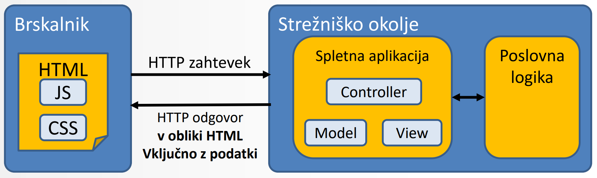
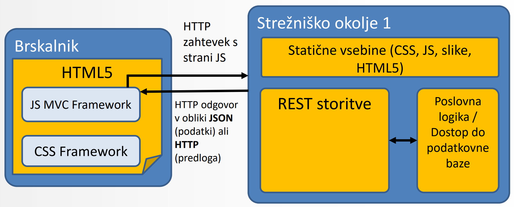
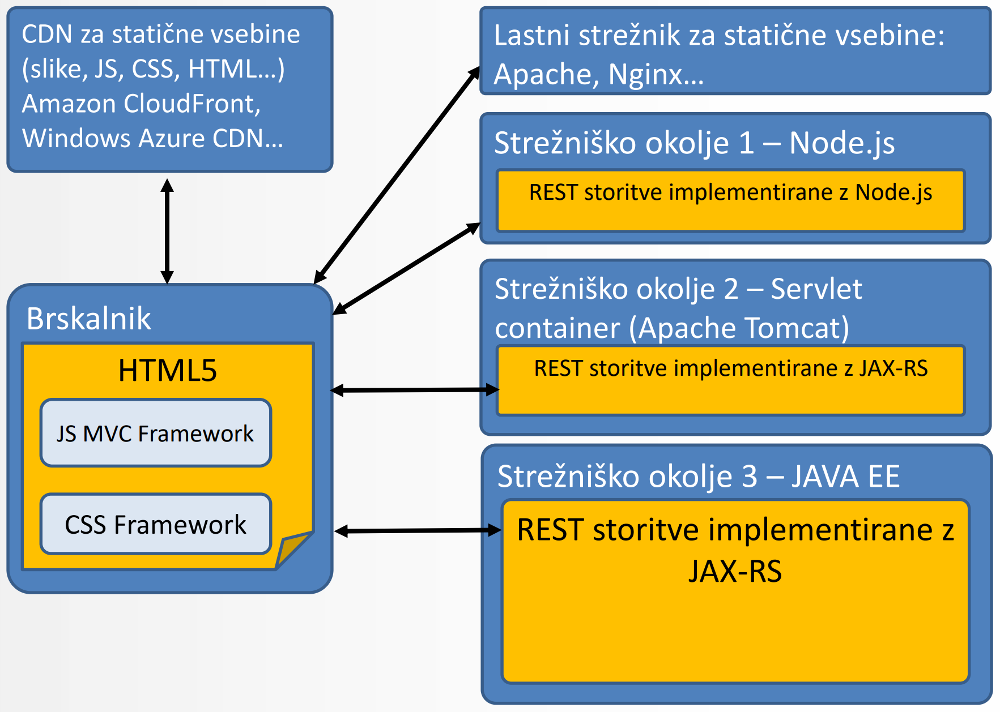

# RAZVOJ SPLETNIH APLIKACIJ Z OGRODJEM ANGULAR

# Pristop k razvoju sodobnih spletnih apliakcij

## Pristop k implementaciji spletnih aplikacij
### Klasični pristop
Klasični pristop se izvaja s komponentnim ogrodjem (JSP, JST, ASP.NET, ...), kjer so *Modeli(M)*, *Pogledi(V)* in *Kontrolerji(C)* na strani strežnika.
- *logika*, *posodobitev modela* in *kakšen je končni prikaz* **se izvajajo na strežniku**

Omejitve tovrstne arhitekture:
- celotna logika nad prikazom in izvajanjem je na strani strežnika
- zahtevajo uporabo **posebnega ogrodja** za generiranje HTML vsebine
- **sklopljenost** front-end in back-end tehnologije
- **problem prilagoditve izpisa** komponente

### Pristop z client-side MVC (*Model-View-Controller na odjemalcu*)
Model, pogled in kontroler se nahajajo na **strani odjemalca**, kar pomeni, da je celotna kontrola na izvajanjem na **strani odjemalca** in ne strežnika.

Stanje se tipično ne hrani na strežniku, saj naj strežniško okolje zagotavlja bolj *stateless* storitve

## Implementacija HTML odjemalca
Za implementacijo naših **REST storitev** lahko uporabimo **poljubno tehnologijo**
- Java EE strežnik JAX-RS
- Servlet Container
- Node.js

**Statične vsebine** tipično streže omrežje **CDN (*Content Delivery Network*)
- JS, CSS, slike, videi, HTML vsebine...

Zaradi **razklopljenosti** odjemalca in strežnika je možna tudi **kombinacija tehnologij**:
- Del statičnih vsebin streže CDN, drugi del pa lokalni strežnik (*nginx/Apache*)

## Predstavitveni nivo

Najpomembnejša je **uporabniška izkušnja**
- Vizualno oblikovanje (look and feel)
- Vizualna percepcija aplikacije
- Arhitektura informacij (struktura in organizacija)
- Strukturiranje, organizacija in označevanje komponent
- Načrtovana uporabniška interakcija
- Uporabnost in učinkovitost uporabe
- Personalizacija

### Tipi uporabniških vmesnikov

#### Strežniški model
Deluje po principu MVC, kjer aplikacijo sestavljajo **pogledi**, ki se izrisujejo v brskalniku tam pa spletna aplikacija procesira pogled v celoti.

Vsako aktivnost procesira strežnik, ki hkrati vzdržuje tudi uporabniško sejo.

#### Odjemalski model
Definira izvajanje aplikacije na strani odjemalca v brskalniku, kjer odjemalec za komunikacijo s strežnikom uporablja **REST vire**. 

Odjemalsko ogrodje (*npr. Angular*) gradi obliko in definira obnašanje aplikacije. 

Večji del procesiranja se izvaja v **brskalniku odjemalca**

Pri tem modelu strežnik **ne vzdržuje** uporabniške seje.

#### Primerjava

| **Strežniški model** | **Odjemalski model** |
|--|--|
| večina procesiranja se izvaja na strežniku|večina procesiranja se izvaja na strani odjemalca|
|na strani odjemalca se izvaja samo delno procesiranje izgleda|na strani strežnika se procesirajo samo **REST viri**|
|večina izgleda pripravljenega na **strežniški strani**|izgled se prirpavi z uporabo naloženih skript na **strani odjemalca**|
|hitro in učinkovito izvajanje programskega jezika|manjša obremenitev strežnika - večja obremenitev odjemalcev|
|Varovano in nadzorovano strežniško okolje|Počasneješe izvajanje JavaScript-a|
|Dobra standardizacija strežniških komponent|nestandardna ogrodja za razvoj odjemaslkih aplikacij|

#### Kombinirani model
Združuje zmogljivost **strežniškega modela** in **odjemalskega** modela, kjer strežnik izvaja procesiranje aktivnosti **v sodelovanju** z odjemalcem.

| **Strežniški model** | **Odjemalski model** | **Kombiniran model**|
|--|--|--|
||||

#### Moderni koncepti spletnih vmesnikov
- HTML5 standard
- Uporaba JavaScript
- Responsive Web Design (*prilagajanje vidnosti in velikosti elemenotv glede na velikost zaslona*)
- Fludini koncepti (***zvezno** prilagajanje vidnosti elementov glede na velikost zaslona, dinamično prilagajanje ob spreminjanju **orientacije** naprave ali **velikosti** zaslona*)

## Single-page HTML5 spletne aplikacije
Nalaganje osnovnega html dokumenta se izvede **samo 1x**.
Brskalnik ima na dizvajanjem uporabniškega vmesnika **popolno kontrolo**
- **HTML** - semantična zasnova uporabniških vmesnikov
- **CSS** - pravila za izgled elementov
- **JavaScript** - izvajanje logike in manipulacija elementov

## Tradicionalni pristop k razvoju mobilnih aplikacij
### Desktip First pristop
Izvaja se postopna degradacija uporabniškega vmesnika

### Mobile First pristop
Izvaja se progresivna krepitev uporabniškega vmesnika
- ključne funckionalnosti aplikacije mmorajo biti **enostavne za uporabo**
- osredotočenost na osnovne primere uporabe

### HTML5 Mediji
omogočajo dodajanje audio in video vsebin s HTML elementi \<audio> in \<video>. Podpira različne formate. Element \<source/> se uporablja za **opis vsebine medija**
