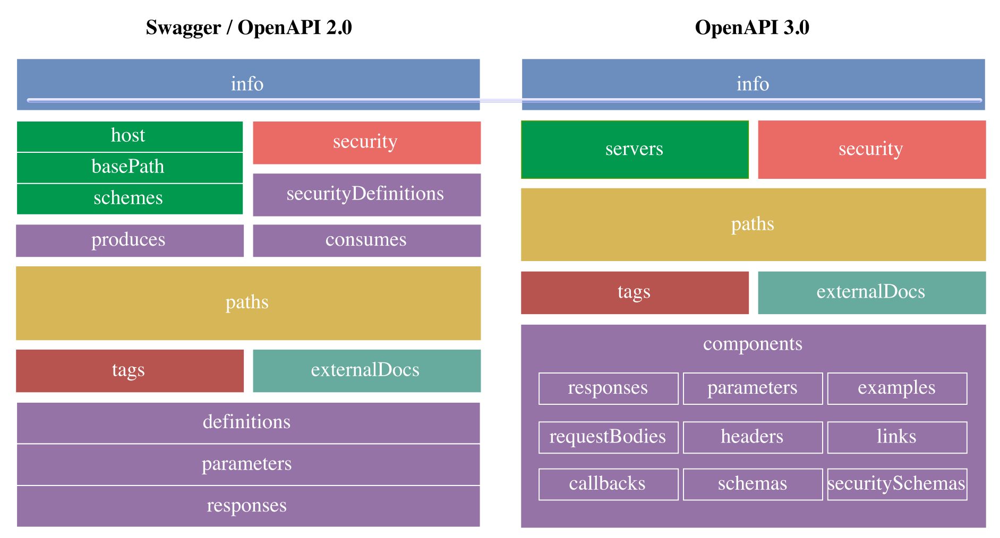

# PRPO zapiski 2. kolokvij
## OpenAPI & Swagger
**Swagger** Specifikacija je de facto standard za opis in dokumenitarnje API-jev, **OpenAPI Specification 3.0** ali **OAS 3.0** pa je nova specifikacija, ki predstavlja pomemnben mejnik pri rasti API ekonomije, ki omogoča opis in dokumentiranje APIjev, ki so razviti po trenutno najboljših praksah.

### primerjava Swagger(OAS 2.0) proti novemu OAS 3.0
</img>

#### sprememba formata
"Swagger" je bil preimenovan v "OpenAPI", med drugim pa nova verzija uporablja tudi *boljše* "**Semver**" verzioniranje: 3.0.0 (nova) namesto 2.0 (stara).
#### opis URL-jev
##### Swagger 2.0
omogoča definiranje posamezne sheme (*scheme*), naslov gostitelja (*host*) in osnovni URL APIja (*baseUrl*)
```yaml
info:
  title: Uber API
  description: uber Uber API
  version: 1.0.0
host: api.uber.com
schemes: [http, https]
basePath: /v1
```
##### OAS 3.0
omogoča definiranje **večih** URLjev - lahko jih definiramo na **nivoju APIja** ali na **nivoju kočne točke**
```yaml
info:
  title: UberAPI
  description: Uber Uber API
  version "1.0.0"
servers:
  - url: https://{subdomain}.uber.com/{version}
    description: The main production server
    variables:
      subdomain: 
        default: api
      version:
        enum:
          - v1
          - v2
        default: v2
```
#### Komponente
##### Swagger 2.0
uporablja *koncept definicij*, ki ni bil dobro definiran
##### OAS 3.0
Standardiziran koncept **komponent**, ki so **definicijski objekti**, ki jih lahko uporabimo na več lokacijah
#### Format Zahtevkov
##### Swagger 2.0
Opis formata telesa z ```body``` ali ```formData``` tipom
```yaml
/products/{productId}:
  post:
    parameters:
      - name: product
        in: body
        description: product to update
        schema:
          $ref: '#/definitions/Product'
      - name: productId
        in: path
        description: ID of product to update
        required: true
        type: string
```
##### OAS 3.0
Opis telesa podamo z namenskim objektom ```requestBody``` ( v katerega je pridružen tudi ```formData``` ), 
```yaml
/products/{productId}:
  post:
    requestBody:
      description: product to update in the system
      required: true
      content:
        application/json:
          schema:
            type: array
            items:
              $ref: '#/components/schemas/Product'
    parameters:
      - name: productId
        in: path
        description: ID of product to update
        required: true
        schema:
          type: string
```
omogoča pa tudi definiranje odgovorov za določeno zahtevo. Uporabljamo lahko tudi *wildcarde*, npr ```status: 4XX```.
```yaml
...
    callbacks:
      productUpdated:
        '{$request.body#/updatedUrl}':
          post:
            requestBody:
              description: 'Updated product.'
              required: true
              content:
                application/json:
                  schema:
                    $ref: '#/components/schemas/Product'
            responses:
              '200':
                description: webhook processed!
```
#### Povezave (*links*) [OAS3.0]
Omogočajo opis, kako lahko *različne vrednosti*, ki jih vrne neka operacija, *uporabimo kot vhod* pri neki drugi operaciji (**definirajo razmerja in mehanizem za prehajanje med operacijami**).
```yaml
...
   responses:
     '201':
       description: Created
       content:
         ...
       ...
       links:
         GetProductById:
           operationId: getProduct #povežemo preko id-ja
           parameters:
             productId: '$response.body#/id'

/products/{productId}:
  get:
    summary: Product details
    operationId: getProduct #uporabimo za identifikacijo
    parameters:
      - name: productId
        in: path
        description: ID of product to update
```


    
