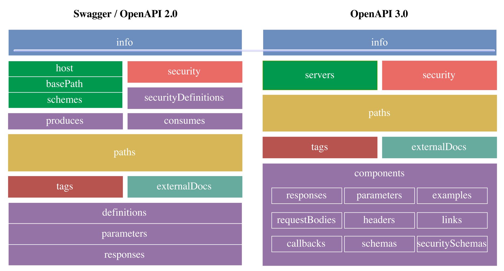

# OpenAPI & Swagger
**Swagger** Specifikacija je de facto standard za opis in dokumenitarnje API-jev, **OpenAPI Specification 3.0** ali **OAS 3.0** pa je nova specifikacija, ki predstavlja pomemnben mejnik pri rasti API ekonomije, ki omogoča opis in dokumentiranje APIjev, ki so razviti po trenutno najboljših praksah.

### primerjava Swagger(OAS 2.0) proti novemu OAS 3.0


#### sprememba formata
"Swagger" je bil preimenovan v "OpenAPI", med drugim pa nova verzija uporablja tudi *boljše* "**Semver**" verzioniranje: 3.0.0 (nova) namesto 2.0 (stara).
#### opis URL-jev
##### Swagger 2.0
omogoča definiranje posamezne sheme (*scheme*), naslov gostitelja (*host*) in osnovni URL APIja (*baseUrl*)
```yaml
info:
  title: Uber API
  description: uber Uber API
  version: 1.0.0
host: api.uber.com
schemes: [http, https]
basePath: /v1
```
##### OAS 3.0
omogoča definiranje **večih** URLjev - lahko jih definiramo na **nivoju APIja** ali na **nivoju kočne točke**
```yaml
info:
  title: UberAPI
  description: Uber Uber API
  version "1.0.0"
servers:
  - url: https://{subdomain}.uber.com/{version}
    description: The main production server
    variables:
      subdomain: 
        default: api
      version:
        enum:
          - v1
          - v2
        default: v2
```
#### Komponente
##### Swagger 2.0
uporablja *koncept definicij*, ki ni bil dobro definiran
##### OAS 3.0
Standardiziran koncept **komponent**, ki so **definicijski objekti**, ki jih lahko uporabimo na več lokacijah
#### Format Zahtevkov
##### Swagger 2.0
Opis formata telesa z ```body``` ali ```formData``` tipom
```yaml
/products/{productId}:
  post:
    parameters:
      - name: product
        in: body
        description: product to update
        schema:
          $ref: '#/definitions/Product'
      - name: productId
        in: path
        description: ID of product to update
        required: true
        type: string
```
##### OAS 3.0
Opis telesa podamo z namenskim objektom ```requestBody``` ( v katerega je pridružen tudi ```formData``` ), 
```yaml
/products/{productId}:
  post:
    requestBody:
      description: product to update in the system
      required: true
      content:
        application/json:
          schema:
            type: array
            items:
              $ref: '#/components/schemas/Product'
    parameters:
      - name: productId
        in: path
        description: ID of product to update
        required: true
        schema:
          type: string
```
omogoča pa tudi definiranje odgovorov za določeno zahtevo. Uporabljamo lahko tudi *wildcarde*, npr ```status: 4XX```.
```yaml
...
    callbacks:
      productUpdated:
        '{$request.body#/updatedUrl}':
          post:
            requestBody:
              description: 'Updated product.'
              required: true
              content:
                application/json:
                  schema:
                    $ref: '#/components/schemas/Product'
            responses:
              '200':
                description: webhook processed!
```
#### Povezave (*links*) [OAS3.0]
Omogočajo opis, kako lahko *različne vrednosti*, ki jih vrne neka operacija, *uporabimo kot vhod* pri neki drugi operaciji (**definirajo razmerja in mehanizem za prehajanje med operacijami**).
```yaml
...
   responses:
     '201':
       description: Created
       content:
         ...
       ...
       links:
         GetProductById:
           operationId: getProduct #povežemo preko id-ja
           parameters:
             productId: '$response.body#/id'

/products/{productId}:
  get:
    summary: Product details
    operationId: getProduct #uporabimo za identifikacijo
    parameters:
      - name: productId
        in: path
        description: ID of product to update
```
#### Varnost [OAS 3.0]
OpenApi 3.0 vključuje tudi podporo za *OpenID Connect*. Preimenovani so tudi *OAuth 2.0* tokovi in hraki jih lahko definiramo **več**.
```yaml
security:
  - keycloak: []
  - apikey: []
components:
  securitySchemes:
    apikey:
      type: apiKey
      name: X-API-Key
      in: header
    keycloak:
      type: openIdConnect
      openIdConnectUrl: https://kumuluzapi-ha.cloud.si/auth/realms/kumuluz-api/.well-known/openid-configuration
```
### Orodja Swagger in podpora za OpenAPI 3.0
Swagger nudi orodja s podporo za OpenAPI specifikaijo
- **Swagger Editor** - urejevalnik specifikaije
- **Swagger Codegen** - generator kode na podlaki specifikacije
- **Swagger UI** - prikaz dokumentacije
- **Swagger Core** - strežniška integracija za generiranje OAS
- **Swagger Parser** - OAS to Java POJOs

#### OpenAPI 3.0 v Javi (JAX-RS)
knjiznjiza **Swagger-Core 2.0.X** podpira generiranje OAS 3.0 definicijskih datotek na podlagi **anotacij**, ki so grupirane v:
- Operations:
  - **@Operation** - opis operacije
  - **@RequestBody** - opis vsebine zahtevka operacije
  - **@ApiResponse** - opis vsebine odgovora operacije
  - **@Callback** - opis množice zahtevkov
  - **@Parameter** - opis parametra operacije
  - **@Link** - design-time opis povezave odgovora
  - **@LinkParameters** - opis povezave
  - **@Content** - shema in primeri odgovora
  - **@Schema** - definicija vhodnih in izhodnih podatkov.
- Schemas
- Info:
  - **@Info** - splošni metapodatki za OpenAPI definicijo
  - **@Contact** - podatki kontaktne osebe
  - **@License** - informacije o licenci
  - **@Extension** - opis razširitve
  - **@ExtensionProperty** - opis lastnosti razširitve
- Security:
  - **@SecurityRequirement** – seznam zahtevanih varnostnih shem za izvedbo operacije
  - **@SecurityScheme** – definicija varnostne sheme
  - **@OAuthFlow** – opis podrobnosti podprtega OAuth toka
  - **@OAuthFlows** – konfiguracija podprtih Oauth tokov

### OAS 2.0 (SWAGGER)
  > **definicija:** Standardna specifikacija za opisovanje in dokumentiranje REST API-jev v obliki razumljivi človeku **in** računalniku. Predstavlja **orodje** za implementacijo, uporabo in vizualizacijo REST API-jev
  
OAS omogoča formalno predstavitev REST API-jev v **yaml** ali **json** in ne zahteva *refaktoriranja obstoječe implmentacije* ter ne določa nekega *razvojnega procesa* (kot npr. *'design-first'* ali *'code-first'*)

Osrednji elementi OAS za nek REST API so:
- **Swagger Object** - korenski objekt API specifikaije, ki vsebuje glavne info. o APIju
- **Path Object** - vsebuje definicije relativnih poti posameznih končnih točk
  - **Path Item Object** - definira operacije, ki so na voljo na neki poti
  - **Operation Object** - definira API operacijo na neki poti
  - **Parameter Object** - definira vhodne parametre operacije
  - **Responses ovject** - definira pričakovane odgovre operacije
- **Schema Object** - vsebuje definicije vhodnih in izhodnih podatkovnih tipov
#### Implementacija
OAS lahko implementiramo
- **ročno** - s pripravo specifikacije v formatu **json** ali **yaml** (format *YAML* je **nadmnožica** foramta *JSON*)
- **programsko** - z uporabo ustreznih **anotacij**

OAS za REST API navadno pišemo v samostojno datoteko, poimenujemo pa jo **/swagger.(yaml|json)/** (odvisno od formata, ki ga uporabljamo).
OpenAPI podpira standarden nabor primitivnih podatkovnih tipov, OpenAPI shema pa definira več polj:
| ime polja | tip | opis |
|-----------|-----|------|
| **swagger** | string | verzija uporabljene OpenAPI specifikacije |
| **info** | Info Obj | Metapodatki API-ja |
| host | string | Naslov gostitelja |
| basePath | string | Osnovni del poti na kateri je izpostavljen API (relativen glede na gostitelja) |
| schemes | [string] | Transportni protokol (http, https, ws, wss) |
| consumes | [string] | Seznam MIME tipov, katere lahko prejme API |
| produces | [string] | Seznam MIME tipov, katere lahko API vrne kot odgovor |
| **paths** | Paths Object | obstoječe poti virov in operacija API-ja |
| definitions | Definitions Object | Podatkovni objekti, ki prejemajo ali vračajo operacije |

V zgornji tabeli se fokusirajmo na **Paths Object**, ki ga uporablja polje **paths**. Ta vsebuje vse poti do virov, ki lahko vsebujejo po več različnih **operacij**:
| ime polja | tip | opis |
| -- | -- | -- |
| tags | [string] | Seznam oznak operacije |
| summary | string | Povzetek operacije |
| description | string | Opis operacije in njenega delovanja |
| parameters | [Parameter Object | Reference Object ] | Seznam podatkovnih tipov, ki jih lahko prejme operacija |
| **responses** | Responses Object | Seznam odgovorov, ki jih lahko operacija vrne v odgovor |
```yaml
paths:
  /products:
    get:
      tags:
        - Products
      summary: Product Types
      description: my description
      parameters:
        - name: latitude
          in: query
          description: Latitude component of location
          required: true
          type: number
          fomrat: double
        - name: ...
          ...
      responses:
        200:
          description: success
          schema:
            $ref: '#/definitions/Error'
```
#### Swagger generator kode
Na podlagi OAS je mogoče s pomočjo orodja **Swagger Codegen** generirati ogrodje kode na strani strežnika in odjemalca v več različnih programskih jezikih ( C#, Go, Haskell, Java, NodeJS ...)
#### Definiranje z Anotacijami
najprej je treba uvozit knjiznjico *swagger-core*
```mvn
<dependency>
  <groupId>io.swagger</groupId>
  <artifactId>swagger-core</artifactId>
  <version>${verzija}</version>
</dependency>
```
##### Anotacije knjižnjice swagger-core
| Anotacija | Opis |
| -- | -- |
| @Api | Anotacija za označevanje virov |
| @ApiImplicitParam | Anotacija za označevanje parametra operacije |
| @ApiImplicitParams | Anotacija za označevanje seznama parametrov operacije |
| @ApiModel | Anotacija za zagotavljanje dodatnih informacij o podatkovnih modelih |
| @ApiModelProperty | Anotacija za urejanje polj podatkovnih modelov |
| @ApiOperation | Anotacija za opis operacije oz. HTTP metode |
| @ApiParam | Anotacija za zagotavljanje dodatnih metapodatkov parametrov operacije |
| @ApiResponse | Anotacija za navajanje možnega odgovora operacije |
| @ApiResponses | Anotacija za navajanje seznama možnih odgovorov operacije. |
| @Authorization | Anotacija za deklaracijo avtorizacijske sheme na viru ali operaciji |
| @AuthorizationScope | Anotacija za opis obsega delovanja OAuth2 avtorizacije |
| @ResponseHeader | Anotacija za predstavitev možnih glav odgovorov |

Zraven zgornjih naštetih je mogoče v najnovejši verziji OpenAPI uporabiti tudi naslednje:

| Anotacija | Opis |
| -- | -- |
| @SwaggerDefinition | Anotacija za zagotavljanje splošnih inforamcij dokumentacije Swagger |
| @Info | Anotacija za zagotavljanje osvnonih meta podatkov |
| @Contact | Anotacija za zagotavljanje informacij kontaktne osebe |
| @License | Anotacija za opis licence |
| @Extension | Anotacija za dodajanje razširitev z dodatnimi informacijami |
| @ExtensionProperty | Anotacija za dodajanje polj posameznim razširitvam |

##### Uporaba anotacij
Najbolj pomembna je anotacija ```@Api``` in je obvezna za definicijo API vira (definira lastnosti operacij, ki so definirane znotraj vira.)
```java
@Path("/razmerja")
@Api(value = "razmerja", authorizations = { @Authorization(value="sampleoauth", scopes = {}) })
@Produces({"application/json", "application/xml"})
public class RazmerjaResource {
  ...
}
```
Anotacija ```@ApiOperation``` se uporablja za **opis** posamezne operacije, kjer je operacija definirana kot <u>unikatna kombinacija *poti* in *HTTP metode*</u>
```java
@GET
@ApiOperation(
  value = "vrniRazmerja",
  notes = "Operacija vrne seznam razmerij. Operacija podpira ostranjevanje rezultatov",
  response = Razmerje.class,
  responseContainer = "List"
)
public Response vrniRazmerja(...) { ... }
```
Anotaciji ```@ApiResponses``` in ```@ApiResponse``` se uporabljata za opis odgovorov, ki niso splošni (večinoma napake)
```java
@ApiResponses(
  value = {
    @ApiResponse(
      code = 400, 
      message = "ID ni pravilen",
      responseHeaders = @ResponseHeader(
        name = "X-RackCache", 
        description = "Pojasni ali je bil uporabljen predpomnilnik", 
        response = Boolean.class
      )
    ),
    @ApiResponse(
      code = 404, 
      message = "Razmerje not found"
    ) 
  }
)
public Response getRazmerjeById(...) {...}
```
Anotaciji ```@Authorization``` in ```@AuthorizationScope``` se uporabljata v okviru anotacij *@Api* in *@ApiOperation*. Z njima označimo, kateri avtorizacijski mehanizem se uporablja na viru ali opraciji
```java
@ApiOperation(
  value = "Dodaj novo razmerje",
  authorizations = {
    @Authorization(
      value="razmerjeoauth",
      scopes = { @AuthorizationScope(scope = "add:razmerje") }
    )
  }
)
public Response dodajRazmerje (...) {...}
```
Anotacija ```@ApiParam``` se uporabi v kombinaciji z anotacijami ```@PathParam```, ```@QueryParam```, ```@HeaderParam```, ```@FromParam```, ```@BeanParam``` za podrobnejši opis parametrov.
```java
@Path("/{username}")
@ApiOperation(
  value = "Updated user", notes = "This can only be done by the logged in user."
)
public Response updateUser(
  @ApiParam(value = "name that need to be updated", required = true) @PathParam("username") String username,
  @ApiParam(value = "Updated user object", required = true) User user)
{...}
```
Anotaciji ```@ApiImplicitParam``` in ```@ApiImplicitParams``` uporabimo v primeru *Servletov* (to je takrat, ko ne uporabljamo JAX-RS anotacij)
```java
@ApiImplicitParams({
  @ApiImplicitParam(
    name = "name", 
    value = "User's name",
    required = true,
    dataType = "string",
    paramType = "query"
  ),
  @ApiImplicitParam(
    name = "email", 
    value = "User's email",
    required = false,
    dataType = "string",
    paramType = "query"
  ),
  @ApiImplicitParam(
    name = "id",
    value = "User ID",
    required = true,
    dataType = "long", 
    paramType = "query"
  ) 
})
public void doPost( HttpServletRequest request, HttpServletResponse response) throws ServletException, IOException {...}
```
Anotacijo ```@ResponseHeader``` uporabimo za podrobnejši opis glav v odgovoru. Dodamo jo v **@ApiOperation** ali **@ApiResponse**.

Z uporabo anotacije ```@ApiModel``` lahko manipuliramo metapodatke nekega modela.
```java
@ApiModel(value ="Zavarovanje", subTypes = {PokojninskoZavarovanje.class}) 
public class Zaposleni{ }
```
Dodaten opis in nadzor opisa lastnosti pa omogoča anotacija ```@ApiModelProperty```
```java
@ApiModelProperty(value = ”Status uporabnika", allowableValues = "active,disabled")
public String getStatus() { return status; }
```
Anotacija ```@SwaggerDefiniton``` omogoča definiranje splošnih lastnosti API-ja. Lahko jo uporabimo v kateremkoli razredu, ki je skeniran ob generiranju
```java
@SwaggerDefinition(
  info = @Info(
    description = "API za upravljanje razmerij", 
    version = "v1.0.0",
    title = "RzmerjaAPI", 
    termsOfService = "http://api.kumuluz.com/terms.html",
    contact = @Contact( 
      name ="Zvone Gazvoda", 
      email = "zvone.gazvoda@kumuluz.com", 
      url = "http://api.kumuluz.com" 
    ), 
    license = @License(
      name = "Apache 2.0", 
      url = "http://www.apache.org/licenses/LICENSE-2.0" 
    )
  ),
  consumes = {"application/json", "application/xml"},
  produces = {"application/json", "application/xml"},
  schemes = {SwaggerDefinition.Scheme.HTTP, SwaggerDefinition.Scheme.HTTPS},
  tags = {
    @Tag(
      name = "Private", 
      escription = "Tag used to denote operations as private"
    )
  },
  externalDocs = @ExternalDocs(
    value = "Meteorology", 
    url ="http://api.kumuluz.com/razmerja.html"
  ) 
)
public interface RazmerjaApiConfig { }
```

#### Generiranje in izpostavitev OAS
Če imamo celotno zadevo pravilno anotirano, lahko našo specifikacijo
- integriramo v sam API ob namestitivi v ivajalno okolje *ali*
- generiramo ob grandji projekta samega

Dokumentacijo APIja integriramo v App takole:
1. V projekt dodamo ustrezne Swagger odvisnosti
2. Swagger integriramo v konfiguracijo JAX-RS aplikacije
3. Konfiguriramo in inicializiramo Swagger

Swagger odvisnosti:
```maven
<dependency>
  <groupId>io.swagger</groupId>
  <artifactId>swagger-jersey2-jaxrs</artifactId>
  <version>1.5.0</version>
</dependency>
```
Swagger-core lahko z JAX-RS Aplikacijo **integriramo** na več načinov:
- Package scanning / Concrete class selection
- Lasten Application podrazred

Inicializacijo lahko izvedemo na dva načine:
- z uporabo Swagger servleta v web.xml *ali*
- z uporabo Swagger BeanConfig, *in sicer*
  - z uporabo Servleta
  - z uporabo lastnega Application podrazreda

