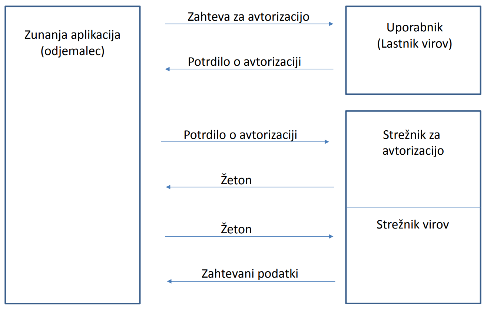

# REST Napredne Teme

## Šifriranje in omejevanja dostopa do storitev
**cilj**: Na storitvah z zaupno vsebino želimo, da so podatki vidni **le končnima točkama** in dovoliti dostop **le določenim uporabnikom**.

Za širfiranje se uporablja **HTTPS**, ki je kombinacija **HTTP** in **TLS** - **Transport Layer Security** protokola in omogoča šifrirano komunikacijo.

## HTTP basic authentication
Sistem avtentikacije z uporabniškim imenom in geslom. 

Ob dostopu do zaščitenega vira dobimo odgovor
```HTTP
HTTP/1.1 401 Access Denied
WWW-Authenticate: Basic realm= "zavarovano"
Content-Length: 0
```
Za avtentikacijo sledi ponovno pošiljanje zahteve, ki vsebuje uporabniško ime in geslo
```HTTP
GET /uporabniki HTTP/1.1
Host: www.prpo.si
Authorization: Basic aHR0cHdhdGNoOmY=
```
> uporabniško ime in geslo sta *zakodirana* (base64)  v headerju *Authorization*

Zaradi prenosa občutljivih podatkov je potrebno **šifriranje** s TLS *(HTTP+TLS=HTTPS)*

## OAuth 2.0
Predstavlja standard za avtentikacijo

Glavne funkcionalnosti:
- **Deljenje uporabnikovih podatkov z zunanjimi aplikacijami brez posredovanja gesla**
- Definiranje podmnožice podatkov, ki so vidni zunanjim aplikacijam
- Že odobren dostop zunanjim aplikacijam je mogoče preklicati
- **dostop do večjega števila aplikacij z enim uporabniškim imenom in geslom**
- Hitrejša registrecija uporabnika v novo aplikacijo

> OAuth 2.0 je uporabljen pri *Google*, *Facebook*, *Microsoft*, *Twitter* ...

### Vloge
| naziv | pomen |
| -- | -- |
| Lastnik virov (**Resource Owner**) | Oseba, ki dovoljuje dostop do svojih podatkov |
| Strežnik virov (**Resource Server**) | Strežnik spodatki, ki jih želimo deliti |
| Strežnik za avtorizacijo (**Authorization server**) | Strežnik, ki je zadolžen za potrjevanje identitete ter upravljanju žetonov |
| Odjemalec (**Client**) | Zunanja aplikacija, ki želi dostopati do uporabnikovih podatkov |

### Potek Avtentikacije


### prednosti OAuth 2.0
- zunanje aplikacije ne hranijo gesel
- Zunanje aplikacije hranijo le žetone, ki jih lahko prekličemo
- Podpora za večino platform
- Zunanji aplikaciji lahko dovolimo dostop le do podmnožice podatkov

## OpenID Connect
Temelji na *OAuth 2.0* in omogoča uporabno **enega uporabniškega računa v več aplikacijah** oz. "**single sign-on**" hkrati pa podpira tudi **upravljanje sej**.


