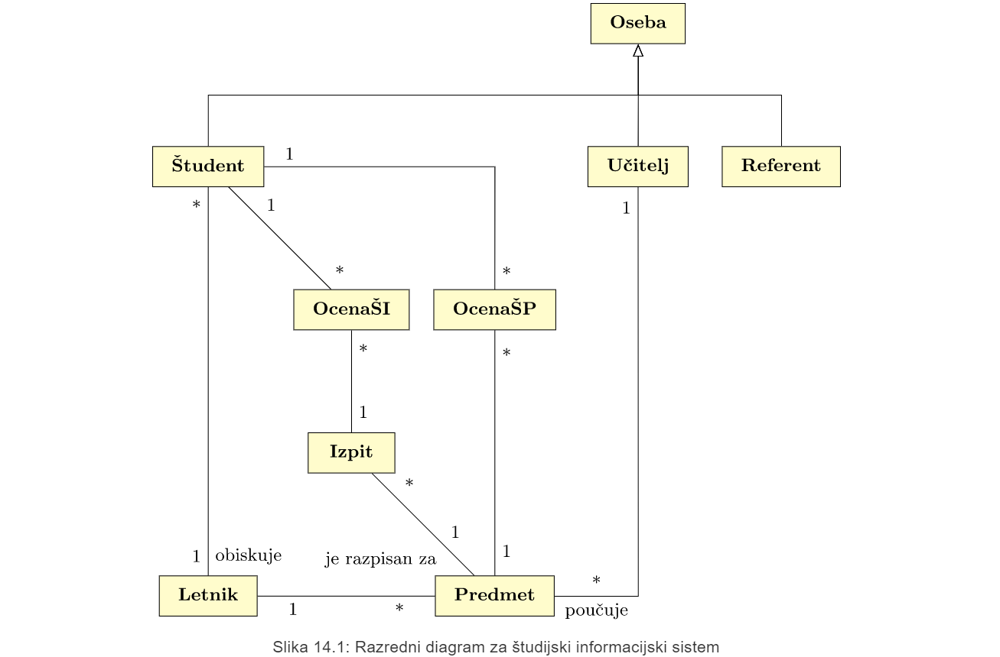
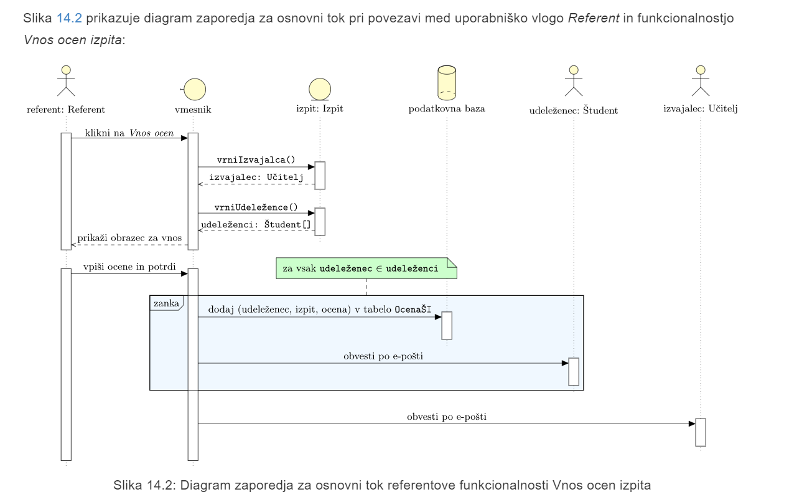
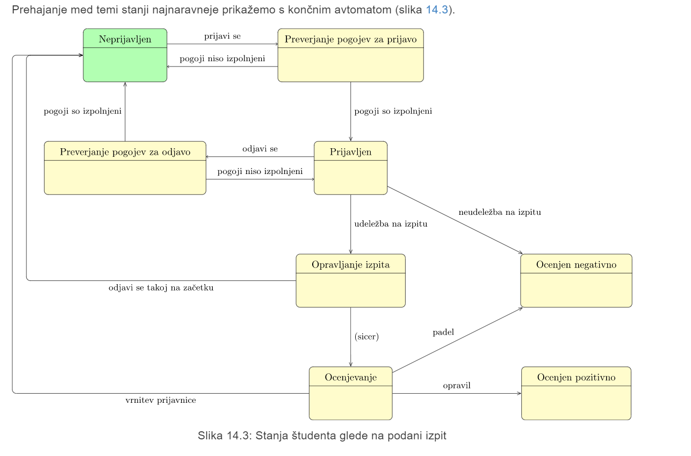
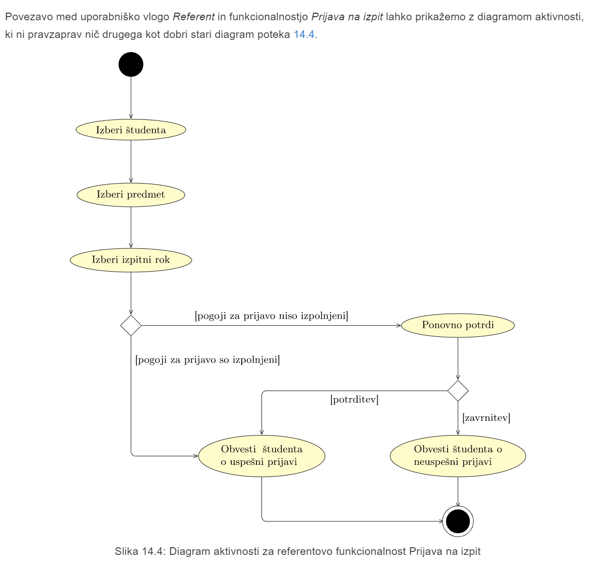

# LP3 Načrt rešitve
# 1.3 Povzetek
## 1.4 Načrt arhitekture sistema:
- <a href="https://github.com/mindOfCaspian/zapiski/tree/main/tpo/III_sklop/P7/#user-content-arhitekturnivzorci">Arhitekturni vzorci P7 </a>
- <a href="https://github.com/mindOfCaspian/zapiski/tree/main/tpo/III_sklop/P7/#user-content-pogledinazasnovoarhitekture">Pogledi na zasvnovo arhitekture P7 </a>

## 1.5 Načrt strukture
- **Razredni diagram**

## 1.6 Načrt obnašanja
Osnova, da ga lahko nardimo je **diagram primerov uporabi z LP2**.

### 1.6.1 **Diagram zaporedja** prikazuje tokove dogodkov (osnovni, alternativni in izjemni) znotraj podanega primera uporabe.

### 1.6.2 **končni avtomat**

### 1.6.3 **Diagram aktivnosti**

## 1.7 Načrtovlaski vzroci
Vsi vzorci k smo jih narisal v LP3 so ubistvu neki <a href="https://refactoring.guru/design-patterns/catalog">načrtovalski vzorci</a>

