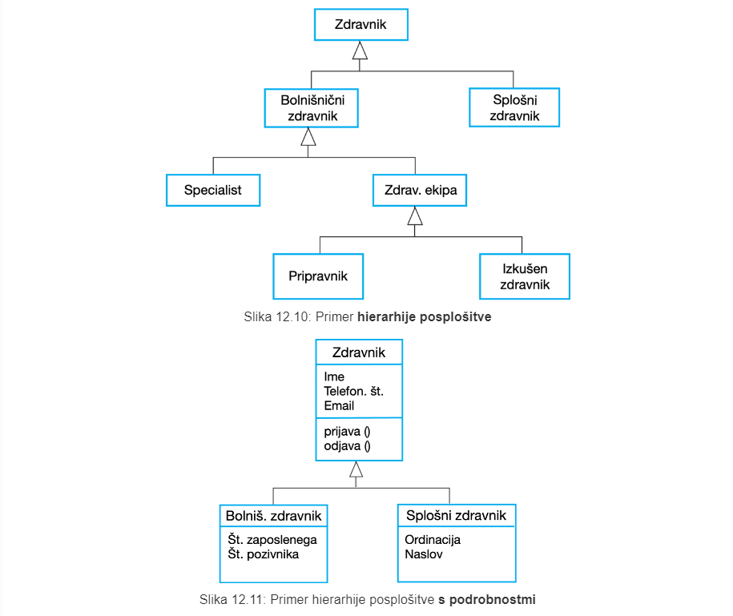

# P6 Načrtoanje sistema
# 1. Uvod
**Načrtovanje sistema** je proces razvijanja abstraktnih modelov sistema, kjer vsak načrt predstavlja drugačen pogled ali perspektivo tega sistema.

Pri načrtovanju sistema se uporablja izbrano grafično notacijo, ki skoraj vedno temelji na zapisu v **jeziku UML *(Unified Modeling Language)***.

## 1.1 Obstoječi in novi sistemski načrt
**Načrt obstoječega sistema** se uporablja pri zajemu zahtev in pomaga pojasniti, kaj obstoječi sistem izvaja in se lahko uporagblja kot podlaga za razpravo o njegovih prednostih in slabostih.

**Načrt novega sistema** se uporablja pri zajemu zahtev kot pomoč pri razlagi predlaganih zahtev drugim deležnikom sistema.

## 1.2 Vdiki sistema
- **Zunanji vidik** - načrtujemo kontekst oz. okolje sistema
- **Vidik sodelovanja** - načrtujemo interakcije med sistemom in njegovim okoljem ali med komponentami sistema
- **Strukturni vidik** - načrtujemo organizacijo sistema ali strukturo podatkov, ki jih sistem obdeluje
- **Vedenjski vidik** - načrtujemo dinamično vedenje sistema in kako se odziva na dogodke

## 1.3 Vrste diagramov UML
- **Diagrami aktivnosti** - prikazujejo aktivnosti, vključene v proces ali obdelavo podatkov
- **Diagrami primerov uporabe** - prikazujejo interakcije med sistemom in njegovim okoljem
- **Diagrami zaporedja** - prikazujejo interakcije med akterji in sistemom ter med komponentami sistema
- **Razredni diagrami** - prikazujejo razrede objektov v sistemu in povezave med temi razredi
- **Diagrami stanj** - prikazujejo, kako se sistem odziva na notranje in zunanje dogodke

## 1.4 Uporaba gradičnih načrtov
Grafični načrti se uporabljajo kot:
- **Sredstvo za lažjo razpravo o obstoječem ali predlaganem sistemu**, kjer so nepopolni ali nepravilni modeli sprejemljivi, saj je njihova vloga predvsem v podpori razprave.
- **Način za dokumentiranje obstoječega sistema**, kjer morajo načrti natančno predstavljati sistem, ni pa nujno, da so popolni
- **Podroben opis sistema**, ki ga je mogoče uporabiti za generiranje implementacije sistema, kjer mora biti načrt pravilen in popoln

# 2 Načrt konteksta
Načrt konteksta se uporablja za ponazoritev operativnega konteksta sistema - prikazuje, **kaj se nahaja zunaj meja sistema**.

## 2.1 Meje sistema
Meje sistema so določene tako, da opredelijo, kaj je znotraj in kaj zunaj sistema. Prikazujejo druge sisteme, ki se uporabljajo ali so odvisni od sistema, ki se razvija.

### 2.1.1 Kontekst sistema Mentcare

## 2.2 Procesni vidik
**Procesni načrt** prikazuje, kako se sitem, ki se razvija, uporablja v širših poslovnih procesih.

### 2.2.1 Načrt procesa neprostovoljnega pridržanja v sistemu Mentcare

# 3 Načrt sodelovanja
Načrtovanje **interakcije z uporabniki** je pomembno, saj pomaga identificirati uporabniške zahteve.

Načrtovanje **interakcije med sistemi** poudarja težave s komunikacijo, ki se lahko pojavijo.

Načrtovanje **interakcije med komponentami** nam pomaga razumeti, ali bo predlagana sistemska struktura omogočila zahtevano zmogljivost sistema in zanesljivost.

## 3.1 Načrtovanje s primeri uporabe
Vsak primer uporabe predstavlja diskretno nalogo, ki vključuje zunanjo interakcijo s sistemom.

### 3.1.1 Primer uporabe prenosa podatkov v sistemu Mentcare

### 3.1.2 Tabelarični opis primera uporabe prenosa podatkov v sistemu Mentcare

### 3.1.3 Primeri uporabe v sistemu Mentcare, ki vključujejo vlogo referenta

## 3.2 Načrtovanje z diagrami zaporedja
Diagrami zaporedja prikazujejo zaporedje medsebojnih interackij, ki se odvijajo med posameznim primerom uporabe ali primerkom primera uporabe.

### 3.2.1 Diagram zaporedja za primer uporae ogled osebnih podatkov sistema Mentcare

### 3.2.2 Diagram zaporedja za primer uporabe prenosa podatkov

# 4 Strukturni načrt
Strukturni načrt prikazuje **organizacijo sistema** v smislu **komponent**, ki ta sistem sestavljajo, in njihovih **medsebojnih razmerij**.

Strukturni načrti so lahko:
- **statični**, ki prikazujejo strukturo načrtovanega sistema
- **dinamični**, ki prikazujejo organizacijo sistema, ko se izvaja

## 4.1 Razredni diagrami
**Razredni diagrami** se uporabljajo pri razvoju načrta objektno usmerjenega sistema za prikaz razredov v sistemu in povezav med temi razredi.

- **Objektni razred** lahko razumemo kot splošno opredelitev določene vrste sistemskega objekta.

- **Asociacija** je povezava med razredi, ki prikazuje obstoj razmerja med temi razredi

### 4.1.1 Primeri razrednih diagramov v sistemu Mentcare

### 4.1.2 Posploševanje
**Posploševanje** oz. **generalizacija** je preprosta tehnika, ki jo uporabljamo za obvladovanje kompleksnosti.

### 4.1.3 Združevanje
Načrt z uporabo **združevanja** oz. **agregacije** prikazuje, kako je razred sestavljen iz množice drugih razredov.

> V semantičnih podatkovnih modelih je pojem združevanja podoben razmerju **"je del"**.

# 5 Načrt vedenja
**Načrt vedenja** predstavlja model dinamičnega obnašanja sistema med izvajanjem.

> prikazuje, kaj se zgodi ali kaj naj  bi se zgodilo, ko se sitem odziva na *spodbude* iz svojega okolja

poznamo dve vrsti *spodbud*:
- na vhod sistema pridejo **podatki**, ki jih mora sistem obdelati
- zgodi se določen **dogodek**, ki sproži procesiranje sistema

## 5.1 Podatkovno usmerjeno načrtovanje
Načrt, ki temelji na podatkih, prikazuje **zaporedje korakov**, ki so potrebni pri obdelavi *vhodnih podatkov* ob generiranju odvisnih *izhodnih podatkov*.

## 5.2 Dogodkovno usmerjeno načrtovanje
Dogodkovno usmerjen načrt prikazuje, kako se sitem odziva na zunanje in notranje dogodke. Temelji na predpostavki, da ima sistem **končno število stanj** in da lahko dogodki (*spodbude*) povzročijo prehod iz enega stanja v drugo.

### 5.2.1 Načrt končnih avtomatov
Načrt končnih avtomatov prikazuje **sistemska stanja** v obliki **vozlišč** in **dogodke** kot **povezave** med temi vozlišči.

**Diagrami stanj** so sestavni deli jezika UML in se uporabljajo za predstavitev načrta končnih avtomatov.

# 6 Načrtno usmerjena izdelava programske opreme
**Načrtno usmerjena izdelava programske opreme oz. MDE (*Model-Driven Engineering*)** je pristop k razvoju programske opreme, kjer so namesto programov **rezultat** razvojnega procesa **načrti** oz. **modeli**.

## 6.1 Uporaba načrtno usmerjene izdelave programske opreme
**Prendnosti**:
- omogoča obravnavo sistema na višji ravni abstrakcije
- samodejno generiranje kode pomeni, da je prilagoditev sistema novi platformi cenejša

**Slabosti**:
- abstraktno načrtovanje, ki ni nujno ustrezno za izvajanje
- prihranki iz naslova samodejnega generiranja kode so lahko nižji od stroškov razvoja prevajalnikov za nove platforme

## 6.2 Načrtno usmerjena arhitektura
**Načrtno usmerjena arhitektura oz. MDA (*Model-Driven Architecture*)** je predhodnica bolj splošne načrtno usmerjene izdelave programske opreme, kjer se za opis sistema uporablja podmnožico modelov jezika UML.

### 6.2.1 Vrste modelov
- **Model, neodvisen od izvajanja oz. CIM (*Computation Independent Model*)** zajema načrt pomembnih abstrakcij problemske domene, ki se uporabljajo v sistemu. CIM včasih imenujemo tudi **domenski model**.
- **Model, neodvisen od platforme oz. PIM (*Platform Independent Model*)** zajema načrt delovanja sistema brez sklicevanja na njegovo implementcijo.
- **Model, odvisen od platforme oz. PSM (*Platform Specific Model*)** predstavlja transformacije modela, neodvisnega od platforme z ločenim PSM za vsako izbrano aplikacijko platformo.

Transformacije med različnimi vrstami modelov:

Prednost uporabe načrtno usmerjene arhitekture, kjer lahko iz enega modela, neodvisnega od platforme (PIM), generiramo več modelov, odvisnih od platforme:

### 6.2.2 Agilne metode in MDA

Pobudniki pristopa MDA trdijo, da je le-ta namenjen podpori iterativnemu pristopu k izdelavi programske opreme in se lahko uporablja tudi z agilnimi metodami.

### 6.2.3 Sprejetost MDA
Za pretvorbo iz modelov iz ene ravni v drugo je potrebna **podpora specializiranega orodja** (omejena dostopnost).

Za **sisteme z dolgo življensko dobo**, ki so razviti z uporabo MDA, podjetja zelo nerada razvijajo lastna orodja ali se zanašajo na manjđa podejtja, ki lahko v tem obdobju prenehajo delovati.

Pri najbolj kompleksnih sistemih **implementacija ni največja težava**, ampak je veliko bolj problematilno:
- zajem zahtev
- varnost in zanesljivost
- integracija z obstoječimi sistemi
- testiranje

# 7 Zaključne ugotovitve
- **Model** je abstrakten pogled na sistem, ki ne upošteva vseh sistemskih podrobnosti. S pomočjo dodatnih modelov načrta lahko prikažemo kontekst sistema, sodelovanje, strukturo in vedênje.
- **Načrt konteksta** prikazuje, kako je načrtovani sistem postavljen v okolje z drugimi sistemi in procesi.
- **Diagrami primerov uporabe** in **diagrami zaporedja** se uporabljajo za opis sodelovanja med uporabniki in sistemi v načrtovanem sistemu. Primeri uporabe opisujejo interakcije med sistemom in zunanjimi akterji, diagrami zaporedja jim dodajo še več informacij tako, da prikažejo interakcije med objekti sistema.
- **Strukturni načrt** prikazuje organizacijo in arhitekturo sistema. Razredni diagram se uporablja za opredelitev statične strukture razredov v sistemu in njihove asociacije.
- **Načrt vedênja** se uporablja za opis dinamičnega obnašanja izvajalnega sistema. To vedênje je mogoče modelirati z vidika podatkov, ki jih sistem obdela, ali dogodkov, ki spodbujajo odzive sistema.
- **Diagram aktivnosti** se lahko uporabi za modeliranje obdelave podatkov, kjer vsaka aktivnost predstavlja en procesni korak.
- **Načrt končnih avtomatov** se uporablja za modeliranje vedênja sistema kot odziv na notranje ali zunanje dogodke.
- **Načrtno usmerjena izdelava programske opreme** je pristop k izdelavi programske opreme, kjer je sistem predstavljen kot množica modelov, ki jih je mogoče samodejno pretvoriti v izvršljivo kodo.

