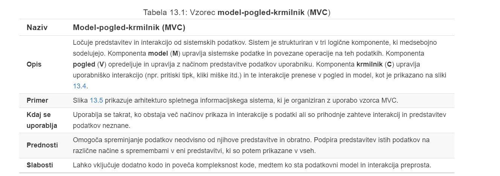

# P7 Zasnova arhitekture
# 1. Uvod
Pri **zasnovi arhitekture** se ukvarjamo z razumevanjem, kako bi bilo treba organizirati programsko opremo in oblikovati celotno strukturo tega sistema.

Rezultat zasnove arhitekture je **načrt arhitekture**, ki opisuje, kako je sistem organiziran kot sklop sodelujočih komponent.

## 1.1 Agilnost in arhitektura
Pri agilnih pristopih se v zgodnji fazi ukvarjamo prav z načrtovanjem celovite arhitekture sistemov.

## 1.2 Posploševanje arhitekture
- **Arhitektura v ožjem kontekstu** se ukvarja z arhitekturo posameznih programov.
- **Arhitektura v širšem kontekstu** zadeva arhitekturo kompleksnih poslovnih sistemov.

## 1.3 Prednosti nedvoumne arhitekture
- pri **komuniciranju z deležniki** lahko arhitekturo uporabimo kot osrednjo temo razprave
- možno je izvesti **sistemsko analizo**, kjer preverimo, ali lahko zadostimo nefukncionalnim zahtevam
- arhitektura se lahko **ponovno uporabi** v različnih sistemih.

## 1.4 Predstavitev arhitekture
Za dokumentiranje arhitekture programske opreme se najbolj pogosto uporabljajo enostavni, neformalni **blokovni diagrami**, ki prikazujejo entitete in razmerja.

## 1.5 Uporaba načrta arhitekture
- **način za lažjo razpravo o načrtu sistema** - *deležniki razumejo abstrakten pogled na sistem. O sistemu se je mogoče pogovarjati kot o celoti, ne da nas zmedejo podrobnosti*
- **način dokumentiranja načrtovane arhitekture** - *cilj je izdelati popoln model sistema, ki prikazuje različne komponente sistema, njihove vmesnike in njihove medsebojne povezave*

# 2. Odločitve pri zasnovi arhitekture
Načrtovanje arhitekture je **ustvarjalni proces**, zato se postopek razlikuje glede na vrsto sistema, ki se razvija.

## 2.1 Ponovna uporaba arhitekture
- Sistemi v isti problemski domeni imajo pogosto **podobno arhitekturo**, ki doraža domenske koncepte.

- Produktna linija aplikacij je zgrajena okrog jedrne arhitekture z različicami, ki zadovoljujejo določene zahteve strank.

- Arhitektura sistema je lahko zasnovana okoli enega od več arhitekturnih vzorcev ali stilov. Le-ti zajemajo bistvo arhitekture in jih lahko uporabimo na različne namene

## 2.2 Arhitektura in značilnosti sistema
- **Zmogljivost** - *lokalizacija kritičnih operacij, zmanjševanje medsebjne komunikacije, uporaba splošnih in ne podrobnih komponent.*
- **Varnost** - *uporaba večplastne arhitekture, lokaliziranje varnostno kritičnih funkcij v majhnem številu podsistemov.*
- **Razpoložljivost** - *vključevanje redundantnih komponent in mehanizmov za toleranco pri okvarah*
- **Vzdržljivost** - *uporaba zamenljivih komponent na nizki ravni podrobnosti*

# 
 3. Pogledi na zasnovo arhitekture 

Sprašujemo se:
- kateri **pogledi** ali **perspektive** so **uporabne** pri oblikovanju in dokumentiranju sistema?
- katere **zapise** oz. **notacije** je treba uporabiti za opis arhitekturnih modelov?

Vsak akhitekturni vzorec **prikazuje samo en pogled** ali perspektivno sistema, in sicer:
- kako je sistem razčlenjen na module
- kako procesi med izvajanjem medsebojno delujejo ali
- različne načine, na katere so sistemske komponente razdeljene po omrežju

pri načrtovanju in dokumentiranju je treba po navadi **predstaviti več pogledov na arhitekturo programske opreme**

**Logični pogled** prikazuje *ključne abstrakcije* v sistemu v obliki *objektov oz. razredov*. 
> predstavljene entitete logičnega pogleda mora biti mogoče povezati s sistemskimi zahtevami.

**Procesni pogled** prikazuje, kako je sistem sestavljen iz povezanih procesov v času izvajanja. 
> koristen za presojo ustreznosti sistema z vidika nefukncionalnih zahtev (zmogljivost, dosegljivost, ...)

**Razvojni pogled** prikazuje, *kako je programska oprema sestavljena pri razvoju*. Prikazuje razdelitev programske opreme *v komponente*, ki jih kasneje razvija posamezen razvijalec oz. razvojna skupna.
> koristen za vodje razvoja in programerje

**Fizični pogled** prikazuje *sistemsko strojno opremo* in *kako bo programska oprema porazdeljena po procesorjih v sistemu*.
> koristen za sistemske inženirje, ki načrtujejo namestitev sistema

## 3.1 Predstavitev pogledov na arhitekturo
Ker UML ne podpira abstrakcij, primernih za opis sistema na visoki ravni, so nastali opisni jeziki arhitekture (**ADL**), ki pa se ne uporabljajo pogosto.

# 
 4. Arhitekturni vzorci 

**Vzorec** je sredstvo za predstavitev, izmenjavo in ponovno uporabo znanja.

**Arhitekturni vzorec** je stiliziran opis dobre načrtovalske prakse, ki je preizkušena v različnih okoljih.

## 4.1 Vozrec model-pogled-krmilnik (MVC)

## 4.2 Večplastna arhitektura
**Večplastna arhitektura** se uporablja za načrtovanje povezovanja podsistemov.

## 4.3 Arhitektura repozitorija
Podsistemi morajo med seboj izmenjavati podatke, kar lahko dosežemo na dva načina:
- Skupni podatki se hranijo v **osrednji shrambi podatkov** ali **repozitoriju** in do njih lahko dostopajo vsi podsistemi
- Vsak podsistem vzdržuje svojo **lastno bazo podatkov** in podatke izrecno posreduje drugim podsistemom

## 4.4 Arhitektura odjemalec/strežnik
**Arhitektura odjemalec/strežnik** je model porazdeljenega sistema, ki prikazuje, kako so podatki in obdelava podatkov porazdeljeni po različnih komponentah.
> se lahko izvaja na enem računalniku

## 4.5 Arhitektura cev in filter
Pri **arhitekturi cev in filter** funckionalne transformacije obdelujejo svoje vhode, da vrnejo rezultat na izhodu. Kadar imamo opravka z zaporednimi transformacijami, gre za **serijski sekvenčni model**, ki se pogosto uporablja v sistemih za obdelavo podatkov.

# 5. Arhitekture aplikacij
**Generična arhitektura aplikacij** je arhitektura za tip programske opreme, ki se lahko konfigurira tako, da ustvarimo sistem, ki ustreza posebnim zahtevam.

## 5.1 Uporaba arhitektur aplikacij
- kot izhodišče za zasnovo arhitekture
- kot kontrolni sistem pri načrtovanju
- kot način organiziranja dela razvojne skupine
- kot sredstvo za ocenjevanje komponent za ponovno uporabo
- kot slovar pri pogovoru o vrstah aplikacij

## 5.2 Vrste aplikacij
- **Sistem za obdelavo podatkov** je podatkovno usmrejen in obdeluje podatke v paketih brez izrecnega posredovanja uporabnika med obdelavo.

- **Sistem za obdelavo transakcij** je osredotočen na podatke, ki obdelujejo zahteve uporabnikov in posodabljajo informacije v podatkovni bazi sistema.

- **Sistem za obdelavo dogodokov** predstavlja aplikacijo, kjer so sitemska dejanja odvisna od interpretacije dogodkov iz okolja sistema.

- **Sistem za obdelavo jezika** je aplikacija, kjer so uporabniške zahteve v formalnem jeziku, ki ga sistem obdeluje in interpretira.

## 5.3 Sistem za obdelavo transakcij
**Sistem za obdelavo transakcij** procesira zahteve uporabnikov po informacijah iz podatkovne baze ali zahteve za posodobitev podatkovne baze.

z vidika **uporabnika** velja:

*"**Transakcija** je vsako skladno zaporedje operacij, ki izpolnjuje cilj (npr. poišči čase odhodov letal iz Ljubljane do Madrida)*

## 5.4 Informacijski sistem
**Informacijski sistem** omogoča nadzorovan dostop do velike količine informacij in skoraj vedno gre za spletne sisteme, kjer je uporabniški vmesnik implementiran v spletnem brskalniku.

## 5.5 Spletni informacijski sistemi
**Sistem za upravljanje informacij in virov** so zdaj ponavadi spletni sistemi, kjer so uporabiški vmesniki implementirani v spletnem brskalniku.

Spletni sistemi so pogosto implementirani v obliki večplastne odjemalec/strežnik arhitekture
- **Spletni strežnik** je odgovoren za vso komunikacijo z uporabnikom in je implementiran v spletnem brskalniku

- **Aplikacijski strežnik** je odgovoren za izvajanje logike aplikacije, kot tudi za shranjevanje informacij in izpolnjevanje zahtev po pridobivanju informacij

- **Podatkovni strežnik** skrbi za prenos informacije v podatkovno bazo in iz nje. Obravnava tudi upravljanje transakcij.

## 5.6 Sistem za obdelavo jezika
**Sistem za obdelavo jezika** na vhodu sprejme naravni ali umetni jezik in to pretvori v drugo predstavitev tega jezika.

### 5.6.1 Komponente prevajalnika
Komponente prevajalnika, ki jih uporabimo v obliki arhitekture repozitorija ali arhitekture cev in filter, so:
- **Leksikalni analizator**
- **Tabela simbolob**
- **Sintaktični analizator**
- **Razčlenitveno sintaktično drevo**
- **Semantični analizator**
- **Generator kode**

# 6. Zaključne ugotovitve

- **Arhitektura programske opreme** opisuje organizacijo sistema programske opreme.  

- **Odločitve pri zasnovi arhitekture** so odločitve o vrsti aplikacije, porazdelitvi sistema, uporabljenih arhitekturnih slogih itd.  

- Arhitektura se lahko **dokumentira iz več različnih pogledov**, kot so logični ali fizični pogled in pogled razvoja ali procesa.  

- S pomočjo **arhitekturnih vzorcev** ponovno uporabimo znanje o generičnih sistemskih arhitekturah. Arhitekturo opisujejo in pojasnjujejo, kdaj jo lahko uporabimo, ter izpostavijo njene prednosti in slabosti.  

- **Model arhitekture aplikacijskih sistemov** nam pomaga razumeti in primerjati aplikacije, preveriti skladnost aplikacijskega sistema in ovrednotiti obsežne komponente z vidika ponovne uporabe.  

- **Sistem za obdelavo transakcij** je interaktivni sistem, ki omogoča dostop do podatkov v podatkovni bazi in njihovo spreminjanje s strani številnih uporabnikov.  

- **Sistem za obdelavo jezika** se uporablja za prevajanje besedila iz enega jezika v drugega in za izvajanje navodil, podanih v jeziku vnosa. Vključuje prevajalnik in abstraktni stroj, ki izvrši ustvarjeni jezik.

