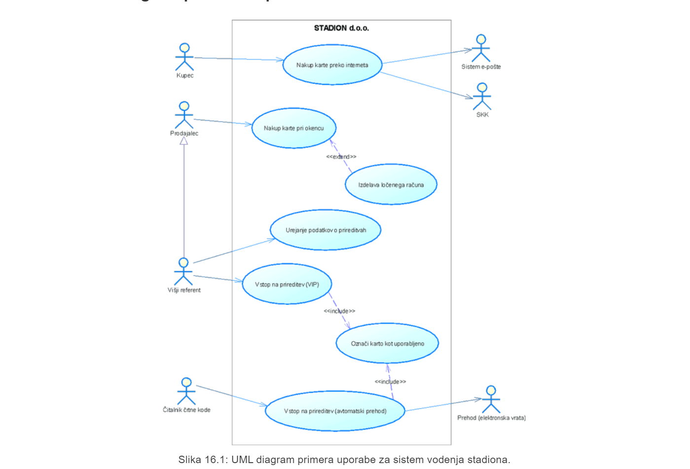
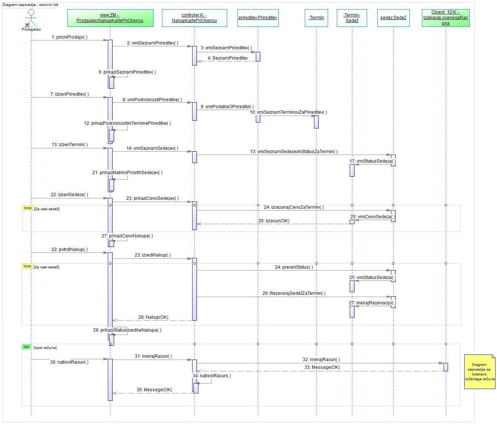
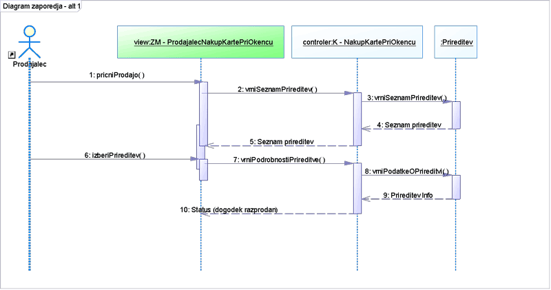
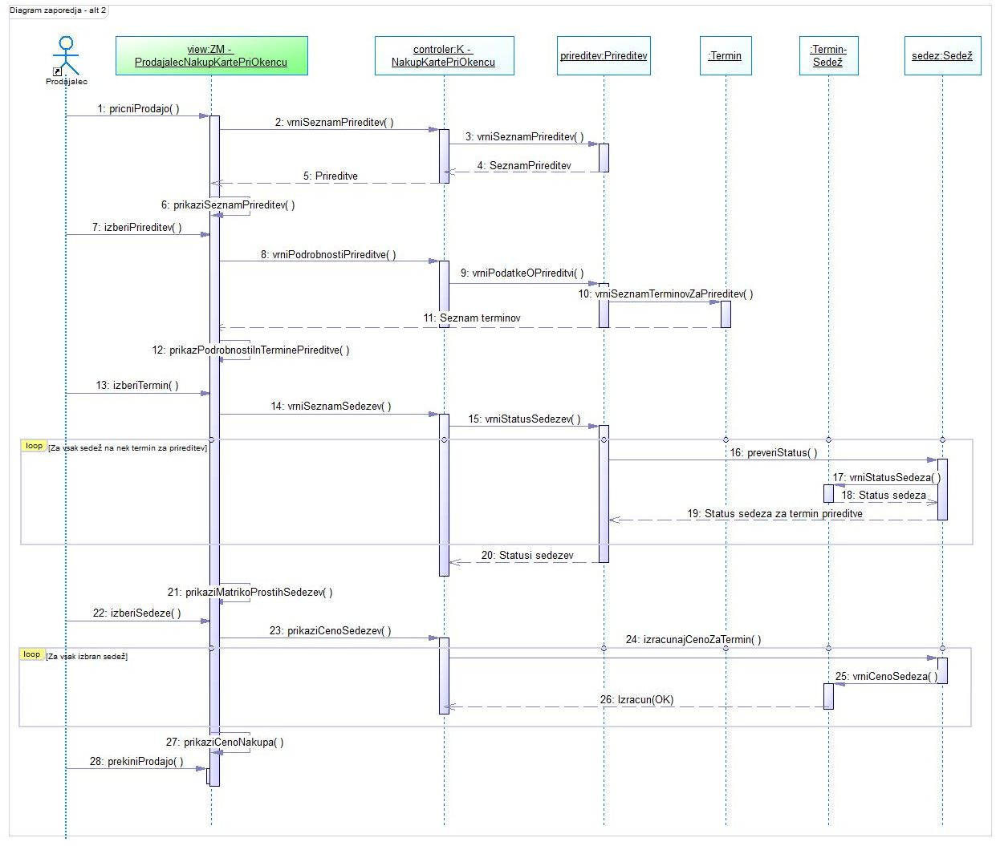
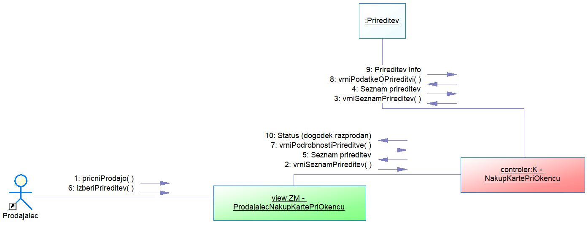
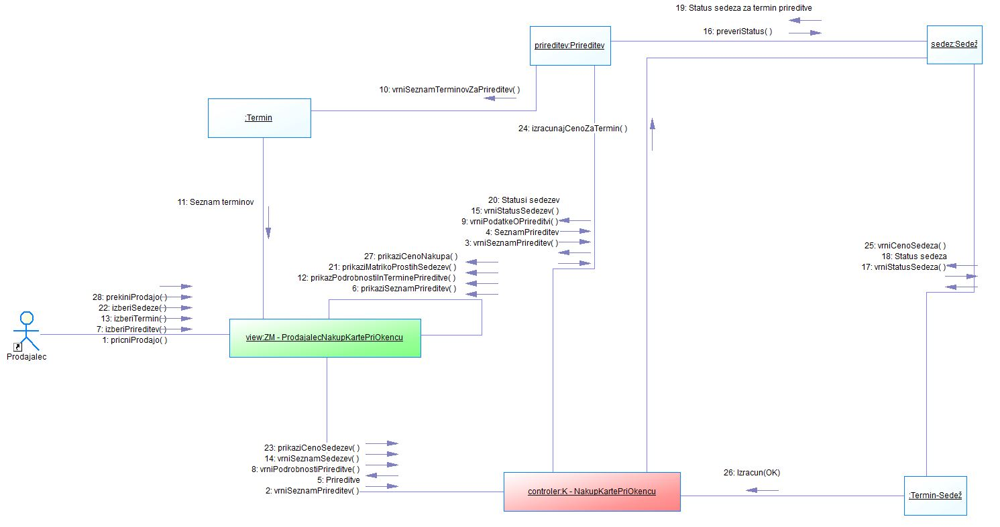
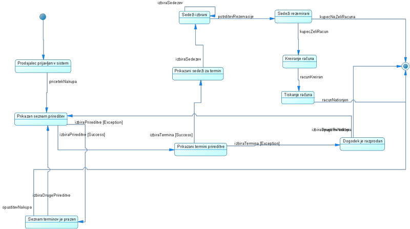
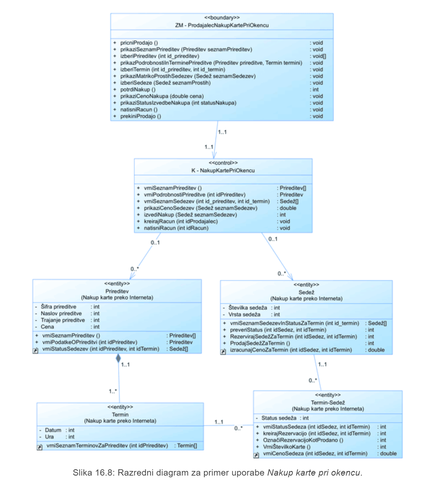
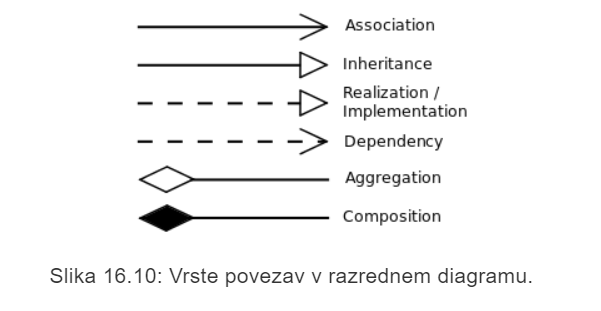
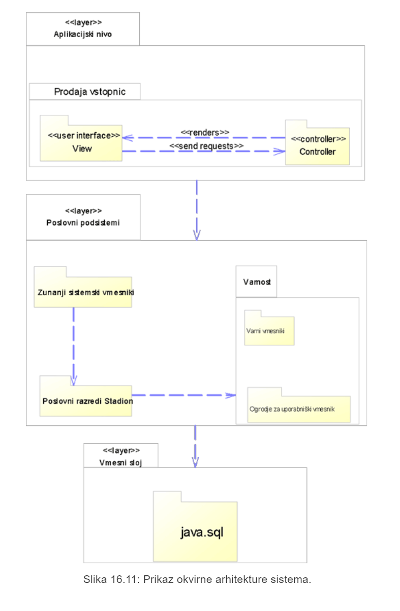

# LP5 Načrt sistema in njegove arhitekture
# 1 Navodila
Sistem smo modelirali iz treh vidikov:
- **Zunanji vidik** - *meje sistema in kako sistem v procesu deluje z ostalimi sistemi v okolju*
- **Vidik sodelovanja** - *sodelovanje med akterji, komponentami sistame (use-case diagrami, diagrami zaporedja)*
- **Strukturni vidik** - *organizacija sistema v smislu komponent (razredni diagram)*

Uporabljene bodo naslednje tehnike:
- **diagram primerov uporabe** - use-case
- **diagram aktivnosti** - activity diagram
- **diagram zaporedja** - sequence diagram
- **diagram komunikacije** - communication diagram
- **razredni diagram** - class diagram
- **diagram stanj** - state diagram

# 2 vaja:
## 2.1 Diagrami zaporedja

Diagram zaporedja:
- vsebuje nadzoren priakz zaporedja **klicev sporočil** med objekti
- Omogoča identifikacijo razredov, interakcij med razredi in odgovornosti posameznih razredov
- prikazujejo **kronološko zaporedje dogodkov**, ne pa tudi povezav med objekti
- operacije so nadzorno vidne, ravno tako parametri in tipi rezultatov
- uporaben je za prikaz velikega števila objektov znotraj diagrama uporabe in za modeliranje bolj zapletenih scenarijev

blok **loop** označuje zanko

blok **opt** označuje opcijsko izvedbo

Imamo preprost diagarm primerov uporabe:

Obravnavali bomo primer uporabe **nakup karte pri okencu**

Imamo 4 tokove:

**Osnovni tok:**
1. Prodajalec odpre zaslonsko masko za nakup karte.
2. Sistem prikaže seznam prireditev.
3. Prodajalec izbere prireditev.
4. Za izbrano prireditev sistem vrne prodajalcu seznam terminov, kjer so še prosti sedeži, in podrobne podatke o prireditvi.
5. Prodajalec izbere termin.
6. Sistem prikaže prodajalcu matriko sedežev z označenimi zasedenimi in rezerviranimi sedeži.
7. Prodajalec izbere enega ali več prostih sedežev.
8. Sistem prodajalcu prikaže ceno izbranih sedežev.
9. Sistem označi izbrane sedeže kot rezervirane.
10. Sistem prikaže sporočilo o uspešnem nakupu in rezervaciji sedežev.

**Alternativni tok 1**:
1. Prodajalec odpre zaslonsko masko za nakup karte.
2. Sistem prikaže seznam prireditev.
3. Prodajalec izbere prireditev.
4. Za izbrano prireditev sistem vrne prodajalcu seznam terminov, kjer so še prosti sedeži, in podrobne podatke o prireditvi.
5. Prodajalec izbere termin.
6. Sistem prikaže prodajalcu matriko sedežev z označenimi zasedenimi in rezerviranimi sedeži.
7. Prodajalec izbere enega ali več prostih sedežev.
8. Sistem prodajalcu prikaže ceno izbranih sedežev.
9. Prodajalec potrdi nakup.
10. Sistem označi izbrane sedeže kot rezervirane.
11. Sistem prikaže sporočilo uspešnem nakupu in rezervaciji sedežev
12. Prodajalec (izdela in) natisne račun.

**Osnovni tok** in **Alternativni tok 1** lahko združimo v en diagram

**Alternativni tok 2 (izjemni tok)** - *prireditev je razprodana*:
1. Prodajalec odpre zaslonsko masko za nakup karte.
2. Sistem prikaže seznam prireditev.
3. Prodajalec izbere prireditev.
4. Sistem prodajalcu vrne sporočilo, da so za izbrani termin vse karte na vseh terminih prodane in prekliče nakup.

**Alternativni tok 3 (izjemni tok)** - *kupec si premisli*:
1. Prodajalec odpre zaslonsko masko za nakup karte.
2. Sistem prikaže seznam prireditev.
3. Prodajalec izbere prireditev.
4. Za izbrano prireditev sistem vrne prodajalcu seznam terminov, kjer so še prosti sedeži, in podrobne podatke o prireditvi.
5. Prodajalec izbere termin.
6. Sistem prikaže prodajalcu matriko sedežev z označenimi zasedenimi in rezerviranimi sedeži.
7. Prodajalec izbere enega ali več prostih sedežev.
8. Sistem prodajalcu prikaže ceno izbranih sedežev.
9. Prodajalec prekliče nakup.

## 2.2 Diagrami sodelovanja

Diagram sodelovanja prikazuje **organizacijo objektov in strukturo sodelovanja med objekti**.

Slika prikazuje diagram sodelovanja za primer uporabe **Nakup karte pri okencu**.

> Diagram sodelovanja lahko v boljših programih generiramo iz **diagramov zaporedja**

Slika prikazuje bolj kompleksen diagram sodelovanja, kjer so všteti vsi razredi, uporabljeni pri diagramih zaporedja.

## 2.3 Diagram stanj

## 2.4 Razredni diagram 
Razredni diagram je sestavljen iz treh vrst razredov:
- **Entitetni razred *\<\<entity>>***, ki hrani in upravlja ključne podatke sistema, je neodvisen od okolja, strogo je osredotočen na **entiteto**, ki jo modelira.
> Praviloma je to **trajen** razred

- **Kontrolni razred *\<\<control>>*** usklajuje proces znotaj primera uporabe. Preprost primer uporabe ima lahko en kontrolni razred. Bolj zapleten primer uporabe ima lahko enega ali več kontrolnih razredov.
> Kontrolni razred je praviloma specifičen za nek primer uporabe, saj ločuje specifično obnašanje primera uporabe od poslovnih razredov, ki morajo biti odvisni in ponovno uporabljivi v različnih komponentah

- **Mejni razred *\<\<boundary>>*** je posrednik med okoljem in sistemom. Akterji s sistemom komunicirajo preko mejnih razredov. Vrste mejnih razredov:
- razred uporabniškega vmesnika
- razred sistemskega vmesnika
- razred vmesnika do naprav

- **Asociacija (association)** - puščica predstavja smer navigacije (lahko dvosmerno). To je splošen izraz, ki se uporablja za predstavitev, kdaj razred A uporablja funckionalnosti razreda B.

- **Generalizacija (generalisation)** - generalizacijo v programskih jezikih poznamo kot **dedovanje** oz. **inheritance**

- **Realizacija (implementation)** - komponenta (podsistem) realizira nek vmesnik (ni prisotno v razrednem diagramu) 

- **Odvisnost (dependency)** - razred A nekako "ve" za drugi razred B. Pomeni, da prvi razred (A) uporablja drugi razred (B)

- **Agregacija (aggregation)** - to je *posebna vrsta (mošnejša oblika)asociacije*. Agregacijo uporabljamo:
    - kadar je objekt A fizično sestavljen iz drugih objektov B *(avto je sestavljen iz motorja in štirih koles)*
    - kadar je objekt A logična zbirka drugih objektov B *(zdravniška kartoteka je sestavljena iz raznih neodvisnih dokumentov)*

- **Kompozicija (composition)** - če si:
    - objekt nadrejenega razreda A lasti drug objekt podrejenega razreda B 
    - **IN**
    - objekt podrejenega razreda B ne more samostojno obstajati brez objekta nadrejenega razreda A.

## 2.5 Arhitekturni diagram

