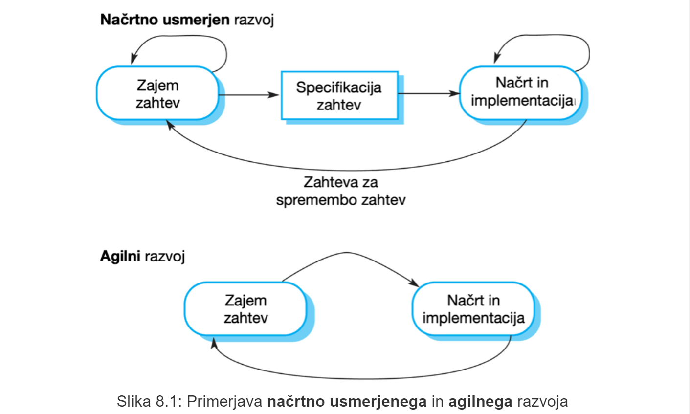
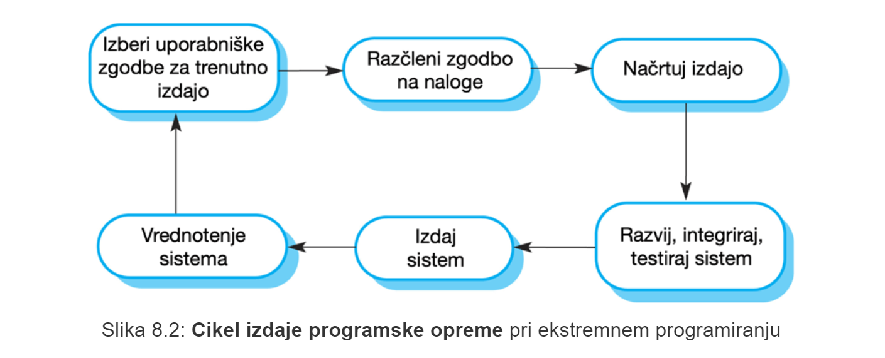
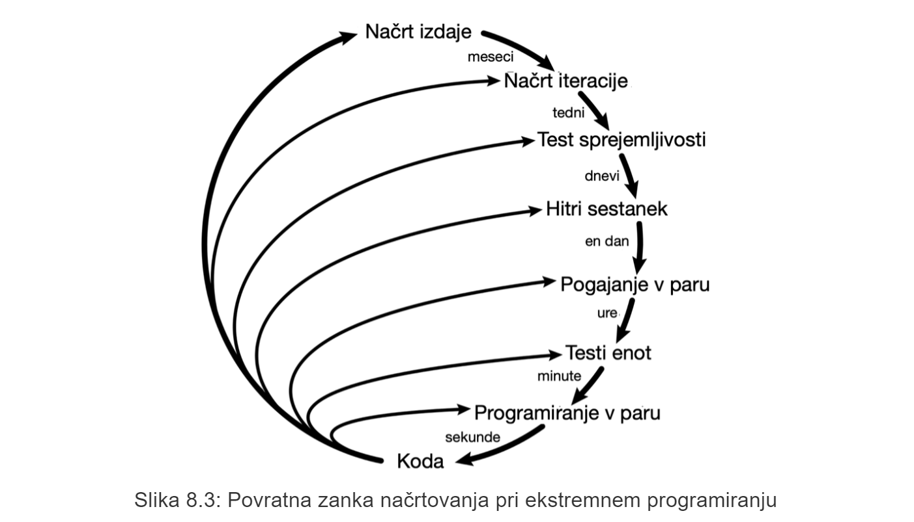
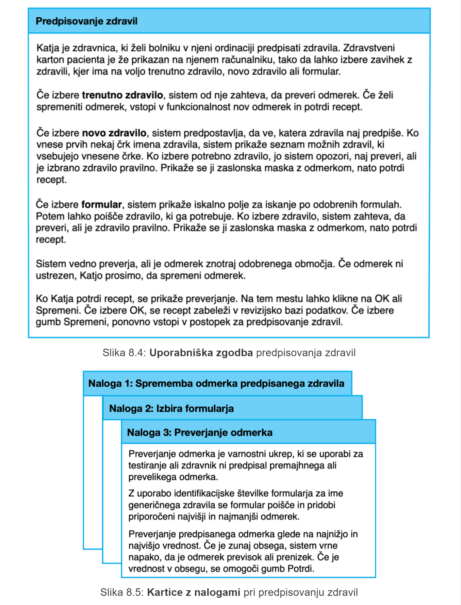
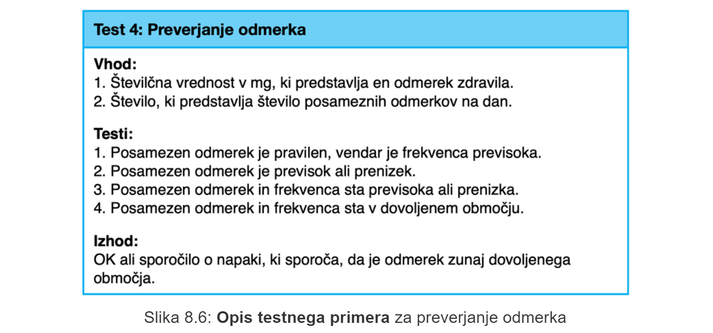
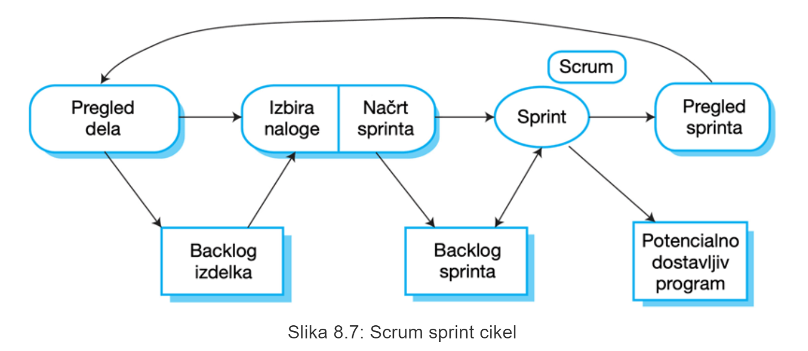
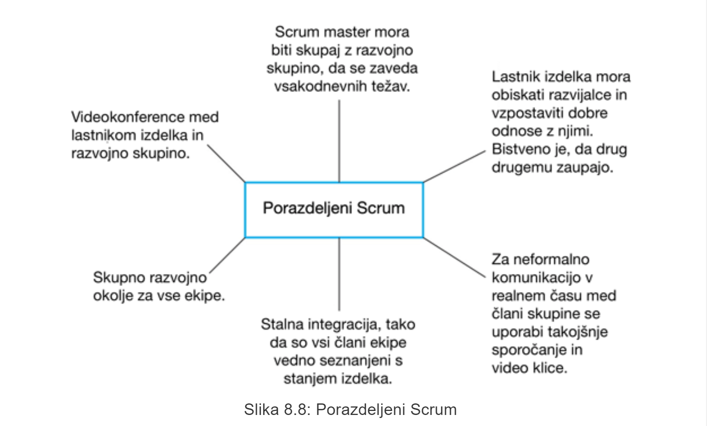
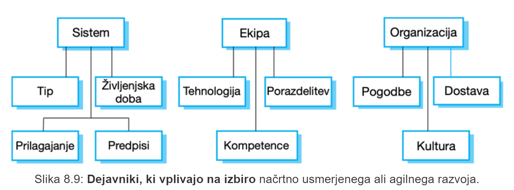
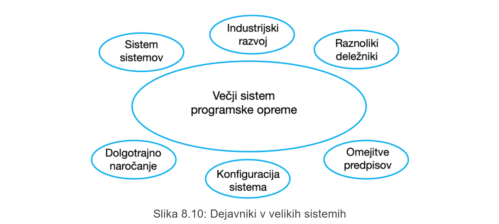
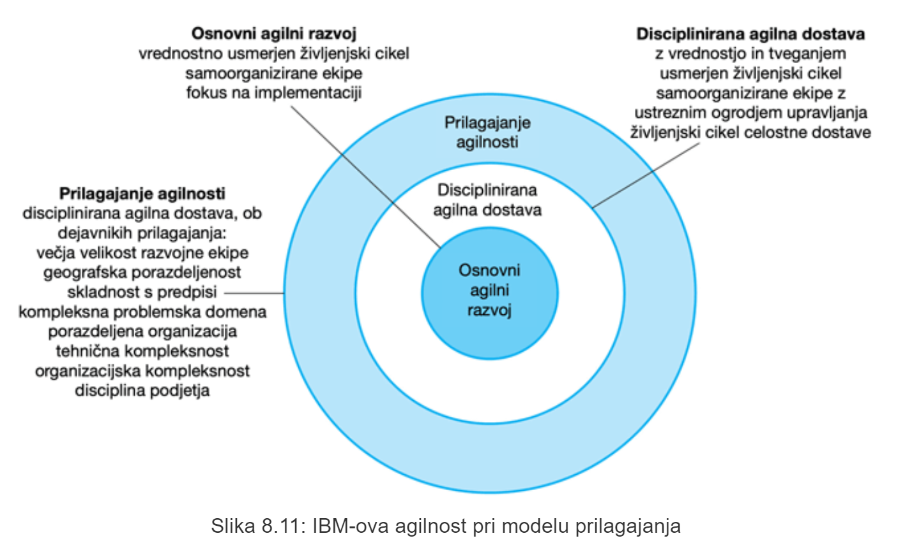

# 1 Hiter razvoj programske opreme
## 1.1 Uvod
praktično **nemogoče je izdelati stabilne zahteve**, ki tekom razvoja nebi imele potrebe po spremembi.

## 1.2 Agilni razvoj
**Izdelava specifikacije, načrt** in **implementacija** so med seboj **testno povezani**

Sistem razvijamo kot **zaporedje različic (inkrementov)**, kjer so značilne **pogoste dostave novih različic**, ki se vedno ovrednotijo s strani razvijalca in uporabnika.

Dokumentacije je minimalno saj je **fokus** predvsem **na** **izvorni kodi**

## 1.3 Načrtno usmerjen vs Agilni razvoj

**Načrtno usmerjen razvoj**:
- ločene razvojne stopnje, rezultate na vsaki od stopenj pripraviti v naprej
- iteracije se izvajajo znotraj aktivnosti

**Agilni razvoj**:
- zajem zahtev, načrt, izvedba in testiranje so **med seboj prepleteni**

# 2 Agilne metode
značilnosti agilnih metod:
- **fokus na izvorni kodi**
- **iterativni pristop**
- **hitro zagotavljanje delujoče programske opreme**

## 2.1 Agilni manifest
Prvaila agilnega manifesta:
1. fokus na **posameznikih in interakcijah** namesto procesih ter orodjih
2. **Delujoča programska oprema je bolj pomembna** od izčrpne dokumentacije
3. **Sodelovanje z naročnikom** namesto izvajanje po pogodbi
4. **Odziv na spremembe** namesto sledenje načrtu

## 2.2 Principi agilnih metod
### 2.2.1 Sodelovanje stranke
Stranke morajo biti **testno** vključene v celoten razvojni proces. Njihova naloga je predvsem konstantno **vrednotenje** trenutnega napredka.
### 2.2.2 Postopna dostava
Programska oprema je razvita in dostavljena **v inkrementih** in **v sodelovanju s stranko**.
### 2.2.3 Ljudje in procesi
Člani skupine morajo imeti možnost **izbire in uporabe lastnih pristopov** brez predpisanih procesov.
### 2.2.4 Sprejemanje sprememb
Sistem je načrtovan tako, da pričajujemo spremembe zahtev s strani stranke.
### 2.2.5 Ohranjanje enostavnosti
Kjerkoli je mogoče se aktivno odpravlja zapletenost sistema. Osredotočamo se na **enostavnosti razvoja programske opreme**

## 2.3 Uporabnost agilnih metod
Uporabne so predvsem pri razvijanju programske opreme, kjer je končni izdelek majhen oziroma nima prevelikega obsega. 

Agilni pristop je pametno uporabiti predvsem pri razvijanju programske opreme **po meri**, kjer je stranka neprestano vključena v razvoj.

# 3 Tehnike agilnega razvoja
## 3.1 **Ekstremno programiranje (XP)**
Uporablja se "ekstremni" pristop k iterativnemu razvoju:
- **nove različice** se lahko izdelajo **večrat na dan**
- **inkrementi** se dostavljajo strankam **vsaka 2 tedna**
- za vsako grandjo je potrebno **izvesti vse teste**. Grandja je sprejeta in dostavljena le, če se **vsi** testi izvedejo pravilno
## 3.2 Cikel izdaje programske opreme

## 3.3 Dobre prakse ekstremnega programiranja
- **postopno oz. inkrementalno načrtovanje**
- **majhne izdaje**
- **enostaven načrt**
- **razvoj z vnaprejšnim testiranjem**
- **preurejanje kode**
- **programiranje v paru**
- **skupinsko lastništvo**
- **stalna integracija**
- **trajnostni tempo**
- **stalna prisotnost tranke**

## 3.4 XP in agilna načela
>glej 3.3 ....
- inkrementalni razvoj podprt z pogostimi izdajami sistema
- vključenost stranke - *predstavnik naročnika prisoten v polnem delovnem času*
- programiranje v paru - *poudarek na skupnem lastništvu*
- obvladovanje sprememb podprto z navadnimi izdajami sistema
- ohranjanje enostavnosti s stalnim preurejanjem izvorne kode

## 3.5 Vplivne prakse XP
XP je **tehnično naravnano** - ni ga enostavno vključiti v prakso upravljanja (*predvsem v velikih podjetjih*)

**Agilni razvoj** uporablja številne dobre prakse XP:
- **uporaba uporabniških zgodb pri specifikacij zahtev**
- **preoblikovanje izvorne kode**
- **razvoj z vnaprejšnim testiranjem**
- **programiranje v paru**

### 3.5.1 Uporaba uporabniških zgodb pri specifikacij zahtev
pri XP je stranka **del razvojne skupine** in je odgovorna za **odločanje o zahtevah**.

`Uporabniška zahteva = uporabniška zgodba (ali scenarij)`

Zgodbe so zapisane na **karticah**, ki jih razvojna skupina razčleni na posamezne **razvojne naloge** --> le-te so **osnova časovnega načrta in ocene stroškov**.

Stranka izbere zgodbe za vključitev v naslednjo izdajo na podlagi njenih prednostnih nalog in predvidenih urnikov.

### 3.5.2 Preoblikovanje izvorne kode
**Splošno znana modrost** v programskem inženirstvu je **načrtovanje za spremembe**.

Pri **XP** tega ne upoštevamo, saj gre za pristop kjer **ni mogoče zanesljivo predvideti sprememb** - namesta tega **stalno preoblikujemo izvorno kodo** z namenom lažje vpeljave sprememb, ko do le-teh pride.

Nekaj primerov preoblikovanja izvorne kode:
- reorganizacija razredne hierarhije - odstanitev podvojene kode
- urejanje in preimenovanje spremenjlivk/atributov/metod za lažje razumevanje
- zamenjava delov kode s klici na metode, ki so vključene v neko programsko knjižnico

### 3.5.3 Razvoj z vnaprejšnim testiranjem
Pri XP je **testiranje osrednjega pomena** - testiramo po **vsaki opravljeni spremembi**.

lastnosti testiranja pri XP:
- razvoj z vnaprejšnjim testiranjem
- **inkrementalni razvoj testov** in scenarijev
- **sodelovanje uporabnikov/naročnikov pri razvoju in vrednotenju testov** - *pomaga pri razvoju testov sprejemljivosti za zgodbe, ki jih je treba izvesti v naslednji izdaji sistema.*
- **avtomatizirani testi**, ki se izvajajo vsakic, ko je zgrajena nova izdaja - **avtomatizirano ogrodje za testiranje** je sistem, ki omogoča enostavno pisanje izvedljivih testov in predložitev množice testov za izvedbo.

#### 3.5.1 Opis testnega primera za preverjanje odmerka

### 3.5.4 Programiranje v paru
Uporablja se kot **neformalni postopek pregledovanja**, saj vsako vrstico kode obravnava več kot ena oseba.

> baje je kar nekaj dokazov, ki pravijo, da sta dva programerja ki programirata na istem projektu vsak za svojim računalnikom **manj učinkovita** kot dva programerja, ki sedita za istim računalnikom in izvajata programiranje v paru.

# 4 Agilno vodenje projektov

glavne odgovornosti vodje projekta:
- **programska oprema se dostavi pravočasno**
- **programska oprema se dostavi v okviru proračuna projekta**

## 4.1 Scrum
Scrum je **agilna metoda**, ki se osredotoča na **upravljanju iterativnega razvoja programske opreme**.

Scrum sestavljajo tri faze:
- **začetna faza** - je faza *načrtovanja*, kjer se *določijo splošni cilji projekta* in se *oblikuje arhitektura programske opreme*
- **vrsta ciklov sprinta** - v okviru enega cikla se razvije en inkrement sistema
- **faza zaključka projekta** - zaključimo projekt, dopolnimo zahtevano dokumentacijo...

scrum terminologija:
- **razvojna skupina** - *skupina razvijalcev, ki ne presega 7 ljudi. Odgovorni za razvoj P.O in ostalih bistvenih projektnih dokumentov.
- **potencialno dostavljiv inkrement izdelka** - *inkrement iz sprinta je v končnem stanju in ni potrebnega dodatnega dela, kot npr. testiranje za njegovo vključitev v končni izdeleke.*
- **backlog izdelka** - *seznam opravil, ki jih mora opraviti razvojna skupina.* 
- **lastnik izdelka** - *posameznik/majhna skupina z nalogo identifikacije lastnosti izdelka ali zahteve in prednostne razvrstitve za razvoj.*
- **Scrum** - *vsakodnevno srečanje razvojne skupine, ki pregleda napredek in daje prednost delu, ki ga je treba opraviti ta dan.*
- **Scrum master** - *odgovoren za sledenje procesu in vodejje ekipe pri učinkoviti uporabi Scruma. Odgovoren, da razvojne ekipe ne motijo dejavniki iz zunanjega seta. Nenehno mora pregledovati backlog izdelka in zagotoviti, da projekt neprestano izpolnjuje kritične poslovne zahteve.
- **Sprint** - razvojna iteracija, ki običajno traja od 2 do 4 tedne
- **hitrost** - ocena, ki nam povej, kolikšen delež izdelka lahko razvojna skupina implementira v enem sprintu.

### 4.1.1 Scrum sprint cikel

### 4.1.2
> glej terminologijo...

### 4.1.3 Prednosti Scruma
- izdelek razdeljne na **množico obvladljivih in razumljivih delov**
- nestabilne zahteve **ne zadržujejo** napredka
- celotna ekipa ima pregled nad vsem
- stranke pravočasno vidijo dostavo inkrementov in pridobijo povratne informacije o tem, kako projekt napreduje.
- vzpostavljeno zaupanje med naročnikom in razvijalci ter ustvarjena pozitivna kultura, v kateri vsi pričakujejo uspeh projekta

### 4.1.4 Porazdeljeni Scrum

# 5 Prilagajanje agilnih metod
**Prilagajanje navzgor** se nanaša na uporabo agilnih metod za razvoj večjih sistemov programske opreme, ki jih majhna skupina ne more razviti.

**Prilagajanje navzdol** se nanaša na uvedbo agilnih metod v veliko organizacijo z dolgoletnimi izkušnjami pri ravzoju programske opreme.

## 5.1 Praktične težave z agilnimi metodami
- neformalnost razvoja **ni združljiva** s pravnim pristopom opredelitve pogodbe
- neprimerne za **vzdrževanje** programske opreme.
- neprimerne za **večje** razvojne skupine (korporacije)

## 5.2 Merjenje procesa
Pri razvojnem projektu programske opreme je potrebna **pogodba, kjer je ovrednoten čas razvijalca** in ne zahtevana funkcionalnost.

## 5.3 Agilne metode in vzdrževanje programske opreme
Če želimo da bodo agilne metode **uspešne** morajo podpirati zudi **vzdrževanje in prvotni razvoj**.

Težave se pojavijo, če prvotne razvojne skupine ni mogoče ohraniti.

## 5.4 Agilno vzdrževanje
ključne težave:
- pomankanje dokumentacije izdelka
- vključenost naročnika v razvojem procesu
- ohranjanje kontinuitete razvojen skupine

## 5.6 Agilna načela in organizacijske prakse
> **načelo** - *praksa*
- **vključenost naročnika** - *predvsem odvisno od naročnikove pripravljenosti do sodelovanja
- **odprtost na spremembe** - *težko upoštevati, ko naročnika sestavlja več posameznikov, saj običajno različni posamezniki različno vidijo prioritetni vrstni red nalog.
- **postopna dostava** - *tržni direktorji morajo poznati funkcionalnosti izdelka več mesecev v naprej, da lahko pripravijo učinkovito oglaševalsko akcijo*

## 5.7 Agilni in načrtno usmerjeni dejavniki

## 5.8 Sistemske težave
- **Kako velik je sistem, ki se razvija?** - agilne metode so učinkovite če je razvojan skupina majhna
- **Kakšen tip sistema se razvija?** - kompleksni sistemi z veliko obsega in ki zahtevajo veliko analize pred izvedbo, potrebujejo podroben načrt.
- **Kakšna je pričakovana življenska doba sistema?** - daljša je planirana življenska doba, bolj podrobno in dobro dokumentacijo potrebujemo, saj se ta uporablja za komunikacije med skupino razvijalcev in skupino, ki zagotavlja podporo.
- **Ali mora sistem upoštevati zunanje predpise?** 

## 5.9 Ljudje in ekipe
- **Kako dobri so razvijalci, arhitekti in programerji v razvojni skupini?** - *agilne metode zahtevajo **višjo raven** znanja in spretnosti.
- **Kako je organizirana razvojna skupina?**
- **Katere podporne tehnologije so na voljo?** - če projektne dokumentacije ni na voljo, je **podpora za vizualizacijo in analizo programa** v razvojnem orodju **bistvena**

## 5.10 Organizacijska vprašanja
- Tradicionalno usmerjena razvojna podjetja imajo kulturo razvoja, ki temelji na načrtih, saj je to norma v (programskem) inženirstvu
- Ali je tradicionalna organizacijska praksa razviti podrobno specifikacijo sistema?
- Ali so predstavniki naročnika na voljo za zagotavljanje povratnih informacij o inkrementu sistema?
- Ali se neformalni agilni razvoj umešča v organizacijsko kulturo s podrobno dokumentacijo?

## 5.11 Agilne metode za večje sisteme
**Ekipe** pogosto delajo **na različnih geografskih lokacijah**.

Veliki sistemi pogosto vključujejo in sodelujejo z ostalimi že zgrajenimi sistemi in rešitvami. 

## 5.12 Razvoj večjih sistemov
- **dolg čas dobave in razvoja**
- **Težko je ohranjati tudi skladnost razvojne skupine**

### 5.12.1 Dejavniki pri razvoju večjih sistemov

### 5.12.2 IBM-ova agilnost pri modelu prilagajanja

### 5.12.3 Razširitev na velike sisteme
- popolnoma inkrementalni pristop pri zajemanju zahtev je **nemogoč**
- nikoli zgolj en lastnik izdelka
- ni se mogoče osredotočiti zgolj na kodo izdelka
- potrebujemo dodatne, dobro zasnovane mehanizme za komunikacijo med razvojnimi skupinami
- stalna integracija **praktično nemogoča**

### 5.12.4 Scrum in več razvojnih ekip
- **podvajanje vlog** - *vsaka razvojna skupina ima svojega Scrum Masterja*
- **Arhitekti izdelkov** - *vsaka ekipa izbere svojega arhitekta, ki nato sodeluje z orhitekti ostalih skupin pri oblikovanju in razvoju celotne sistemske arhitekture*
- **Uskladitev izdaj** - *datumi izdaje izdelkov so usklajeni tako, da je izdelan **delujoč in popoln** sistem*
- **Scrum Scrumov** - *dnevna srečanja, kjer se srečujejo Scrum Masterji in razpravljajo o napredku in načrtovanju dela v prihodnje*

### 5.12.5 Agilne metode v podjetjih
- Vodje projektov brez izkušenj z agilnimi metodami niso pripravljeni sprejeti tveganja novega pristopa
- Zaradi svoje birokratske narave so verjetno nezdružljivi z agilnimi metodami.
- V podjetjih je ponavadi prisotna široka paleta sposobnosti in spretnosti, agilni pristopi pa potrebujejo visoko raven znanja pri vsakem posamezniku.
- Pri tradicionalnih podjetjih, kjer je uporabljena konvecionalna inženirska praksa, lahko pride do kulturne odpornosti na agilne metode.

# 6 Zaključne ugotovitve
- Agilne metode so inkrementalne razvojne metode, ki se osredotočajo na hitro razvijanje programske opreme, pogoste izdaje programske opreme, zmanjšanje režijskih stroškov z zmanjšanjem dokumentacije in izdelavo visoko kakovostne kode.
- Agilne razvojne prakse vključujejo:
    - uporabniške zgodbe za zajem specifikacije sistema,
    - pogoste izdaje programske opreme,
    - stalno izboljševanje programske opreme,
    - vnaprejšnje testiranje,
    - sodelovanje naročnika v razvojni skupini.
- Scrum je agilna metoda, ki predstavlja ogrodje za vodenje projektov.
- Temelji na zaporedju sprintov, ki predstavljajo določena časovna obdobja za razvoj inkrementa sistema.
- Veliko praktičnih razvojnih metod je mešanica načrtno usmerjenega in agilnega razvoja.
- Prilagajanje agilnih metod za večje sisteme je težavno.
Večji sistemi potrebujejo vnaprejšnje načrtovanje, določeno dokumentacijo in organizacijska praksa je lahko v nasprotju z neformalnostjo agilnih pristopov.

