# 1 Uvod
Zahteve sistema predstavljajo **opisi storitev in omejitve**, ki nastanejo med procesom zajemanja zahtev.
## 1.1 Kaj je zahteva?
Zahtevo lahko jemljemo kot **abstraktno opredelitev** neke storitve na visoki ravni ali sistemske omejitve.

Lahko pa jo opredelimo kot **podrobno matematično** funkcionalno **specifikacijo**.

Zahteve se uporabljajo za dvojni namen:
- zahteve so **osnova za ponudbo**
- zahteve so **osnova za pogodbo**

## 1.2 Abstrakcija zahtev
Zahteve morajo biti napisane tako, da lahko več različnih izvajalcev odda svojo **ponudbo**.

Po dogovorjeni pogodbi mora izvajalec podrobneje zapisati **opredelitev sistema** za naročnika.

Oba dokumenta imenujemo **dokument zahtev** za sistem.

## 1.3 Vrste zahtev
- **Uporabniška zahteva** - *sestavljajo jo izjave v naravnem jeziku in **diagrami storitev**, ki jih sistem zagotavlja ter operativne omejitve. **Vsebina namenjena naročniku**.*

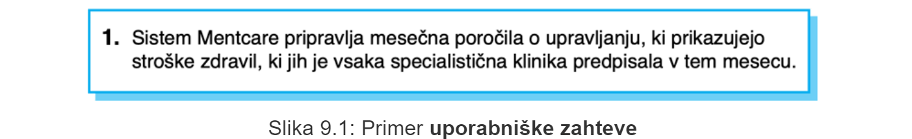

- **Sistemska zahteva** - *strukturiran dokument, ki določa podrobne opise funkcij sistema, storitev in omejitev delovanja. Lahko služi kot **del pogodbe med naročnikom in izvajalcem**.*

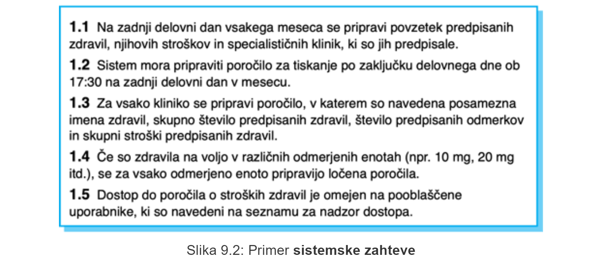

## 1.4 Bralci različnih vrst zahtev

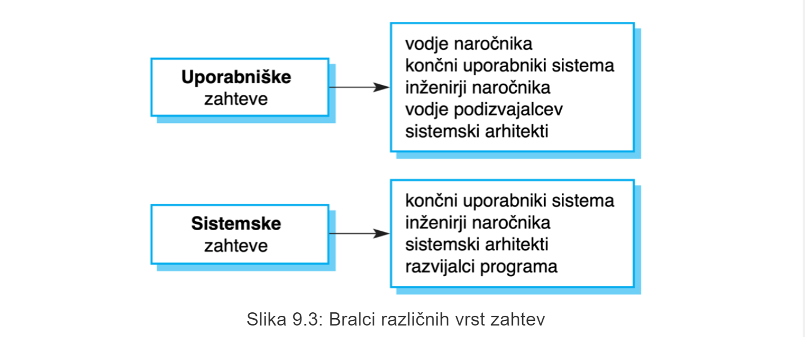

## 1.5 Deležniki sistema
**Deležnik sistema** je posameznik ali organizacija, ki je **vključen v projekt** ali pa bo izvedba projekta kakorkoli **vplivala na njegove koristi**.

vrste deležnikov:
- končni uporabniki
- vodje sistema
- lastniki sistema
- zunanji deležniki

## 1.6 Deležniki v Mentcare sistemu (primer)
- bolniki
- Zdravniki
- Medicinske sestre
- Referenti
- IT osebje
- Vodja etike v zdravstvu
- Upravljalci zdravstvenega varstva
- Osebje za vodejnje zdravstevnih evidenc

## 1.7 Agilne metode in zahteve
- številne agilne metode trdijo, da je izdelava podrobnih sistemskih zahtev izguba časa, kjer se bodo vedno spreminjale.
- dokument z zahtevami je zato vedno zastarel.
- pri agilnih metodah običajo uporabljamo **inkrementalni zahem zahtev** v obliki **uporbniških zgodb**.

# 2 Funkcionalne in nefunkcionalne zahteve
**Funkcionalne zahteve** predstavljajo podrobnosti storitev, ki jih mora sistem zagotavljati in načine odziva sistema na določene vhodne podatke. Lahko vsebujejo tudi navedbe, česa sistem ne bi smel izvajati.

**Nefunkcionalne zahteve** predstavljajo omejitve storitev ali funckije, ki jih ponuja sistem, kot npr. *časovne omejitve, omejitve razvojnega procesa, uporabe standardov itd.*. Pogosto veljajo za sistem kot celoto in ne za posamezne funckionalnosti ali storitve.

**Zatheve, povezane s problemsko domeno**, so omejitve iz problemske domene, kjer sistem deluje

## 2.1 Funkcionalne zahteve
- opisujejo **funkcionalnosti** ali **sistemske storitve**
- odvisne od **vrste programske opreme, končnih uporabnikov in vrste sistema**.
- trditve na visoki abstraktni ravni, ki nam povedo, "kaj naj sistem počne".
- podrobno morajo opisati sistemske storitve
### 2.1.1 Funckionalne zahteve v Mentcare sistemu
- Uporabnik naj ima na voljo iskanje po seznamu sestankov za vse specialistične klinike.
- Sistem za vsako specialistično kliniko vsak dan pripravi seznam bolnikov, za katere se pričakuje, da se bodo tega dne udeležili sestanka oz. pregleda.
- Vsak uslužbenec, ki uporablja sistem, je enolično opredeljen s svojo 8-mestno številko zaposlenega.
### 2.1.2 Nenatančnost zahtev
Če je zahteva slabo definirana oz. opisana, si lahko uporabnik in razvijalec zelo različno predstavljata rešitev, kar pripelje do težav.

Poznamo dva vidika razlage zahtev: 
- **vidik uporabnika**
- **vidik razvijalca**

### 2.1.3 Celovitost in skladnost zahtev
Zahteve morajo biti:
- **celovite** - *vključevati morajo opise vseh potrebnih zmogljivosti*
- **skladne** - *v opisih zmogljivosti sitema ne sme biti konflikotv ali protislovij*

## 2.2 Nefunkcionalne zahteve
- določajo **lastnosti sistema** (*npr. zanesljivost, odzivni čas, ...) in **omejitve** (*npr. sposobnost V/I naprav, predstavitve sistema itd.*).
- lahko so **bolj kritične** kot funkcionalne zahteve, saj je lahko zaradi neizpolnjenih nefunkcionalnih zahtev sistem neuporaben

### 2.2.1 Vrste nefunkcionalnih zahtev

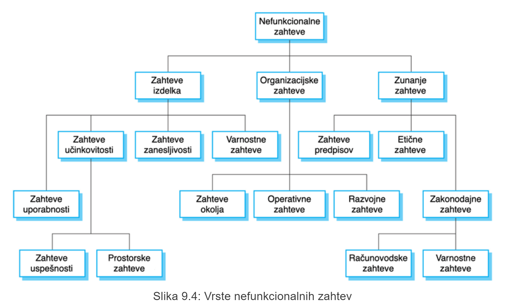

### 2.2.2 Implementacija nefunkcionalnih zahtev
Nefunkcionalna zahteva lahko vpliva na celotno arhitekturo sistema in ne zgolj na posamezne komponente. S posamezno nefunkcionalno zahtevo je lahko povezanih več funkcionalnih zahtev.

### 2.2.3 Klasifikacija nefukncionalnih zahtev
- **Zahteve izdelka** - *hitrost izvajanja, stopnja zanesljivosti ipd.* (povejo, na kakšen način se more obnašati izdelek)
- **Organizacijske zahteve** - *posledica organizacijskih politik in pristopov (npr. uporabljen standardni proces, implementacijske zahteve ipd.)*
- **Zunanje zahteve** - *izhajajo iz dejavnikov, ki so zunaj sistema (npr. zakonodajne zahteve, zahteve glede interoperabilnosti ipd.)*

### 2.2.4 Nefunkcionalne zahteve v Mentcare sistemu
**Zahteva izdelka**
>Sistem Mentcare je na voljo vsem specialističnim klinikam med delovnim časom (ponedeljek - petek, 08:30 - 17:30). Čas nedelovanja med delovnim časom ne sme preseči 5 s v katerem koli dnevu.

**Organizacijska zahteva**
>Uporabniki sistema Mentcare se morajo identificirati s svojo osebno izkaznico zdravstvenega organa.

**Zunanja zahteva**
>Sistem mora biti implementiran v skladu s predpisom o zasebnosti pacientov v HStan-03-2006-priv.

### 2.2.5 Cilji in zahteve
Cilj zahteve je **doseči splošni namen uporabnika**, kot npr. *enostavna uporaba*. Cilji so predvsem pomoč razivjalcem, saj izražajo namere uporabnikov sistema.

**Preverljiva nefunkcionalna zahteva** je trditev z uporabo določene **meritve**, ki se lahko objektivno preveri.

#### 2.2.5.1 Zahteva uporabnosti v Mentcare sistemu
- **Cilj**: Sistem mora biti enostaven za uporabo s strani medicinskega osebja in mora biti organiziran tako, da so možne minimalne napake uporabnikov.
- **Preverljiva nefunkcionalna zahteva**: Po štirih urah usposabljanja mora biti medicinsko osebje sposobno uporabljati vse funkcije sistema. Po usposabljanju uporabnikov je lahko povprečno število napak izkušenih uporabnikov največ dve na uro uporabe sistema.

### 2.2.6 Metrike za določanje nefunckionalnih zahtev
- **hitrost** - *število obdelanih transakcij/sekundo, odzivni čas, čas osveževanja zaslona...*
- **velikost** - *Mbajtov, Število ROM čipov...*
- **enostavnost uporabe** - *Čas usposabljanja, število zahtevanih pomoči...*
- **zanesljivost** - *Povprečen čas do napake, verjetnost nerazpoložljivosti, stopnja pojavitve napake, razpoložljivost...*
- **robustnost** - *čas ponovnega zagona po napaki, delež dogodkov, ki povzročijo napako, verjetnost poškodbe podatkov ob napaki...*
- **prenosljivost** - *delež ukazov, odvisnih od cilja, število ciljnih sistemov...*

# 3 Procesi zajemanja zahtev
Procesi zajemanja zahtev se lahko razlikujejo glede na ralzlične dejavnike...

Obstajajo aktivnosti, ki so skupne vsem procesom:
- **pridobivanje zahtev**
- **specifikacija zahtev**
- **vrednotenje zahtev**
- **upravljanje zahtev**

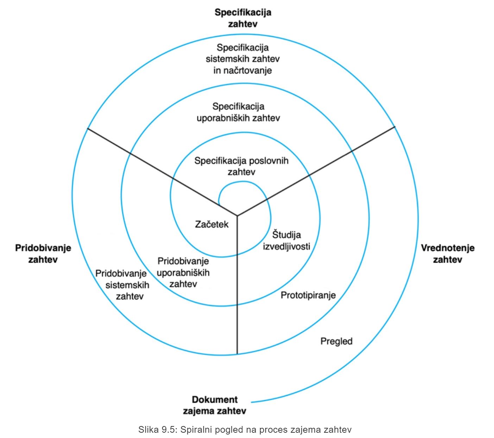

# 4 Pridobivanje zahtev
Lahko imenujemo tudi "odkrivanje" zahtev. Aktinvost vključuje tehnično osebje, ki sodeluje z:
- končnimi uporabniki,
- vodji,
- inženirji,
- področnimi strokovnjaki, 
- sindikati
- itd.
- *...vglavnem z vsemi, ki so koristni za dobro opredelitev zahtev sistema.*

## 4.1 Težave pridobivanja zahtev
- deležniki ne vedo, kaj resnično želijo
- deležniki izražajo zahteve s svojimi besedami (ne znajo pravilno arktikuirat tako da razume razvijalec)
- različni deležniki imajo lahko nasprotujoče si zahteve
- na sistemske zahteve lahko vplivajo organizacijski ali politični dejavniki
- med analizo se zahteve pogosto spreminjajo

## 4.2 Proces pridobivanja in analize zahtev
Stopnje pridobivanja zahtev vklučujejo:
- **Odkrivanje zahtev**
- **Razvrstitev in organizacija zahtev**
- **Določanje prioritet in pogajanja glede zahtev**
- **Specifikacija zahtev**

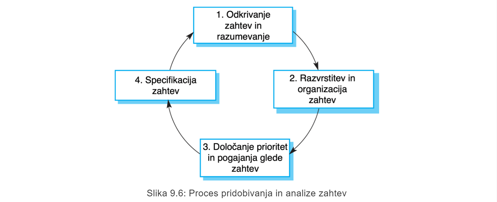

## 4.2.1 Odkrivanje zahtev
> od tukej pa do **specifikacije zahtev** je polno neke solate, ki jo bom strnu v par stavkov*

**Odkrivanje zahtev** je postopek *zbiranja informacij* o potrebnih in obstoječih sistemih ter pridobivanje uporabniških in sistemskih zahtev iz teh informacij.

Informacije lahko zbiramo z izvajanjem
- **zaprtih intervijujev**
- **odprtih intervijujev**
- **anket**

> Snov nato napelje na neko etnografsko zadevo. To izpustim. Fix ne bo v PZ.

**Scenarij** je **strukturirana oblika uporabniške zgodbe** in mora vsebovati:
- opis začetne situacije,
- opis normalnega toka dogodov
- opis, kaj gre lahko narobe
- informacije o ostalih sočasnih aktivnostih
- opis stanja, ko se scenarij zaključi

# 5 Specifikacija zahtev
**Specifikacija zahtev** je postopek zapisovanja zahtev uporabnika in sistemskih zahtev v **dokument z zahtevami**.

Zahteve morajo biti razumljive končnim uporabnikom in strankam, ki nimajo tehničnega ozadja.

## 5.1 Načini pisanja specifikacije sistemskih zahtev
- **Naravni jezik**
- **Strukturiran jezik**
- **Opisni načrtovalksi jezik**
- **Grafični zapis**
- **Matematične specifikacije** 

## 5.2 Zahteve in načrt
Zahteve morajo opredeliti **kaj naj sistem počne**, načrt pa mora opredeliti **kako naj to počne**

> V praksi so zahteve in načrt neločjive.

## 5.3 **Specifikacija v naravnem jeziku**
Zahteve so zapisane v obliki stavkov naravnega jezika, dopolnjene z diagrami ni tabelami.

## 5.3.1 Smernice
- ločevati moramo obvezne in zaželene zahteve
- izogibanje uporabe računalniškega žargona
- vključevanje razlag, utemeljitev...

## 5.3.2 Težave z naravnim jezikom
- **Pomankanje jasnosti** - težko vpeljati natančnost, poseldično težko berljiv dokument
- **Zmedene zahteve** - pomešanost funkcionalnih in nefunkcionalnih zahtev
- **Združevanje zahtev** - skupaj se izraža več zahtev hrkati

## 5.4 **Strukturirana specifikacija**
**Strukturirana specifikacija** je pristop k pisanju zahtev, kjer je svoboda pisca zahtev omejena in so zahteve zapisane na **standardni način**.
### 5.4.1 Specifikacija na osnovi obrazca
- opredelitev funkcije ali entitete
- opis vhodov in od kod prihajajo
- opis rezultatov(izhodov) in kam gredo
- informacije o informacijah, ki so potrebne za izračun druge uporabljene entitete
- opis ukrepa, ki ga je treba izvesti
- pogoji *(če so prisotni)*
- stranski učinki *(če so prisotni)*

### 5.4.2 Strukturirana specifikacija zahtev za nadzorni sistem inzulinske črpalke

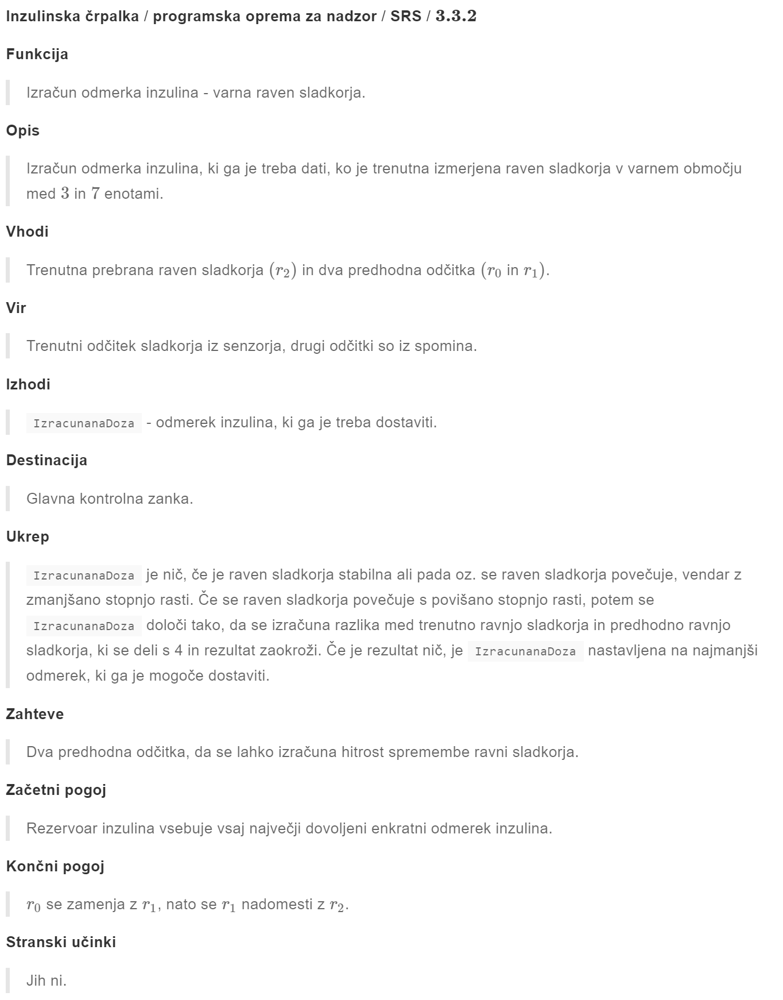

## 5.5 **Tabelarična specifikacija**
**Tabelarična specifikacija** se uporablja kot dodatek naravnemu jeziku. Še posebej je uporabna, če je treba določiti več možnih alternativnih učinkov ukrepanja.

## 5.5.1 Tabelarična specifikacija izračuna odmerka za inzulinsko črpalko

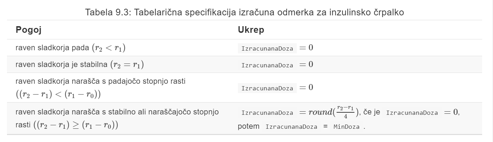

## 5.6 **Primeri uporabe**
Primeri uporabe so neke vrste *scenariji*, ki so vkljuleni v **UML**. Identificirajo **akterje** v interakciji in **opisujejo samo interakcijo**. 

Gre za **grafični model na visoki ravni**, ki ga dopolnjuje podrobnejši tabelarični opis.

### 5.6.1 Primeri uporabe za sistem Mentcare

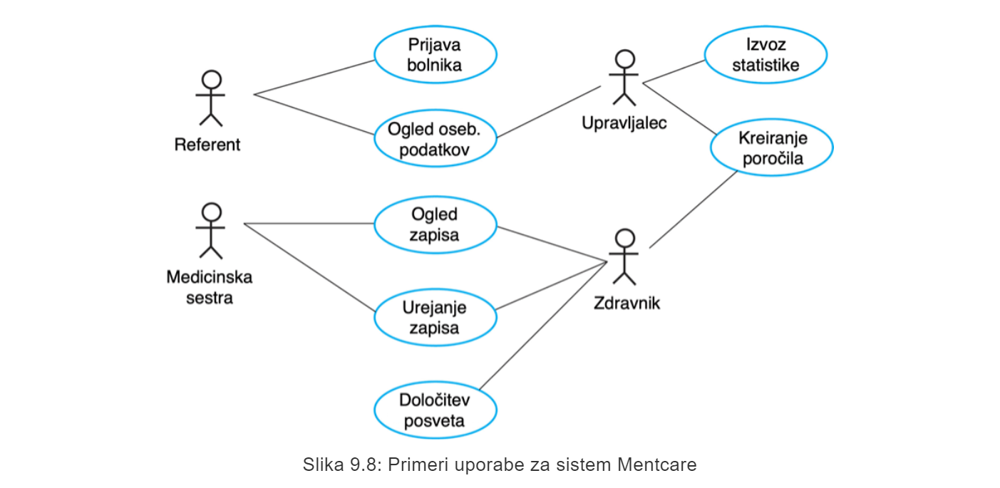

## 5.7 Dokument zahtev programske opreme
**Dokument zahtev programske opreme** je uradna izjava o tem, kaj se zahteva od razvijalcev sistema. Vključevati mora:
- **opredelitev uporabniških zahtev** in
- **specifikacijo sistemskih zahtev**.

Omenjen dokument *NI PROJEKTNI DOKUMENT*, saj v največji meri določa le, **kaj naj bi sistem delal**

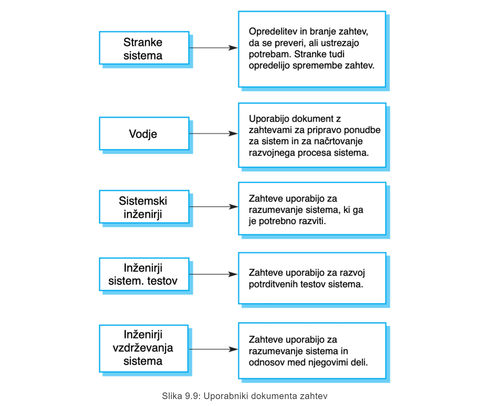

### 5.7.1 Raznolikost dokumenta zahtev
Informacije v dokumentu zahtev so odvisne od:
- **vrste sistema**
- **uporabljenega pristopa razvoja** - *inkrementalno razviti sistemi imajo manj podrobnosti v takem dokumentu*

### 5.7.2 Struktura dokumenta zahtev
1. Predgovor
2. Uvod
3. Slovar - *opredeljeni tehnični izrazi, uporabljeni v dokumentu*
4. **Opredelitev uporabniških zahtev** - *opis storitev, ki bodo na voljo končnemu uporabniku*
5. Arhitektura sistema - *pregled nad sistemsko arhitekturo na visoki ravni, prikazuje se porazdelitev funkcij med moduli sistema...*
6. **Opredelitev sistemskih zahtev** - *Podrobnejši opis funkcionalnih in nefunkcionalnih zahtev*
7. Modeli sistema - *grafični sistemski modeli, ki prikazujejo razmerja med komponentami sistema in sistemom ter njegovim okoljem... (npr. objektni modeli, modeli toka podatkov, semantični podatkovni modeli...)*
8. Evolucija sistema - *Opis temeljnih predpostavk sistema in vse pričakovane spremembe zaradi razvoja strojne opreme, spreminjajočih se potreb uporabnikov itd...*
9. Dodatki 
10. Kazalo

# 6 Vrednotenje zahtev
Pri vrednotenju zahtev se ukvarjamo z dokazovanjem, da zahteve določajo pravi sistem, ki ga stranka resnično želi.

Ker so **stroški napak pri zahtevah lahko visoki**, je korak vrednotenja zahtev **neizogiben**.

## 6.1 Preverjanje zahtev
- **veljavnost** - *ali sistem zagotavlja vse funckije, ki kar najbolje podpirajo potrebe stranke?*
- **skladnost** - *ali obstajajo med zahtevami kakšni konflikit?*
- **celovitost** - *ali so vključene vse funckije, ki jih zahteva stranka?*
- **realističnost** - *ali se lahko zahteve izvedejo glede na razpoložljiv proračun in tehnologijo?*
- **preverljivost** - *ali lahko zahteve realno preverimo?*

## 6.2 Tehnike vrednotenja zahtev
- **pregled zahtev**
- **prototipiranje**
- **generiranje testnih primerov**

### 6.2.1 Pregled zahtev
- **preverljivost** - *Ali je zahteva realno preverljiva?*
- **razumljivost** - *Ali je zahteva pravilno razumljena?*
- **sledljivost** - *Ali je poreklo zahteve jasno navedeno?*
- **prilagodljivost** - *Ali se lahko zahteva spremeni brez velikega vpliva na druge zahteve?*

# 7 Spremembe zahtev
## 7.1 Razvoj zahtev

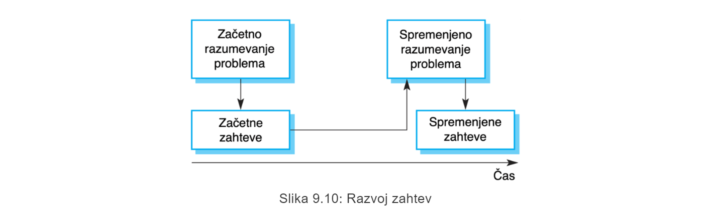

## 7.2 Upravljanje zahtev
**Upravljanje zahtev** je proces obvladovanja spreminjajočih se zahtev v procesu zajema zahtev in razvoja sistema.

### 7.2.1 Načrtovanje in upravljanje zahtev
- **identifikacija zahtev** - *vsaka zahteva enolično identificirana*
- **proces upravljanja sprememb** - *niz dejavnosti, ki ocenjujejo vpliv in stroške sprememb*
- **politike sledljivosti** - *določajo razmerja med posameznimi zahtevami ter med zahtevmi in načrtom sistema*
- **podpora za orodja** - *posebni sistemi za upravljanje zahtev, preglednice, preprosti sistemi podatkovnih baz...*

### 7.2.2 Proces upravljanja sprememb
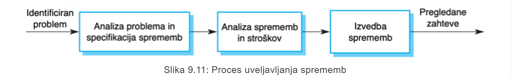

- **Analiza problema in specifikacija sprememb** - *preverimo če je problem veljaven. Analiza se vrne tistemu, ki je spremembo zahteval.*
- **Analiza sprememb in stroškov** - *Ocenimo učinek oz. vpli predlagane spremembe z uporabo informacij o sledljivosti in splošnega poznavanja sistemskih zahtev.*
- **Izvedba sprememb** - *Dokument zahtev, načrt sistema in izvedba sistema se spremenijo. Idealno je imeti dokument zahtev organiziran tako, da so spremembe lahko izvedljive.*

# 8 Zaključne ugotovitve
- Zahteve sistema programske opreme določajo, kaj naj sistem počne in opredeljujejo omejitve za njegovo delovanje in izvajanje.
- Funkcionalne zahteve so trditve o storitvah, ki jih mora sistem zagotoviti, ali opis izvedbe izračunov.
- Nefunkcionalne zahteve pogosto omejujejo sistem in razvojni proces.
- Zahteve so pogosto povezane z lastnostmi sistema in se zato nanašajo na sistem kot celoto.
- Proces zajema zahtev je iterativen proces, ki vključuje pridobivanje zahtev, specifikacijo in vrednotenje.
- Pridobivanje zahtev (glej sliko 9.6) je iterativen proces, ki ga lahko predstavimo kot spiralo aktivnosti - odkrivanje zahtev, razvrstitev in organizacija zahtev, določanje prioritet in pogajanja glede zahtev in specifikacija zahtev.
- Uporabimo lahko vrsto tehnik za zajem zahtev, vključno z intervjuji in etnografijo. Za lažjo razpravo se lahko uporabijo uporabniške zgodbe in scenariji.
- Specifikacija zahtev je proces izdelave formalne dokumentacije uporabniških in sistemskih zahtev ter izdelava dokumenta zahtev programske opreme.
- Dokument zahtev je dogovorjena izjava o sistemskih zahtevah. Organizirati ga je treba tako, da ga lahko uporabijo tako naročniki kot razvijalci programske opreme.
- Vrednotenje zahtev je postopek preverjanja zahtev glede veljavnosti, skladnosti, celovitosti, realističnosti in preverljivosti.
- Poslovne, organizacijske in tehnične spremembe neizogibno vodijo do sprememb zahtev sistema programske opreme. Upravljanje zahtev je proces nadzora teh sprememb.