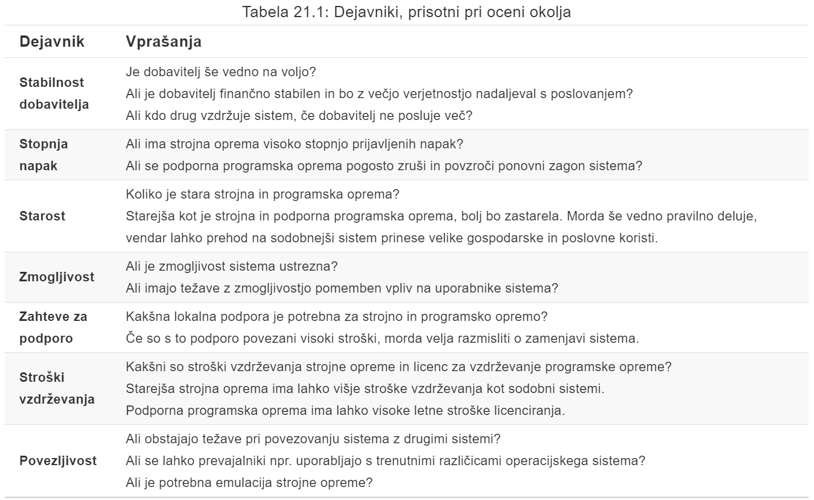

# P11 Evolucija programske opreme
# 1 Uvod
## 1.1 Sprememba programske opreme
Sprememba programske opreme **je neizogibna** zardi številnih razlogov.

- pojavljanje novih zahtev
- spreminjanje poslovnega okolja
- potreba po popravilu napak
- sistemu se dodajajo novi računalniki in oprema
- potreba po izboljšanju kakovosti

Izvajanje in **upravljajnje sprememb obstoječih sistemov** programske opreme je **ključna težava vseh podjetij**

## 1.2 Pomen evolucije
**Večina proračuna** za programsko opremo v večjih podjetjih je **namenjena spreminjanju** in **prilagajanju obstoječe programske opreme** in NE razvoju nove programske opreme.

## 1.3 Evolucija in spiralni model

## 1.4 Evolucija in servisiranje programske opreme

- **Evolucija** programske opreme je stopnja življenskega cikla izdelave sistema programske opreme, kjer se sistem uporablja in razvija v skladu z novimi zahtevami.

- Na stopnji **servisiranja** je programska oprema še vedno uporabna, vendar so izvedene zgolj tiste spremembe, ki so potrebne, da sistem ostane operativen.

- Na stopnju **opuščanja** se programska oprema lahko še vedno uporablja, vendar ni prisotnih nobenih sprememb.

# 2 Evolucijski procesi
Evolucijski procesi programske opreme so odvisni od
- vrste programske opreme
- uporabljenega razvojnega procesa
- spretnosti ter izkušenj vključenih akterjev

## 2.1 Implementacija sprememb
**Implementacija sprememb** predstavlja iteracijo razvojnega procesa, kjer se zasnuje, implementira in testira revizija sistema.

## 2.2 Nujni zahtevki sprememb
Spremembe se bodo absoltno morale izvesti če:
- je treba popraviti resno napako sistema, da se omogoči nadaljevanje normalnega razvoja
- imajo spremembe v okolju sistema nepričakovane učinke
- obstajajo poslovne spremembe, ki zahtevajo zelo hiter odziv (npr. izdaja konkurenčnega izdelka)

## 2.3 Evolucija in agilne metode
Agilne metode temeljijo na inkrementiranem razvoju, zato je prehod iz razvoja v evolucijo **enostaven**.

**Avtomatizirano regresijsko testiranje** je pri spremembah v sistemu še posebej pomembno.

**Spremembe** se lahko izrazijo kot **dodatne uporaniške zgodbe**.

### 2.3.1 Težave pri predaji
Težave pri predaji lahko pridejo v naslednjih scenarijih:
- **Razvojna ekipa** uporablja **agilni pristop**, medtem ko **ekipa za evolucijo** ne pozna agilnih metod in raje uporablja *pristop, ki temelji na načrtovanju*
- ali pa obratno.

# 3 Podedovani sistemi
**Podedovani sistemi** so starejši sistemi, ki se zanašajo na jezike in tehnologije, ki se ne uporabjajo več za razvoj novih sistemov.
## 3.1 Komponente podedovanih sistemov

- **Sistemska strojna oprema**, kjer so podedovani sistemi morda razviti za strojno opremo, ki ni več na voljo.
- **Podporna programska oprema**, kjer so podedovani sistemi mogoče odvisni od vrste programske opreme, ki je zastarela oz. nepodprta.
- **Aplikacijska programska oprema** zagotavlja poslovne storitve, ki so običajno sestavljene iz številnih aplikacijskih programov
- **Aplikacijski podatki**, ki jih obdeluje aplikacijski sistem in so lahko neskladni, podvojeni ali shranjeniv različnih podatkovnih bazah
- **Poslovni procesi**, ki se uporabljajo v podjetju za doseganje doloečnih poslovnih ciljev.
- **Poslovne politike in pravila** so opredelitve, kako je treba opraviti poslovanje, in omejitve poslovanja.

## 3.2 Sloji podedovanega sistema

## 3.3 Zamenjava podedovanega sistema
**Zamenjava** podedovanega sistema je lahko **tvegana** iz več razlogov:
- pomankanje specifikacije celotnega sistema
- testna integracije sistemskih in poslovnih procesov
- poslovna pravila, vgrajena v obstoječi sistem, niso dokumentirana
- razvoj nove programske opreme zamuja ali presega prvotno določen proračun

## 3.4 Sprememba podedovanega sistema
Spreminjanje podedovanih sistemov je zahtevno in drago:
- neskladnost sloga programiranja
- uporaba zastarelih programskih jezikov z malo razpoložljivimi razvijalci
- neustrezna dokumentacija sistema
- poslabšanje strukture sistema
- zaradi optimizacije programov jih je težje razumeti
- napake v podatkih, podvajanje in nedoslednost

## 3.5 Upravljanje podedovanega sistema
Podjetja, ki uporabljajo podedovane siteme, se morajo odločiti za **strategijo razvoja teh sistemov**:
- popolna opustitev
- nadaljevanje vzdrževanja
- prenovs sistema
- zamenjava sistema

## 3.6 Ocenjevanje poslovne vrednosti
Pri **ocenjevanju poslovne vrednosti** je treba upošteva različna stališča:
- končnih uporabnikov sistema
- poslovne stranke
- vodstvenih delavcev
- vodij IT
- višjih vodstvenih delavcev

Pri ocenjevanju poslovne vrednosti se pojavijo **različna uprašanja**:
- **Uporaba sistema**, kjer ima sistem nizko vrednost, če imajo *premalo* število uporabnikov
- **Podprti poslovni procesi**, kjer ima sistem nizko vrednost, če uporabnike prisli k uporabi neučinkovitih poslovnih procesv
- **Sistemska zanesljivost**, kjer ima sistem nizko vrednost, če ni zanesljiv in težave neposredno vplivajo na poslovne stranke
- **Izhodi sistema**, kjer ima sistem visoko vrednost, če je poslovanje odvisno od njegovih rezultatov

## 3.7 Ocenjevanje kakovosti sistema
- **Ocena poslovnih procesov** - *kako dobro poslovni proces podpira trenutne cilje podjetja?*
- **Ocena okolja** - *kako učinkovito je okolje sistema in kako drago je njegovo vzdrževanje?*
- **Ocena uporabe aplikacije** - *kakšna je kakovost aplikacijskega sistema?*

### 3.7.1 Ocena poslovnih procesov
Uporabi se pristop, ki je osredotočen na **pogled akterjev** sistema
- ali obstaja definiran procesni model in ali ga uporabljamo?
- ali različni deli organizacije uporabljajo različne procese za isto funkcijo?
- kako je bil proces prilagojen?
- kakšna so razmerja z drugimi poslovnimi procesi in ali so potrebna?
- ali proces uspešno podpira podedovano programsko opremo?

### 3.7.2 Ocena okolja

### 3.7.3 Ocena uporabe aplikacije

### 3.7.4 Merjenje sistema
Za ocenjevanje kakovosti aplikacije lahko zbiramo **kvantitativne podatke**:
- **število zahtevkov za spremembo sistema**
- **število različnih uporabniških vmesnikov**
- **obseg podatkov**

# 4 Vzdrževanje programske opreme
**Vzdrževanje programske opreme** je spreminjanje le-te po njeni izdaji.

Vzdževanje običajno **ne vključuje večjih sprememb v arhitekturi sistema**.

## 4.1 Vrste vzdrževanja

- **Popravki napak** predstavljajo spreminjanje sistema zaradi napak oz. raznljivosti in odpravljanje pomankljivosti.
- **Prilagotidev okolju** je vzdrževanje za prilagoditev programske opreme različnim izvajalnim okoljem.
- **Dodajanje** in **spreminjanje funkcionalnosti** predstavlja spreminjanje sistema pri izpolnjevanju novih zahtev

## 4.2 Stroški vzdrževanja
**Stroški vzdrževanja** so običajno **višji** od stroškov razvoja. 

Običajno je **dražje dodati nove funkcije v sistem med vzdrževanjem** kot dodajanje enakih funckij med razvojem, kjer:
- nova ekipa mora razumeti, kateri programi se vzdržujejo
- ločevanje vzdrževanja in razvoja pomeni, da razvojna ekipa nima motivacije za pisanje programske opreme
- vzdrževanje programov ni priljubljeno
- s starostjo programov se njihova stuktura poslabša in jih je težje spremeniti

## 4.3 Predvidevanje vzdrževanja
**Predvidevanje** oz. **napovedovanje vzdrževanja** se nanaša na izdelavo ocene, kateri deli sistema lahko povzročijo težave in imajo visoke stroške vzdrževanja.

### 4.3.1 Predvidevanje sprememb
**Napovedovanje števila sprememb** zahteva razumevanje razmerij med sistemom in njegovim okoljem. Testno sklopljeni sitemi zahtevajo spremembe vedno, ko se okolje spremeni.

Dejavniki, ki vplivajo na to razmerje so:
- število in kompleksnost sistemskih vmesnikov
- število inherentno spremenljivih sistemskih zahtev
- poslovni procesi, v katerih se uporablja sistem

### 4.3.2 Metrike kompleksnosti
Napovedi vzdrževalnosti lahko izvedemo z **oceno kompleksnosti komponent sistema**. Študije so pokazale, da se večina napora pri vzdrževanju porabi za relativno majhno število komponent sistema.

Kompleksnost je odvisna od kompleksnosti:
- nadzornih struktur
- podatkovnih struktur
- objekta, metod in velikosti modula

### 4.3.3 Procesne metrike
Za oceno vzdrževalnosti lahko uprabimo **procesne metrike**:
- število zahtevkov za vzdrževanje odpravljanja napak
- povprečni čas, potreben za analizo vpliva
- povprečni čas, potreben za izpolnitev zahteve po spremebi
- število nerešenih zahtevkov za spremembe

## 4.4 Prenova programske opreme
**Prenova programske opreme** je prestrukturiranje ali ponoven razvoj dela ali celotnega obstoječega sistema brez spreminjanja njegove funkcionalnost

Prenova programske opreme ima v primerjavi z zamenjavo naslednje **prednosti**:
- **Zmanjšano tveganje**, saj pri razvoju nove programske opreme obstaja veliko tveganje
- **Znišani stroški**, ki so pri prenovi pogosto bistveno manjši od stroškov razvoja nove programske opreme

### 4.4.1 Aktivnosti procesa prenove programske opreme

Stroški prenove programske opreme so odvisni od obsega opravljenega dela, kjer obstaja širok **spekter možnih pristopov k prenovi**, kot je prikazano na sliki

Na **stroške prenove programske opreme** vplivajo številni dejavniki:
- kakovost programske opreme, ki se prenavlja
- podpora orodij za izvedbo prenove
- zahtevan obseg pretvorbe podatkov
- razpoložljivost strokovnega osebja za pretvorbo

## 4.5 Preurejanje
**Preurejanje** oz. **preoblikovanje** je proces izboljšave programa z namenom upočasnitve postopnega poslabšanja programa, ki se zgodi z večkratnimi spremembami.

### 4.5.1 Preurejanje in prenova
**Prenova** programske opreme poteka po tem, ko je sistem nekaj časa vzdrževan in začnejo stroški vzdrževanja naraščati.

**Preurejanje** oz **preoblikovanje** pa je stalen proces izboljševanja pri razvoju in vrednotenju.

### 4.5.2 Problematični deli kode
Pri razvoju programske opreme obstajajo **stereotipne situacije**, kjer je mogoče kodo programa **izboljšati s preoblikovanjem**:
- **podvojena koda**
- **dolge metode**
- **switch stavki**
- **nakopičeni podatki**
- **špekulativna splošnost**

# 5 Zaključne ugotovitve
- Razvoj programske opreme in **evolucijo** lahko razumemo kot **integriran, iterativen proces**, ki ga lahko predstavimo z uporabo spiralnega modela.
- Pri sistemih po meri **stroški vzdrževanja** programske opreme običajno **presegajo stroške razvoja** programske opreme.
- Proces evolucije programske opreme temelji na zahtevah po spremembah in vključuje **analizo vpliva sprememb, načrtovanje izdaje** in **implementacijo sprememb.**
- **Podedovani sistemi** so starejši sistemi programske opreme, razviti s pomočjo zastarelih programskih in strojnih tehnologij, ki so še vedno uporabni za podjetja.
- **Vzdrževanje** obstoječega sistema je pogosto **cenejše in manj tvegano**, kot razvoj nadomestnega sistema, ki uporablja sodobno tehnologijo.
- Poslovno vrednost podedovanega sistema in kakovost aplikacije je treba oceniti, da se lahko odločimo, ali je treba sistem zamenjati, preoblikovati ali vzdrževati.
- Obstajajo **3 vrste vzdrževanja** programske opreme, in sicer: popravljanje napak, spreminjanje programske opreme za delo v novem okolju in izvajanje novih ali spremenjenih zahtev.
- **Prenova** programske opreme se ukvarja s prestrukturiranjem in ponovnim dokumentiranjem programske opreme, da jo lažje razumemo in kasneje tudi spreminjamo.
- **Preurejanje** je spreminjanje programa, kjer se ohrani prvotna funkcionalnost in je oblika preventivnega vzdrževanja.

