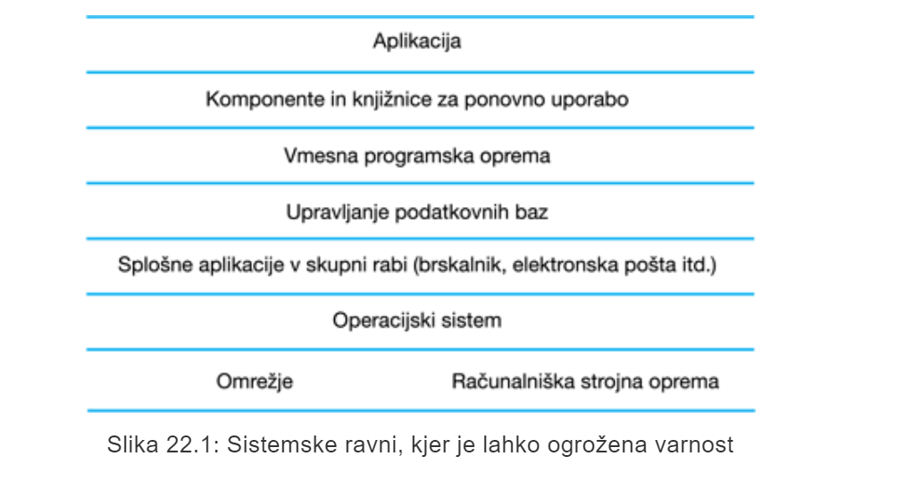
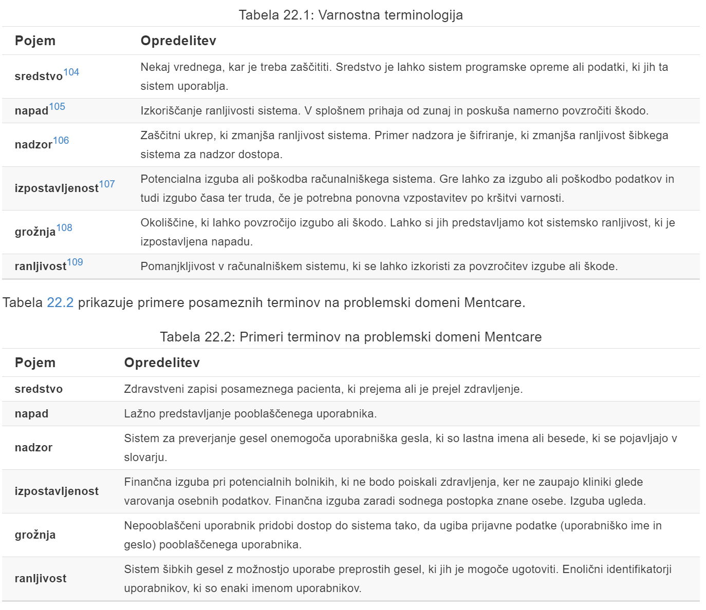
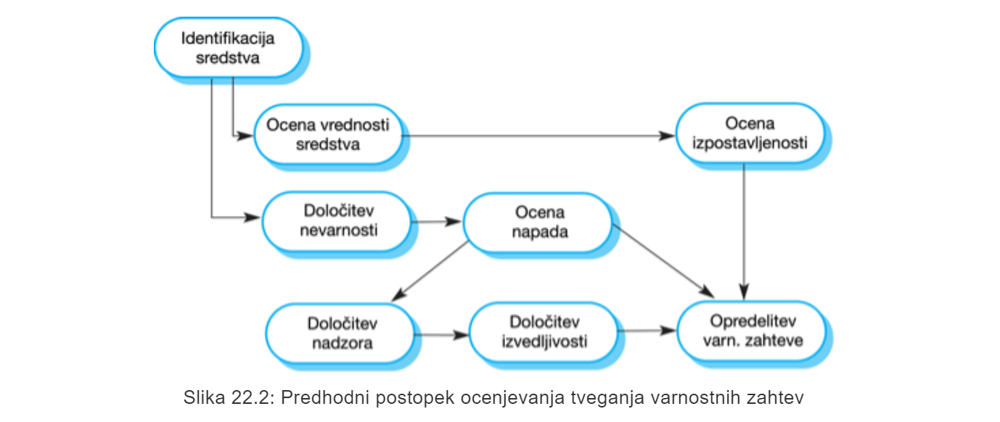
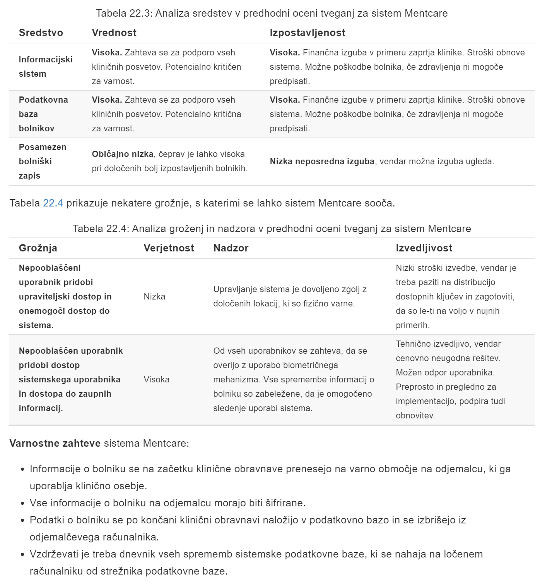
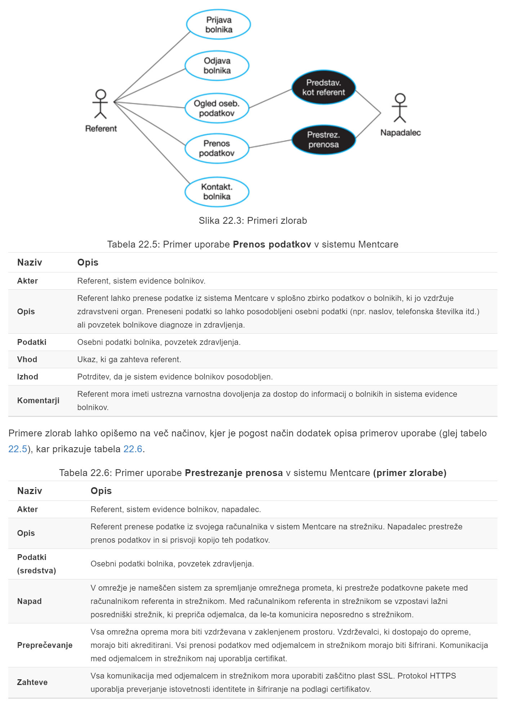
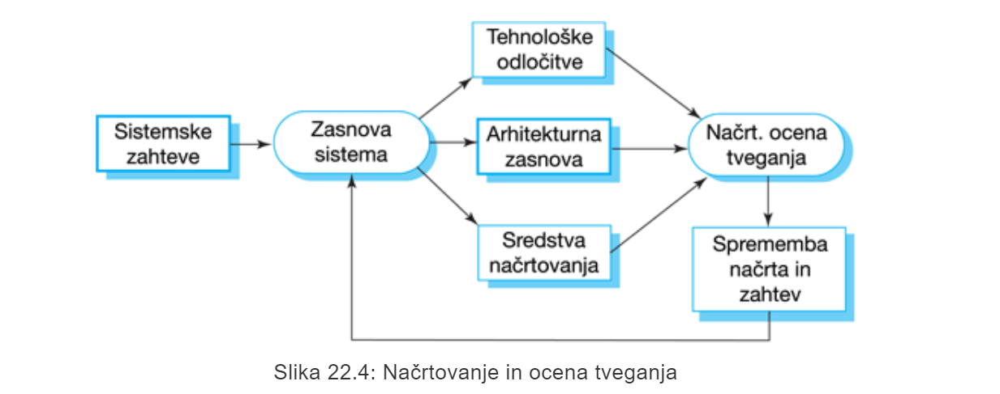
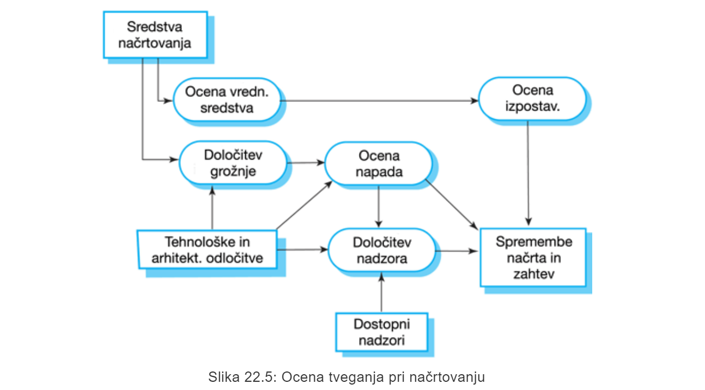
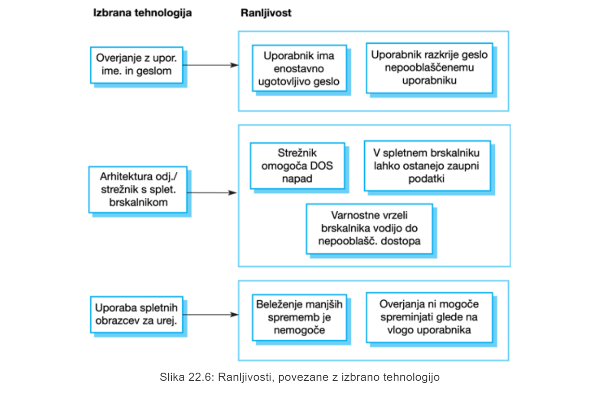
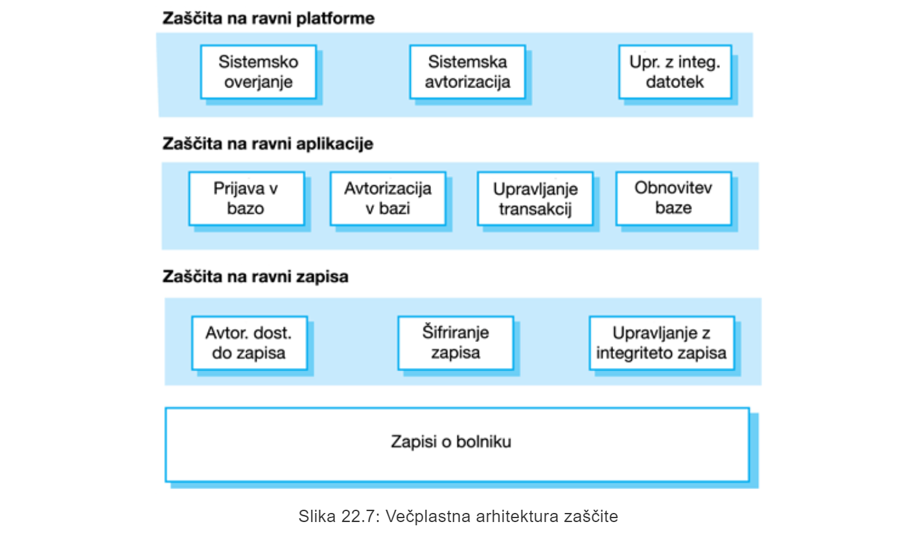
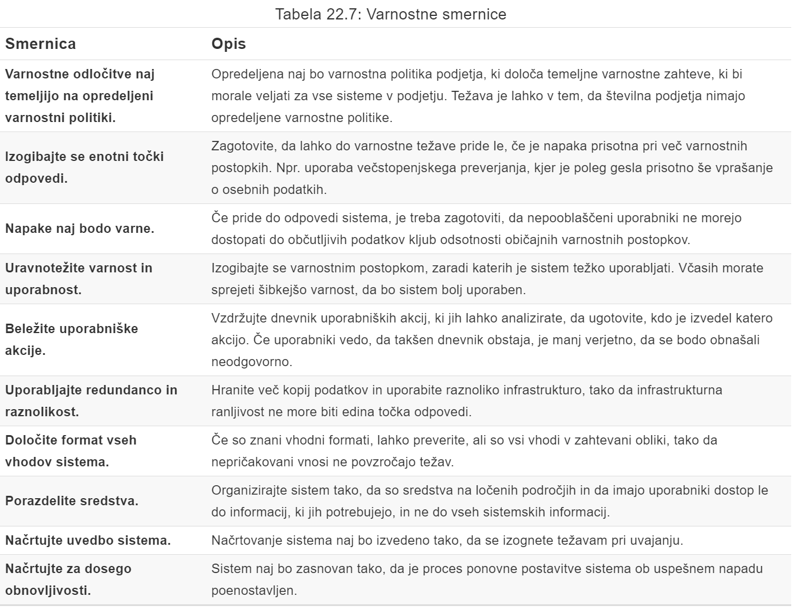

# P12 Varnostno inženirstvo
## 1.1 Uvod
**Varnostno inženirstvo** predstavlja orodja, tehnike in metode za podporo razvoju in vzdrževanju sistemov, ki so odporni na zlonamerne napade.

## 1.1 Varnostne dimenzije
- **zaupnost** - *informacije v sistemu se lahko razkrijejo ali so na voljo uporabnikom oz. programom, ki nimajo dovoljenja za dostop do teh informacij*
- **neokrnjenost** - *če pride v sistemu do okvare informacij, to povzroči nezanesljivost informacij*
- **razpoložljivost** - *dostop do sistema ali njegovih podatkov, ki so običajno na voljo, ni mogoč.*

## 1.2 Ravni varnosti
- **varnost infrastrukture** zadeva ohranjanje varnosti vseh sistemov in omrežij, ki zagotavljajo infrastrukturo in množico skupnih storitev v okviru podjetja.

- **Varnost aplikacij** se ukvarja z varnostjo posameznih aplikacijskih sistemov ali sorodnih skupin sistemov

- **Operativna varnost** se nanaša na varno delovanje in uporabo sistemov organizacije

## 1.3 Varnost infrastrukture in aplikacij
Z **varnostjo aplikacij** se ukvarja **programsko inženirstvo**, kjer mora biti **sistem zasnovan** tako, da je odporen proti napadom.

**Varnost infrastrukture** je v domeni **upravljanja sistemov**, kjer je treba **infrastrukturo nastaviti** tako, da je odporna proti napadom.

## 1.4 Upravljanje varnosti sistema
Upravljanje varnosti sistema vsebuje številne aktivnosti:
- **Upravljanje uporabnikov** in **dovoljenj**, kjer se dodaja in odstranjuje uporabnike iz sistema ter nastavlja ustrezna dovoljenja

- pri **uvajanju** in **vzdrževanju programske opreme** gre za nameščanje programske in vmesne programske opreme ter konfiguriranje teh sistemov, da se izognemo ranljivostim.

- **Nadzor napadov, odkrivanje** in **obnovitev** predstavlja spremljanje sistema proti nepooblaščenemu dostopu, oblikovanje strategij za odpornost do napadov in razvoj strategij za izdelavo varnostnih kopij in obnovitev

## 1.5 Operativna varnost
Uporabniki včasih izvajajo nevarna dejanja z namenom olajšanja svojega dela, zato vedno obstaja **kompromis** med **varnostjo** in **učinkovitostjo sistema**.

# 2 Varnost in zagotovljivost
## 2.1 Varnost
**Varnost sistema** je sistemska lastnost, ki odraža zmožnost sistema, da se zaščiti pred naključnim ali namernim zunanjim napadom.

## 2.2 Terminologija na področju varnostnega inženirstva

## 2.3 Primer nepooblaščenega dostopa do sistema Mentcare
>Osebje klinike se v sistem Mentcare prijavlja z uporabniškim imenom in geslom. Sistem zahteva, da so gesla dolga vsaj 8 znakov, vendar dovoljuje nastavitev gesla brez nadaljnjega dodatnega preverjanja. Napadalec ugotovi, da se ena izmed znanih oseb zdravi zaradi težav z duševnim zdravjem. Pridobiti želi nezakonit dostop do informacij, s katerimi bi lahko nato izsiljeval to znano osebo.

>Medicinskemu osebju se napadalec predstavi kot zaskrbljen svojec. Med pogovorom poskuša pridobiti potrebne podatke za dostop tako, da opazuje oznake z imeni in išče dodatne podatke o družinskih članih medicinskega osebja. Ko ugotovi imena in priimke zaposlenih, poskuša z različnimi kombinacijami uporabniških imen in gesel (npr. imena, priimki, datumi, otroci ipd.) pridobiti dostop do sistema.

## 2.4 Vrste groženj
- **Grožnja prestrezanja** napadalcu omogoča dostop do sredstva
- **Grožnja prekinitve** napadalcu omogoča, da povzroči nedostopnost dela sistema
- **Grožnja spremembe** omogoča napadalcu spreminjanje sistemskega sredstva
- **Grožnja vgradnje** napadalcu omogoča vstavljanje lažnih informacij v sistem

## 2.5 Zagotavljanje varnosti
- **Izogibanje ranljivostim** - *sistem je zasnovan tako, da se ranljivosti ne pojavijo*
- **Odkrivanje in odstranjevanje napadov** - *sistem je zasnovan tako, da se napadi na ranljivosti odkrijejo in nevtralizirajo, preden povzročijo izpostavljenost.*
- **Omejitev izpostavljenosti in predelava** - *sistem je zasnovan tako, da so negativne posledice uspešnega napada čim manjše*

## 2.6 Varnost in zagotovljivost
**Zagotovljivost** je lastnost sistema, da zagotovi svojo razpoložljivost, zanesljivost, zaščito, odpornost, celovitost in zmožnost vzdrževanja.

**Varnost in razpoložljivost**: Običajen napad na spletni sistem je napad z zavrnitvijo storitve, kjer je spletni strežnik preobremenjen z zahtevami za storitve iz različnih virov.

**Varnost in zanesljivost**: Če je sistem napaden in so sistema ali njegovi podatki poškodovani kot posledica tega napada, lahko to povzroči sistematske napake, ki ogrožajo zanesljivost sistema.

**Varnost in zaščita**: Če napad poškoduje sistem ali njegove podatke, pomeni, da prvotne predpostavke o varnosti morda ne držijo.

**Varnost in odpornost**: Odpornost je značilnost sistema, da se upre in ponovno vzpostavi po škodljivih dogodkih.

# 3 Varnost v podjetjih
## 3.1 Varnost je poslovno vprašanje
Varnost veliko stane in pomembno je, da se **varnostne odločitve** sprejemajo na **stroškovno učinkovit način**.

## 3.2 Organizacijske varnostne politike
Varnostne politike morajo določati splošne strategije dostopa do informacij, ki bi se morale uporabljati v celotni organizaciji.

## 3.3 Varnostne politike
Da je obvladovanje tveganja učinkovito, bi morale imeti organizacije **dokumentirano varnostno politiko**, ki določa:
- **Sredstva, ki jih je treba zaščititi**
- **Raven razščite, ki je potrebna za različne vrste sredstev**
- **Odgovornost posameznih uporabnikov, upravljalcev in podjetja**
- **Obstoječe varnostne postopke in tehnologije, ki jih je treba ohraniti**

## 3.4 Ocena in upravljanje varnostnih tveganj
**Ocena in upravljanje tveganj** se ukvarja z ocenjevanjem morebitnih izgub, ki bi lahko nastale zaradi napadov na sistem.

**Upravljanje tveganj** mora voditi organizacijska varnostna politika, kjer je vključeno:
- **predhodna** ocena tveganja
- ocena tveganja **v življenskem ciklu**
- ocena **operativnega** tveganja

### 3.4.1 Predhodna ocena tveganja
Cilj začetne ocene tveganja je opredelitev splošnih tveganj, ki so prisotna v sistemu, in se odločiti, ali je mogoče doseči ustrezno raven varnosti po razumni ceni.

### 3.4.2 Ocena tveganja pri načrtvoanju
Ta ocena tveganja poteka v življenskem ciklu razvoja sistema in temelji na načrtvoanju sistemov in odločitvah o implementaciji.

### 3.4.3 Ocena operativnega tveganja
Ta postopek ocene tveganja se osredotoča na uporabo sistema in možna tveganja, ki lahko nastanejo zaradi človeškega vedenja.

# 4 Varnostne zahteve
## 4.1 Varnostna specifikacija
**Varnostna specifikacija** ima nekaj skupnega s **specifikacijo zahtev za zaščito** - v obeh primerih se želimo izogniti slabim dogodkom. 

## 4.2 Vrste varnostnih zahtev
- zahteve za **identifikacijo** - *določajo, ali naj sistem identificira svoje uporabnike pred njihovo interakcijo s sistemom*
- zahteve za **preverjanje istovetnosti identitete** - *določajo, kako so uporabniki identificirani*
- zahteve za **avtorizacijo dostopa** - *določajo privilegije in dovoljenja za dostop identificiranih uporabnikov*
- zahteve **imunitete** - *določajo, kako naj se sistem ščiti pred virusi, črvi in podobnimi grožnjami*
- zahteve **integritete** - *določajo, kako se je mogoče izogniti okvari podatkov*
- zahteve **zaznavanja vdorov** - *določajo, katere mehanizme je treba uporabiti za odkrivanje napadov na sistem*
- zahteve za **preprečevanje zanikanja** - *določajo, da udeleženec v transakcji ne more zanikati svojega sodelovanja v tej transakcji*
- zahteve **zasebnosti** - *določajo, kako ohraniti zasebnost podatkov*
- zahteve za **varnostno revizijo** - *določajo prisotnost revizijske sledi in možnost preverjanja uporabe sistema*
- zahteve **sistemskega vzdrževanja** - *določajo, kako lahko aplikacija prepreči nenameren obhod varnostnih mehanizmov*

## 4.3 Klasifikacija varnostnih zahtev
- **zahteve izogibanja tveganj** - *določajo tveganja, ki se jim je treba izogniti*
- **zahteve ugotavljanja tveganj** - *opredeljujejo mehanizme, ki ob pojavitvi tveganja le tega identificarajo in tveganje nevtralizirajo*
- **zahteve zmanjševanja tveganja** - *določajo, kako naj bo sistem načrtovan, da je mogoča obnovitev sistemskih sredstev, potem, ko je že prišlo do izgube*

## 4.4 Ocena varnostnega tveganja

### 4.4.1 Ocena varnostnega tveganja sistema Mentcare

## 4.5 Primeri zlorab
**Primeri zlorab**:
- grožnja prestrezanja
- grožnja prekinitve
- grožnja spremembe
- grožnja vgradnje

### 4.5.1 Primeri zlorab v sistemu Mentcare

# 5 Varna zasnova sistema
Pomembna sta dva vidika zasnove sistema: 
- **zasnova arhitekture**
- **dobra praska**

## 5.1 Kompromisi pri načrtovanju
**Zmogljivost**: dodatni varnostni pregledi upočasnijo delovanje sistema

**Uporabnost**: varnostni ukrepi lahko od uporabnikov zahtevajo, da si zapomnijo informacije ali zahtevajo dodatno interackijo za dokončanje transakcije

## 5.2 Ocena tveganja pri načrtvoanju
Proces načrtovanja sistema in ocena načrtovalskih tveganj sta medsebojno prepletena

Na stopnji načrtovanja imamo informacije o predstavitvi in porazdelitvi informacij ter organizaciji podatkovne baze za zaščito sredstev na visoki ravni.

## 5.3 Načrtovalske odločitve pri uporabi COTS sistema pri implementaciji Mentcare

## 5.4 Zasnova arhitekture
Upoštevamo dva vidika:
- **Zaščita** - *kako organizirati sistem, da bodo kritična sredstva zaščitena pred zunanjimi napadi*
- **Porazdelitev** - *kako so sistemska sredstva porazdeljena, da so učinki uspešnega napada čim manjši*

### 5.4.1 Zaščita
Smiselna vpeljava **večplastne arhitekture**

### 5.4.2 Porazdelitev
Porazdelitev sistemskih sredstev pomeni, da napadi na en sistem ne vodijo nujno k popolnemu nedelovanju sistemskih storitev

## 5.5 Načrtovalske smernice za varnostno inženirstvo

# 6 Implementacija varnih sistemov
Pri implementaciji sta pomembna 2 vidika:
- **Ranljivosti so pogosto značilne za izbran programski jezik**
- **Varnostne ranljivosti so tesno povezane z zanesljivostjo programa**

## 6.1 Programske smernice za večjo zanesljivost sistema
1. omejite vidnost informacij v programu
2. preverite veljavnost vseh vnosov
3. obravnavajte vse izjeme
4. zmanjšajte uporabo konkstruktov, ki so nagnjeni k napakam
5. zagotovite možnost ponovnega zagona
6. preverite meje seznamov
7. pri klicih zunanjih komponent vključite časovne omejitve
8. poimenujte konstante, ki predstavljajo dejanske vrednosti

# 7 Testiranje in zagotavljanje varnosti
**Testiranje varnosti** je testiranje obsega, do katerega se lahko sistem zaščiti pred napadi.

## 7.1 Vrednotenje varnosti
- **testiranje na podlagi izkušenj**
- **testiranje vdora**
- **analiza na podlagi orodja**
- **formalno vrednotenje**

# 8 Zaključne ugotovitve
- **Varnostno inženirstvo** se ukvarja z razvojem sistemov, ki so odporni proti zlonamernim napadom.
- **Varnostne grožnje** so lahko grožnje zaupnosti, neokrnjenosti in razpoložljivosti sistema ali njegovih podatkov.
- **Obvladovanje varnostnih tveganj** se ukvarja z ocenjevanjem morebitnih izgub zaradi napadov in odvisnimi varnostnimi zahtevami za zmanjšanje izgub.
- Za **določitev varnostnih zahtev** je treba določiti sredstva, potrebna zaščite, in opredeliti način zaščite teh sredstev z uporabo varnostnih tehnik in tehnologij.
- Pri oblikovanju **varne arhitekture** je ključna organizacija strukture sistema, kjer se ključna sredstva zaščitijo in porazdelijo, da se zmanjša izguba v primeru uspešnega napada.
- **Varnostne smernice** načrtovalce sistemov opomnijo na varnostna vprašanja, ki jih morda niso upoštevali pri prvotni zasnovi. Zagotavljajo osnovo za izdelavo varnostnih kontrolnih seznamov.
- **Vrednotenje varnost**i sistema je težavno, ker varnostne zahteve navajajo, kaj se v sistemu ne sme zgoditi in ne kaj bi se moralo. Poleg tega so napadalci inteligentni in imajo lahko več časa za iskanje slabosti, kot ga je na voljo za varnostno testiranje.