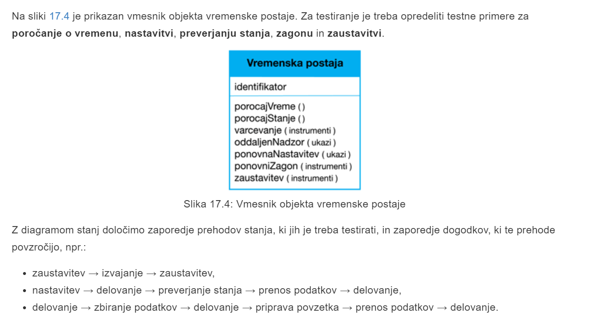

# P9 Testiranje
# 1 Uvod
## 1.1 Testiranje programske opreme
Namen testiranja je pokazati, da program deluje tako, kot je bilo predvideno in da se napake programa odkrijejo, še preden se začne uporabljati.
## 1.2 Cilji testiranja programske opreme
- razvijalcu oz. stranki želimo pokazati, da programska oprema ustreza njihovim zahtevam
- odkrivanje situacij, kjer je delovanje programske opreme nepravilno, nezaželeno ali ni v skladu s specifikacijo
## 1.3 Vrednotenje in testiranje napak
Prvi cilj je povezan z **vrednotenjem**, kjer se pričakuje, da bo sistem pravilno izvajal določeno množico testnih primerov.

Drugi cilj je povezan z **testiranjem napak**, kjer so testni sistemi zasnovani tako, da izpostavljajo napake.
## 1.4 Cilji procesa testiranja
**Vrednotenje** - uspešno izveden test potrjuje, da sistem deluje skladno z načrtom.

**Testiranje napak** - uspešno izveden test je takšen, ki pripravi sistem do nepravilnega delovanja in tako izpostavi napako v sistemu.

## 1.5 Preverjanje in vrednotenje
pri **preverjanju** oz. **verifikaciji** se vprašamo, ali **pravilno gradimo sistem**

pri **vrednotenju** oz **validaciji** se vprašamo, ali **gradimo pravilni sistem**

## 1.6 Zaupanje v preveranje in vrednotenje
Cilj preverjanja in vrednotenja **(V & V)** je vzpostaviti zaupanje, da je sistem primeren za njegov namen, kjer je zaupanje odvisno od:
- **namena programske opreme**
- **pričakovanja uporabnikov**
- **tržnega okolja**

## 1.7 Pregledi in testiranje
**Pregledi** programske opreme se pri odkrivanju težav ukvarjajo z analizo statične predstavitve sistema (**statično preverjanje**).

**Testiranje** programske opreme se ukvarja z izvajanjem in opazovanjem vedenja sistema (**dinamično preverjanje**)

### 1.7.1 Pregledi programske opreme
Ne zahtevajo izvajanja sistema, zato se lahko opravijo še **pred** implementacijo in se lahko uporabijo za poljubno predstavitev sistema *(zahteve, načrt, konfiguracijski podatki, testni podatki, ...)*

### 1.7.2 Testiranje programske opreme

Pri testiranju programske opreme poznamo več **stopenj**:
- pri **razvojnem testiranju** se sitem preizkuša med razvojem z namenom odkrivanja napak
- pri **testiranju izdaje** ločena skupina za testiranje preizkusi celotno različico sistema pred izdajo končnim uporabnikom
- pri **uporabniškem testiranju** uporabniki ali potencialni uporabniki sistema preizkušajo sistem v svojem okolju

# 2 Razvojno testiranje
**Razvojno testiranje** vključuje vse aktivnosti testiranja, ki jih izvaja razvojna skupina
- **testiranje enot** se osredotoči na **testiranje funkcionalnosti objektov** ali **metod**
- **testiranje komponent** se osredotoči na **testiranje komponentnih vmesnikov**
- **testiranje sistema** se osredotoči na **testiranje interakcij med komponentami**

## 2.1 Testiranje enot
**Testiranje enot** je proces izolacije posameznih komponent in testiranja napak, kjer **enote** lahko klasificiramo kot:
- **posamezne funkcije** ali **metode** v okviru objekta
- **razrede objektov**
- **sestavljene komponente** z določenimi vmseniki, ki se uporabljajo za dostop do njihove funkcionalnosti

### 2.1.1 Testiranje razredov objektov
**Testiranje razredov objektov** vključuje popolno pokritost razreda s testi: 
- testiranje vseh operacij, povezanih z objektom
- nastavitev in pregledovanje vse atributov objekta
- izvajanje objekta v vseh možnih stanjih

### 2.1.2 Testiranje vremenske postaje

### 2.1.3 Samodejno testiranje
Kjer je le mogoče, uporabimo **samodejno testiranje**, ki je sestavljeno iz treh delov:
- **namestitev**, kjer inicializiramo sistem s testnim primerom, in sicer določimo vhode ter pričakovane izhode
- **izvajanje**, kjer pokličemo objekt ali metodo, ki jo želimo potestirato
- **potrjevanje**, kjer primerjamo rezultat klica s pričakovanim rezultatom. Če je prisotno ujemanje, je test uspešen, sicer je neuspešen. 

## 2.2 Izbira testnih primerov
Imamo dve vrsti testnih primerov:
- prva vrsta testnih primerov mora odražati **normalno delovanje sistema** in pokazati, da komponenta deluje po pričakovanjih

- druga vrsta testnih primerov pa mora temeljiti na izkušnjah pri testiranju o tem, kje se pojavijo **pogoste težave**.

### 2.2.1 Strategije testiranja
Poznamo dve strategiji testiranja:
- **Testiranje particij**, kjer določimo skupine vhodnih podatkov, ki imajo skupne značilnosti in jih je treba obdelati na enak način.

- **Testiranje na podlagi smernic**, kjer se pri izbiri testnih primerov za testiranje uporabijo smernice.

#### 2.2.2.1 Testiranje particij
Pri **testiranju particij** so vhodni podatki in izhodni rezultati pogosto iz različnih razredov, kjer pa so člani razreda medsebojno povezani.

#### 2.2.2.1 Testiranje na podlagi smernic
**Splošne smernice** pri testiranju so:
- izbira vhodov, ki prisilijo sistem, da zgenerira vsa možna sporočila o napakah
- uporaba vhodnih podatkov, ki povzročijo prekoračitev pomnilnika
- ponovitev enakih vhodnih podatkov ali nizov vhodnih podatkov
- generiranje neveljanvnih izhodnih rezultatov

Pogosto uporabljena smernica je **testiranje zaporedij**

## 2.3 Testiranje komponent
Komponente programske opreme so pogosto sestavljene iz več medsebojno povezanih objektov.

### 2.3.1 Testiranje vmesnika
Pri **testiranju vmesnika** je cilj odkrivanje napak vmesnika ali napak zaradi neveljavnih predpostavk o vmesniku.

Poznamo več vrst vmesnikov:
- **vmesnik parametrov** - *podatki se prenašajo od ene metode ali procedure do druge*
- **skupni pomnilniški vmesnik** - *pomnilniški blok se deli med procedurami ali funkcijami*
- **postopkovni vmesnik** -  *podsistem združuje nabor procedur, ki kliče drug podsistem*
- **vemsnik za posredovanje sporočič** - *podsistemi zahtevajo storitve drugih podsistemov*

### 2.3.2 Napake vmesnika
- **napačna uporaba vmesnika** - *komponenta pokliče drugo komponento in naredi napako pri uporabi vmesnika (npr. parametri v napačnem vrstnem redu)*
- **nerazumevanje vmesnika** - *komponenta pri klicu upošteva določene predpostavke o delovanju druge komponente, ki so napačne*
- **časovne napake** - *komponenti delujeta z različno hitrostjo in tako se dostopa do neažurnih informacij*

## 2.4 Testiranje sistema
**Testiranje sistema** med razvojem vključuje integracijo komponent pri izdelavi različice sistema in nato testiranje integriranega sistema.

### 2.4.1 Testiranje integracije komponent
Med testiranjem sistema se lahko z novo razvitimi komponentami integrirajo komponente za večkratno uporabo in gotovi sistemi; nato pa se testira celoten sistem.

### 2.4.2 Testiranje primerov uporabe
Primeri uporabe, ki so nastali za identifikaijo interakcije s sistemom, se lahko uporabijo za osnovo testiranja sistema.

#### 2.4.2.1 Testni primeri, izpeljani iz diagrama zaporedja

### 2.4.3 Politike testiranja
Primeri politik testiranja:
- testirati je treba **vse sistemske funkcije**, do katerih je mogoče **dostopati preko menijev**
- tesitrati je treba **kombinacije funkcij**, do katerih se lahko dostopa preko istega menija
- ko se zahteva **uporabniški vnos podatkov**, je treba testirati vse funkcije s **pravilnim** in **nepravilnim** vnosom

# 3 Testno usmerjen razvoj (TDD)
**Testno usmerjen razvoj (TDD)** je pristop k izdelavi programske opreme, kjer se testiranje in razvoj izvorne kode prepletata. Testi so napisani pred samo kodo in potrditev testov je ključno gonilo razvoja.

## 3.1 Aktivnosti proces TDD

## 3.2 Prednosti TDD
- **Pokritost s testi** - *vsak segment kode, ki ga napišemo, ima vsaj en povezan test, tako da ima vsa napisana koda vsaj en test*
- **Regresijsko testiranje** - *zbirka regresijskih testov se razvija postopoma, skupaj z razvojem programa*
- **Poenostavljeno iskanje napak** - *ob neuspešnem testu je jasno, kje je težava*
- **Sistemska dokumentacija** - *sami testi predstavljajo določeno obliko dokumentacije, ker opisujejo, kako naj bi program deloval*

### 3.2.1 Regresijsko testiranje
**Regresijsko testiranje** je testiranje sistema, kjer se preveri, da vplejane spremembe niso *pokvarile* delovanje prej delujoče kode.

# 4 Testiranje izdaje
**Testiranje izdaje** je proces testiranja določene izdaje sistema, ki je namenjen za uprabo zunaj razvojne skupine.

## 4.1 Testiranje izdaje in sistema
Testiranje izdaje je določena oblika testiranja sistema, vendar obstajajo pomembne razlike:
- za **testiranje izdaje** mora biti odgovorno **ločena skupina**, ki ni bila vključena v razvoj sistema.

- **Testiranje sistema** s strani razvojne skupine se mora osredotočiti na **odkrivanje napak v sistemu**. Cilj **testiranja izdaje** pa je preveriti, ali **sistem izpolnjuje zahteve** in je dovolj dober za zunanjo uporabo (V&V)

## 4.2 Testiranje na podlagi zahtev
**Testiranje, ki temelji na zahtevah**, vključuje preučevanje vsake zahteve in pripravo ustreznih testov

## 4.3 Testiranje na podalgi scenarijev
**Testiranje, ki temelji na scenarijih**, je pristop testiranja izdaj, kjer se izdela tipišne scenarije uporabe, na podlagi katerih se razvije tesne primere

## 4.4 Testiranje zmogljivosti
**Testi zmogljivosti** običajno vključujejo množico testov, kjer se obremenitev počasi povečuje, dokler delovanje sistema ne postane nesprejemljivo.

**Testiranje izjemninh situacij** je oblika testiranja zmogljivosti, kjer je sistem namerno preobremenjen in se poskuša doseči neustrezno zaupanje.

# 5 Uporabniško testiranje
**Uporabniško testiranje** je stopnja v procesu testiranja, kjer uporabniki ali naročniki zagotovijo vhodne podatke in nasvete o testiranju sistema.

## 5.1 Vrste uporabniškega testiranja
Pri **alfa testu** uporabniki sodelujejo z razvojno ekipo tako, da pri razvijalcih testirajo programsko opremo

Pri **beta testu** je uporabnikom na voljo izdaja programske opreme, ki jim omogoča eksperimentiranje in povzročanje potencialnih težav, ki jih odkrivajo skupaj z razvijalci.

Pri **testu sprejemljivosti** stranka testira sistem z namenom odločanja, ali je le-ta sprejemljiv za uvedbo v okolje stranke.

### 5.1.1 Agilne metode in test sprejemljivosti
Pri agilnih metodah je uporabnik oz. stranka del razvojne skupine in je odgovorna za sprejemanje odločitev o sprejemljivosti sistema.

# 6 Zaključne ugotovitve
- Testiranje lahko samo pomaga razkriti prisotnost napak v programu, ne more pa potrditi, da ni prisotnih napak.
- Za razvojno testiranje je odgovorna ekipa za razvoj programske opreme. Ločena testna skupina pa je odgovorna za testiranje sistema, preden se ta izda stranki.
- Razvojno testiranje vključuje: testiranje enot, kjer testiramo posamezne objekte in metode; testiranja komponent, kjer testiramo sorodne skupine objektov, in sistemsko testiranje, kjer testiramo delne ali popolne sisteme.
- Pri testiranju programske opreme morate poskusiti “razbiti” programsko opremo z uporabo izkušenj in smernic, tako da izberete testne primere, ki so v preteklosti bili učinkoviti pri odkrivanju napak v drugih sistemih.
- Samodejne teste pišemo kadarkoli je mogoče. Takšne teste lahko samodejno izvaja program, ki se pokliče ob vsaki spremembi sistema.
- TDD je pristop k razvoju, kjer so testi napisani pred kodo.
- Pri testiranju na podlagi scenarijev se pripravijo tipični scenariji uporabe, ki so osnova pri pripravi in izvedbi testnih primerov.
- Test sprejemljivosti je vrsta uporabniškega testiranja, kjer se odloča, ali je programska oprema primerna za uporabo v produkcijskem okolju.