# P3 Procesi izdelave programske opreme
# 1 Uvod
## 1.1 Proces izdelave programske opreme
Proces zajema:
1. **specifikacijo** - *kaj naj sistem počne*
2. **načrt in implementacijo**
3. **vrednotenje** - *preverjanje sistemo, da pogledamo če je to to kar stranka želi*
4. **evolucijo** - *predstavlja spreminjanje sistema glede na spreminjajoče zahteve strank*

## 1.2 Opis procesv izdelave programske opreme
Pri opisovanju/razpravljanju o procesih govorimo večinoma o **aktivnosti v teh procesih** in **zaporedju izvajanja** le-teh.

opišemo lahko tudi z:
- **izdelkom**
- **vlogami**
- **pogoji** in **posledicami**

## 1.3 Načrtovalni in agilni procesi
**načrtovalni procesi** : vse aktivnosti se načrtujejo vnaprej
**agilni procesi** : načrtvoanje je postopno - *lažje spremenimo proces*

# 2 Procesni modeli izdelave programske opreme
## 2.1 Slapovni razvoj
razdeljen v faze:
1. **opredelitev zahtev**
2. **načrt sistema**
3. **razvoj in testiranje enot**
4. **integracija in testiranje sistema**
5. **delovanje in vzdrževanje sistema**

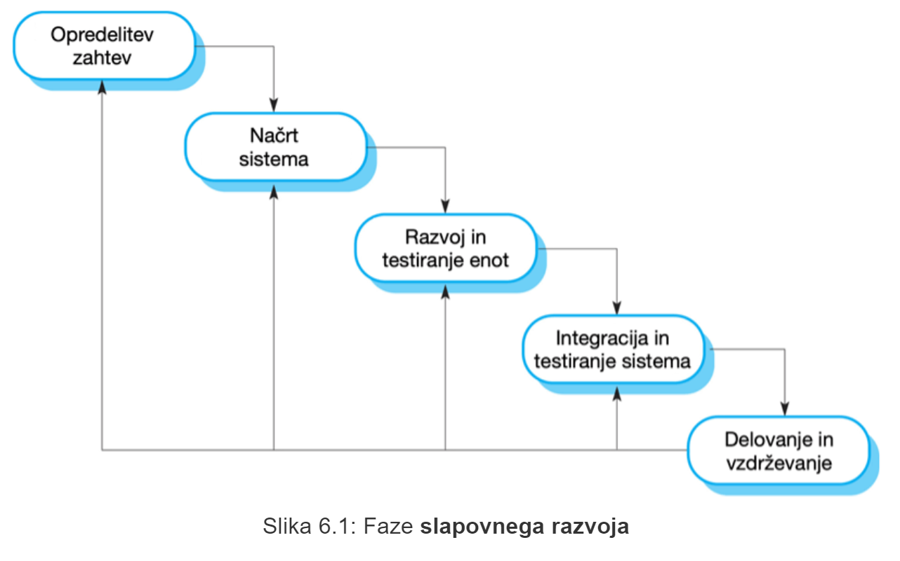

### 2.1.1 Težave
- **težko se prilagodimo spreminjajočim se potrebam strank**
- primerno le **samo ko so zahteve res dobro zastavljene in razumljive**
- zelo malo sistemov ima tako stabilne zahteve

### 2.1.2 Uporaba
Ta model razvoja se uporablja samo v korporacijah, jer več inženirjev dela na istih lokacijah in majo nek skupen grand plan, ki ga potem lahko še sicirajo na manjše plane itd. 

## 2.2 Inkrementalni razvoj

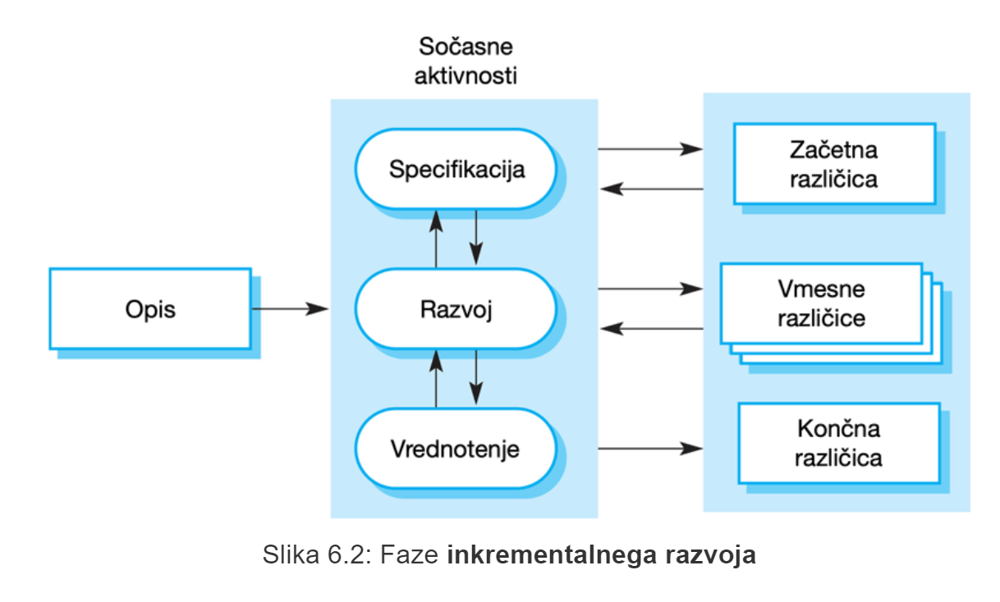

### 2.2.1 Prednosti
- **stroški** prilagajanja spremembam zahtev **se zmanjšajo**
- lažje pridobivamo povratne informacije strank *(**stalno vrednotenje**)*
- **hitrejša dostava, namestitev in uporaba**

### 2.2.2 Slabosti
- **postopek razvoja ni pregleden** - *potrebujemo redne sprotne rezultate*
- **kakovost strukture sistema** se z novimi inkrementi **zmanjšuje**

## 2.3 Integracija in konfiguracija
Temelji na ponovni uporabi programske opreme
### 2.3.1 Vrste programske opreme za večrtano uporabo
- **Samostojni aplikacijski sistemi (COTS)** - *konfigurirani za rabo v določenem okolju*
- **Množica objektov v obliki paketa** - *knjižnjica*
- **Spletne storitve** - *na voljo preko oddaljenih klicev (RESTApi)*

### 2.3.2 Programsko inženirstvo s ponovno uporabo
faze:
1. **specifikacija zahtev**
2. **iskanje in vrednotenje programske opreme**
3. **izboljšanje zahtev**
4. **konfiguracija aplikacijskega sistema**
5. **prilagoditev in integracija komponent**

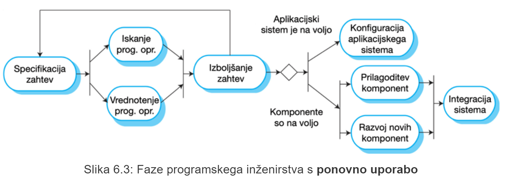

### 2.3.3 Prednosti
- **zmanjšamo stroške tveganj**
- **hitrejša namestitev, dostava in urejanje sistema**
### 2.3.4 Slabosti
- **kompromisi pri specifikaciji zahtev neizogibni**
- **nimamo nadzora nad razvojem ponovno uporabljenih/integriranih elementov sistema**

# 3 Procesne aktivnosti
osnovne procesne aktivnosti so:
- **specifikacija**
- **razvoj**
- **vrednotenje**
- **evolucija**

## 3.1 Proces zajema zahtev

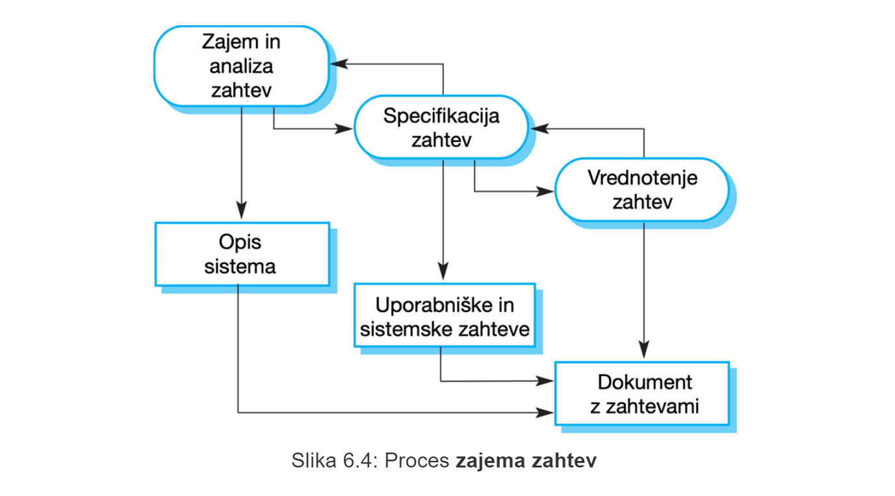

### 3.1.1 Specifikacija programske opreme
**Specifikacija programske opreme** je postopek določanja potrebnih storitev in omejitev delovanja ter izdelave sistema.

Proces zajemanja zahtev predstavlja **pomemben del postopka specifikacije programske opreme**:
- **Zajem in analiza zahtev** - *kaj stranke pričakujejo od sistema?*
- **Specifikacije zahtev** - *zahteve podrobno opredelimo*
- **Vrednotenje zahtev** - *preverjanje veljavnosti zahtev*

Končen produkt je **dokument z zahtevami**

## 3.2 Načrtovanje in implementacija programske opreme
to je postopek **pretvorbe sistemske specifikacije v izvršljiv sistem**
- **Načrtovanje programske opreme**: oblikovanje programske strukture, ki bo realizirala specifikacijo.
- **implementacija**: prenos programske strukture v obliko izvršljivega programa.

### 3.2.1 Splišni model procesa načrtovanja

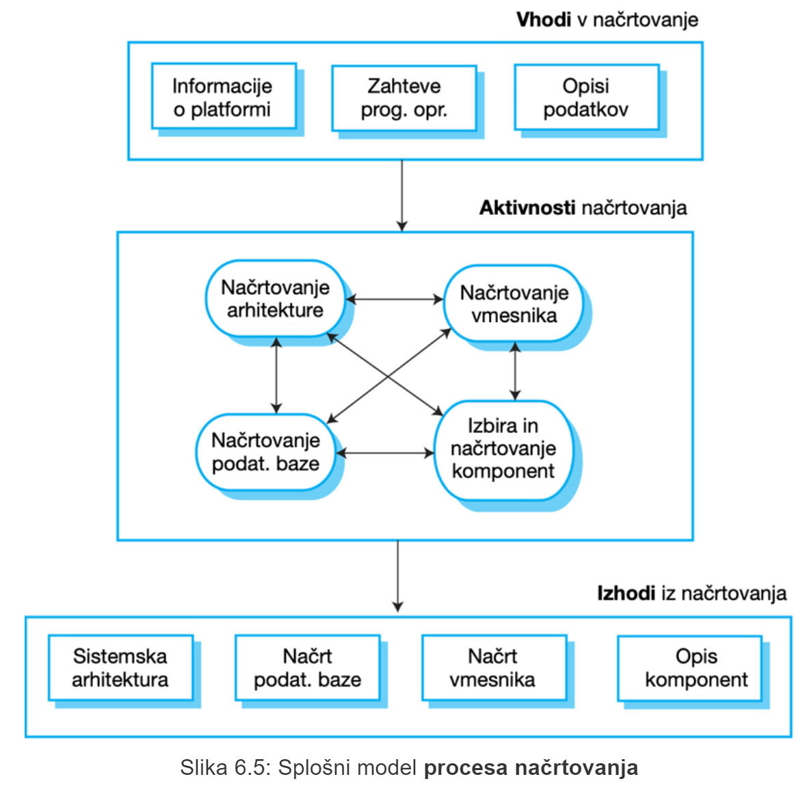

### 3.2.2 Aktivnosti načrtovanja
- **načrtovanje arhitekture** - *določimo celotno strukturo sistema, glavne komponente, njihove odvnisnosti, kako so porazdeljeni
- **načrtvoanje podatkovne baze** - *določa podatkovne strukture sistema, način predstavitve v podatkovni bazi*
- **načrtovanje vmesnika** - *določijo se vmesniki med komponentami sistema**
- **izbira in načrtovanje komponent** - *iščemo komponente ki jih lahko ponovno uporabimo*

### 3.2.3 Implementaicja sistema
Razvoj programske opreme poteka s **programiranjem** informacijske rešitve ali s **konfiguriranjem** obstoječega aplikacijskega sistema.

## 3.3 Preverjanje in vrednotenje programske opreme
Pokazati želimo, da je sistem skladen s specifikacijami in izpolnjuje zahteve naročnika sistema.

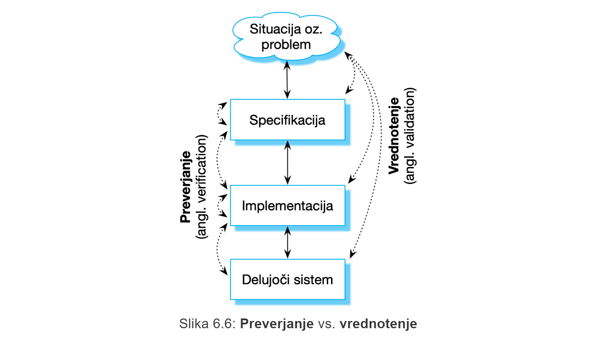

- **preverjanje** - *ali sistem gradimo **pravilno**?*
- **vrednotenje** - *ali gradimo **pravi sistem**?*

Najpogosteje uporabljena aktivnost preverjanja in vrednotenja programske opreme je **testiranje sistema**

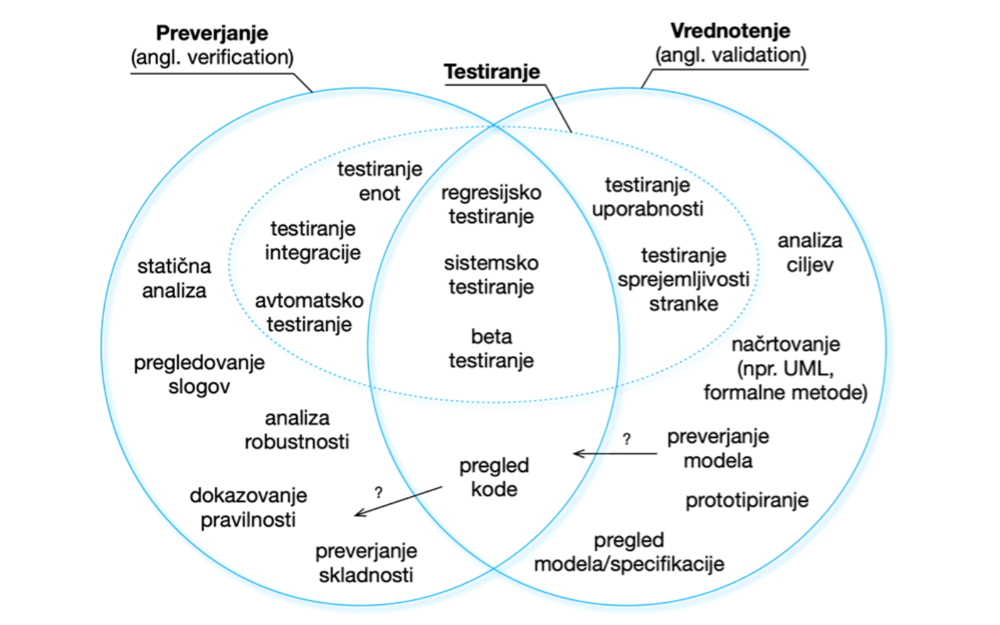

### 3.3.1 Stopnje testiranja

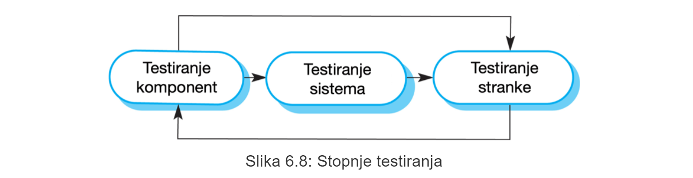

### 3.3.2 Faze testiranja v **načrtno usmerjenem procesu** razvoja programske opreme

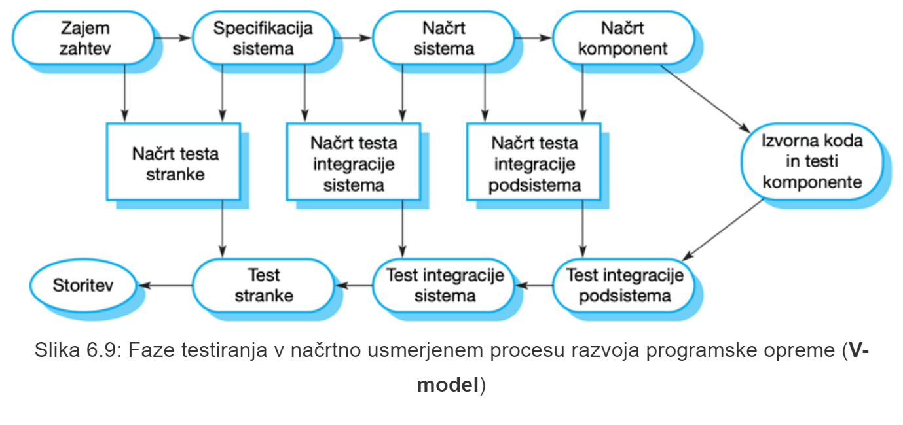

## 3.4 Evolucija programske opreme
Programska oprema je sama po sebi **prilagodljiva** in **se lahko spreminja**.

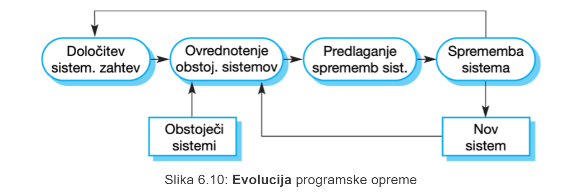

# 4 Oblvadovanje sprememb
**Spremembe so neizogibne** pri vseh velikih projektih razvoja programske opreme.

## 4.1 Zmanjševanje stroškov ponovne izdelave
Stroške ponovne izdelave lahko efektivno zmanjšamo z:
- **predvidevanjem sprememb** - *razvoj vključuje dejavnosti, ki lahko predvidijo možne spremembe, še preden se zahteva ponovno izdelava*
- **toleranco do sprememb** - *proces zasnujemo tako, da so spremembe lahko upoštevane s sorazmerno nizkimi stroški*

## 4.2 Obvladovanje spreminjajočih zahtev
Spreminjajoče zahteve lahko obvladujemo z:
- **protoripiranjem sistema** - *različice se razvijajo hitro, z namenom, da se preverijo zahteve stranke.
- **postopna dostava** - *posamezni inkrementi sistema se dostavijo stranki za pridobitev komentarjev in eksperimentiranje*

## 4.3 Prototipiranje programske opreme
**Prototip** je začetna različica sistema, ki se uporablja za predstavitev osnovnih konceptov in preverjanje različnih načrtovalskih možnosti.

uporaba pri:
- **zajemu zahtev**
- **načrtovanju**
- **testiranju** 

### 4.3.1 Prednosti prototipiranja
- izboljšana uporabnost sitema
- večja usklajenost z dejanskimi potrebami uporabnikov
- izboljšana kakovst načrta
- izboljšana vzdrževalnost
- manja prizadevanja pri razvoju

### 4.3.2 Proces razvoja prototipa

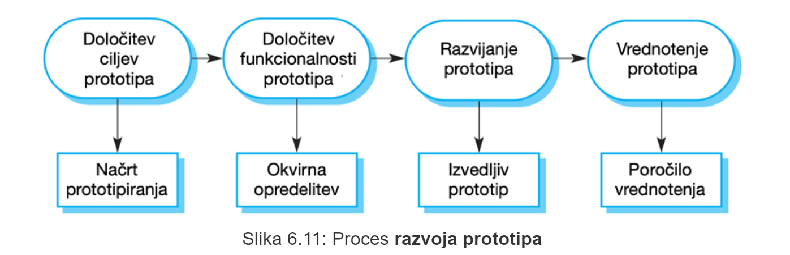

### 4.3.3 Razvoj prototipa
Temelji lahko na **opustitvi posameznih funkcionalnosti**:
- osredotočimo se na **področja** izdelka, **ki niso dobro razumeljena**
- ni potrebe po preverjanju napak
- fokus na **funkcionalnih zahtevah**

### 4.3.4 Prototipe zavržemo
Po razvoju je prototipe potrebno zavreči, saj **niso dobra osnova za produkcijski sistem**

## 4.4 Inkrementalna oz. postopna dostava
- razvoj in dostava se razčlenita v **inkremente**
- zahteve z višjo prioriteto v **začetnih** inkrementih
- **ob razvoju** inkrementa se zahteve **ne spreminjajo**
### 4.4.1 Inkrementalni razvoj in dostava
### 4.4.1.1 Inkrementalni razvoj
Postopno **razvijanje sistema** in **vrednotenje posameznega inkrementa** pred nadaljevanjem z razvojem naslednjega inkrementa *(vrednotenje opravi uporabnik oz. stranka)*
### 4.1.1.2 Inkrementalna dostava
Dostava samega inkrementa **za namen uporabe s strani uporabnikov**

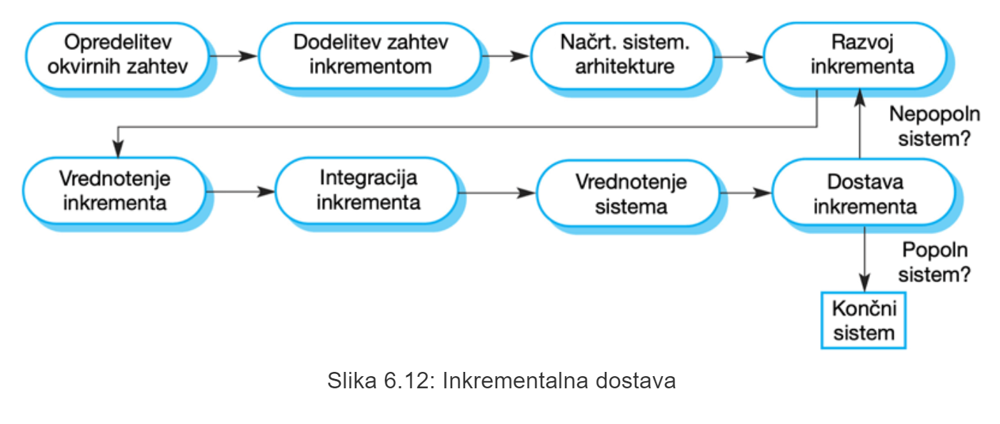

### 4.1.2 Prednosti
- začetni inkrementi v vlogi **prototipov** - *pomaga za kasnejše inkremente*
- **tveganje** za neuspeh celotnega projekta je **manjše**
- več testiranja za storitve sistema **z višjo prioriteto**
### 4.1.3 Slabosti
Če imamo veliko osnovnih lastnosti, ki jih uporabljajo različni deli sistema, potem je težko določiti **skupne lastnosti**, ki bi jih združili v inkremente

# 5 Izboljšanje procesa izdelave
Izboljšanje procesa izdelave se uporablja kot način **izboljšanja kakovosti** svoje **programske opreme**, **zmanjševanje stroškov** ali **pospešitev razvojnih procesov**

## 5.1 Pristopi k izboljšanju
- **pristop zrelosti procesa** - *fokus na izboljšanju **procesnega** in **projektnega** **vodenja** ter uvajanju dobrih praks.*
- **agilni pristopi** - *fokus na **iterativnem razvoju** in **zmanjševanju režijskih stroškov**

## 5.2 Cikel izboljšanja procesa

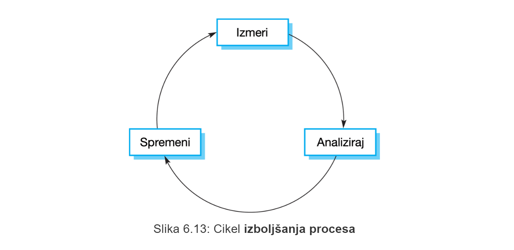

### 5.2.1 Aktivnosti izboljšanja procesa
- **Merjenje procesa** - *merimo enega ali več atributov procesa ali izdelka razvoja programske opreme*
- **Analiza procesa** - *trenutni proces se ocenjuje, kjer se ugotavjajo pomankljivosti in ozka grla*
- **Sprememba procesa** - *predlagajo se spremembe za ugotovljene pomankljivosti*

## 5.4 Merjenje procesa
- zbrati je potrebno **kvantitativne podatke** *(če je to mogoče)*
- gonilo izboljšanja mora izhajati iz **organizacijskih ciljev**

## 5.5 Procesne metrike
- **čas potreben za zaključek dejavnosti procesa** - *npr. koledarski čas ali napor*
- **viri, potrebni za izvedbo procesa** - *npr. skupni nabor v človek-dneh*
- **število pojavitev določenega dogodka** - *npr. število odrkitih napak*

## 5.6 Zmožnostno zrelostne ravni

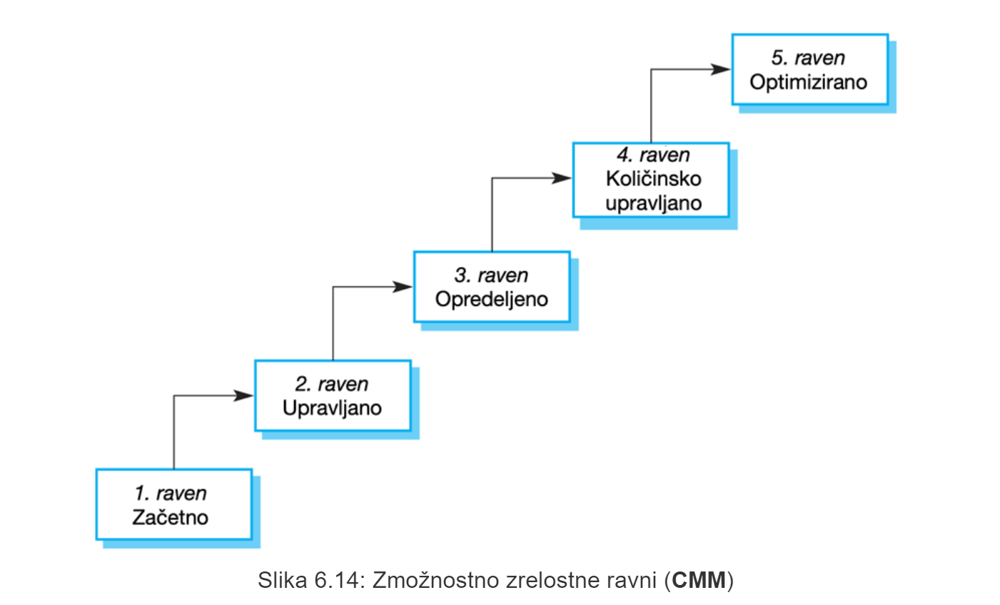

## 5.7 Zmožno zrelostni model (**CMM**)
opredeljenih je 5 ravni:
- **začetna raven** - gre za nenadzorovan proces
- **ponovljiva** oz. **upravljana raven** - *določeni in uporabljeni **postopki za upravljanje izdelkov***
- **opredeljena raven** - *opredeljeni in uporabljeni **postopki upravljanja procesov***
- **količinsko upravljana raven** - *opredeljene in uporabljene **strategije upravljanja kakovosti***
- **optimizirana raven** - *opredeljene in uporabljene **strategije za izboljšanje procesov**

# 6 Zaključne ugotovitve
- Proces izdelave programske opreme predstavljajo aktivnosti, ki so vključene v izdelavo sistema programske opreme. Procesni modeli izdelave programske opreme so abstraktne predstavitve teh procesov.
- Splošni procesni modeli opisujejo organizacijo procesov izdelave programske opreme.
    - Primeri teh splošnih modelov so **slapovni razvoj, inkrementalni razvoj in razvoj, usmerjen v ponovno uporabo**.
- **Proces zajema zahtev** se ukvarja s pripravo specifikacije programske opreme.
- **Procesa načrtovanja in implementacije** se ukvarjata s preoblikovanjem specifikacije zahtev v izvršljiv informacijski sistem.
- **Vrednotenje** programske opreme je postopek preverjanja, ali je sistem skladen s svojimi specifikacijami in izpolnjuje resnične potrebe uporabnikov sistema.
- **Evolucija** programske opreme poteka ob spremembi obstoječega informacijskega sistema, da bi uvedli nove zahteve. Programska oprema se mora dodatno razviti, da ostane uporabna.
- Proces razvoja programske opreme bi moral vključevati tudi dejavnosti, kot sta **izdelava prototipov** in **postopna dostava**, predvsem z vidika obvladovanja sprememb.
- Procesi razvoja so lahko prilagojeni iterativnemu razvoju in dostavi, kjer lahko uvajamo spremembe, ne da bi negativno vplivali na sistem kot celoto.
- Osrednji pristop k izboljšanju procesov je **agilni pristop**, ki je usmerjen v zmanjšanje režijskih stroškov, in **pristop na podlagi zrelosti**, ki temelji na boljšem upravljanju procesov in uporabi dobre prakse izdelave programske opreme.
- Zmožnostni zrelostni model določa stopnje zrelosti, ki v bistvu ustrezajo uporabi dobre prakse izdelave programske opreme.