# 2. Projektno vodenje
## 2.1 Upravljanje projektov programske opreme
**Upravljanje projektov programske opreme** se ukvarja z aktivnostmi, ki zagotavljajo, da je programska oprema dostavljena pravočasno in v skladu z zahtevami.

**Kriteriji uspeha**:
- dostava opreme **v dogovorjenem času**
- skupni stroški razvoja **v okviru proračuna**
- oprema **ustreza zahtevam stranke**
- vzdrževanje **skladne** in **dobro delujoče razvojne skupine**

### 2.1.1 Posebnosti upravljanja projektov
- izdelek **ni oprijemljiv** - ga ne moremo prijeti, ni ga mogoče videti - napredek preverimo tako da preverimo sam izdelek
- številni projekti pri razvoju so **enkratni** - težko predvidimo napake, ki se bodo zgodile pri izvajanju enega projekta
- procesi razvoja so **specifični** in **spremenljivi** glede na posamezno podjetje.

### 2.1.2 Dejavniki ki vplivajo na vodenje projektov
- **velikost podjetja** - manjša podjetja imajo manjži strošek režiranja
- **stranka** - komunikacija s stranko lahko poteka na neformalnem ali formalnem nivoju, odvisno od tega, kdo je stranka ( nekdo ki ga poznamo osebno / vladna organizacija )
- **velikost programske opreme** - večji kot je obseg programske opreme, večjo ekipo potrebujemo
- **vrsta programske opreme** - npr. pri *kritičnih* sistemih je potrebno zabeležiti vse odločitve pri vodenju projetka
- **organizacijska kultura** - pri določenih podjetjih spodbujajo posameznike, spet drugje pa je poudarek na skupinskem delu
- **procesi razvoja** - npr. pri agilnem pristopu poskušamo zmanjšati režijske stroške z upravljanjem

> te dejavniki povejo, da lahko vodje projektov na različnih projektih delujejo na različne načine

## 2.2 Univerzalne aktivnosti upravljanja
- pisanje projektnega predloga
- Načrtovanje projekta
- Upravljanje s tveganji
- Upravljanje z ljudmi
- Poročanje
### 2.2.1 Upravljanje s tveganji
**Upravljanje s tveganji** se ukvarja s prepoznavanjem tveganj pri razvoju projekta in pripravo načrta za zmanjševanje njihovega vpliva na projekt.

#### 2.2.1.1 Klasifikacija tveganj
Poznamo 2 vidika klasificiranja tveganj:
1. **vrsta tveganja** - *tehnično ali organizacijsko itd..
2. **na kaj vpliva** tveganje

Na tej podlagi lahko tveganja razdelimo v naslednje skupine:
- **Projektno tveganje** - vpliva na časovni načrt ali vire *(npr. iz ekipe odide izkušenj sistemski arhitekt)*
- **Produktno tveganje** - vpliva na kakovost ali zmogljivost programske opreme *(npr. kupljena komponenta ne deluje tako kot željeno)*
- **Poslovno tveganje** - vpliva na organizacijo, ki razvija ali dobavlja programsko opremo *(npr. na trg pride konkurenčni izdelek - spremembe na trgu)*

#### 2.2.1.2 Proces upravljanja s tveganji
1. **določitev tveganj** - *opredelijo se projektna, produktna in poslovna tveganja*
2. **analiza tveganj** - *določijo se oceno verjetnosti in posledice tveganj*
3. **načrtovanje tveganj** - *pripravi se načrte za preprečevanje ali zmanjševanje učinkov tveganj*
4. **spremljanje tveganj** - *spremljamo tveganja v celotnem projektu*

#### 2.2.1.3 Določitev tveganj
seznam pogostih tveganj:
- **tehnoločka** tveganja - *uporabljena podatkovna baza ni dovolj zmogljiva za naše zahteve, določene komponente so slabo načrtovane in vsebujejo napake zato jih ni mogoče ponovno uporabiti...*
- **organizacijska** tveganja - *finančne težave, slabo prestrukturiranje vodstva...*
- tveganja, povezana z **ljudmi** - *ne najdemo pravih sodelavcev z potrebnimi veščinami, potrebna usposabljanja za zaposlene niso na voljo...*
- tveganja, povezana z **zahtevami** - *stranka ne razume vpliva spreminjanja zahtev, spremenjene zahteve zahtevajo preveliko predelavo...*
- tveganja, povezana z **ocenjevanjem** - *podcenjevanje časa razojva, precenjevanje zmožnosti ekipe...*
- tveganja, povezana z **orodji** - *izvorna koda, ki jo generirajo orodja za izdelavo programske kode je neučinkovita...*

#### 2.2.1.4 Analiza tveganj
Pri analizi tveganj se oceni **verjetnost**:
- zelo majhna
- majhna
- srednja
- visoka
- zelo visoka

**Posledice** so lahko:
- katastrofalne
- resne
- sprejemljive
- nepomembne

#### 2.2.1.5 Načrtovanje tveganj
Pri načrtovanju moramo razmisliti o:
- **strategiji izogibanja** - *zmanjšanje verjetnosti*
- **strategiji zmanjševanja** - *zmanjšanje vpliva (posledic)*
- **kriznem načrtu** - *opredelitev ukrepov ob nepredvidljivih dogodkih, če se le-te pojavijo

> princip "kaj-če" vprašanj
> - Kaj, če hkrati zboli več članov razvojne ekipe?
> - Kaj, če gospodarska recesija povzroči 20 % zmanjšanje proračuna za projekt?
> - Kaj, če je zmogljivost odprtokodne programske opreme neustrezna in edini strokovnjak za to > odprtokodno programsko opremo zapusti ekipo?
> - Kaj, če podjetje, ki dobavlja in vzdržuje komponente programske opreme, preneha delovati?
> - Kaj, če stranka ne dostavi predvidenih popravkov zajetih zahtev?

#### 2.2.1.6 Spremljanje tveganj
redno ocenjujemo vsako ugotovljeno tveganje in tako ocenimo ali postaja manj ali bolj verjetno. Prav tako lahko ocenimo ali so se posledice tveganja spremenile.

### 2.2.2 Upravljanje z ljudmi
Ljudje so najpomembnejši viri podjetju.

#### 2.2.2.1 Dejavniki upravljanja z ljudmi
- **doslednost** - vse člane ekipe obravnavamo enakopravno, brez favoritiziranja
- **spoštovanje** - člani skupine imajo različne veščine in sposobnosti in to je treba spoštovati
- **vključitev** - vse člane skupine vključimo in prisluhnemo vsem mennjem
- **poštenost** - moramo biti iskreni o tem, kaj se v projektu izvaja dobro in kaj ne

#### 2.2.2.2 Motiviranje ljudi
Motivacija je kompleksen koncept, kjer v splošnem temelji na:
- **osnovnih potrebah** - *hrana, spanje...*
- **osebnih potrebah** - *spoštovanje, samopodoba...*
- **socialnih potrebah** - *sprejetost v skupino...*

#### 2.2.2.3 Hierarhija zadovoljitve potreb
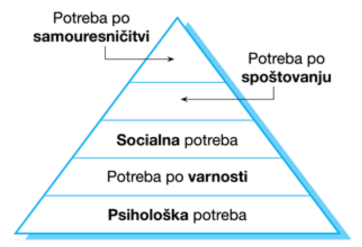

#### 2.2.2.4 Vrste osebnosti
- ljudje usmerjeni k nalogam - motivira jih delo samo
- ljudje usmerjeni k interakciji - motivira jih prisotnost in delo sodelavcev
- samousmerjeni ljudje - motivirani z osebnim uspehom

#### 2.2.2.5 Učinkovitost skupine
na učinkovitost skupine vplivajo:  
- ljudje v skupini
- organizacija skupine
- tehnična in vodstvena komunikacija

#### 2.2.2.6 Komunikacija v skupini
na učinkovitost komunikacije vplivajo:
- velikost skupine
- struktura skupine
- sestava skupine
- fizično delovno okolje skupine

# 3 Načrtovanje projekta
## 3.1 Uvod
### 3.1.1 Faze načrtovanja
imamo tri faze življenskega cikla:
- **faza predloga** - *ponudi se pogodba za razvoj ali zagotovitev sistema programske opreme*
- **faza zagona projekta** - *pripravi se načrt z določenimi viri, delitev projekta na inkremente, delitev finančnih sredstev v podjetju...*
- **med projektom** - *načrt se spreminja glede na pridobljene izkušnje*

#### 3.1.1.1 Načrtovanje predloga
Cilj je zagotoviti informacije, ki bodo uporabljene prid določanju cene sistema naročniku.
#### 3.1.1.2 Načrtovanje zagona projekta
Vemo več o sistemskih zahtevah, nimamo še informacij o načrtu ali izvedbi. Načrt za zagon je osnova za dodeljevanje sredstev projekta. Za agilni razvoj je ta korak neizogiben.
#### 3.1.1.2 Razvojno načrtovanje
**Projektni načrt** je potrebno s časom razvoja **redno spreminjati**.

**Načrt, stroške in tveganja** je potrebno s časom razvoja **redno pregledovati**.

## 3.2 Določanje cene programske opreme
Pri določanju cene moramo upoštevati naslednje dejavnike:
- stroški strojne opreme
- stroški programske opreme
- stroški potovanj
- stroški usposablanj
- strošli dela *(plače)*

ceno lahko **znižamo**, če želimo prodreti na novo tržno območje oz obrdžati zaposlene za prihodnje priložnosti

ceno lahko **zvišamo** če želi naročnik pogodbo s fiksno ceno in tako prodajalec poveča ceno z upoštevanjem nepričakovanih tveganj.

**Zmagovalno ceno** dobimo tako, da ocenimo koliko je naročnik pripravljen plačati za trenutne **funkcionalnosti**.

Če je naročnik pripravljen plačati manj, potem lahko nekaj funkcionalnosti odstranimo in jih dodamo pozneje (*nadrgradnja*).

Dodatne stroške lahko vključimo naknadno, če pride do spremembe zahtev, ki zahtevajo po večjih stroških.

## 3.3 Načrtno usmerjen razvoj
Pri načrtno usmerjenem razvoju je projekt **podrobno načrtovan** z projektnim načrtom, kjer se beleži delo, ki ga je treba opraviti, kdo bo to naredil, časovni načrt razvoja in seveda tudi izdelki.

### Pros&Cons načrtno usmerjenga razvoja:
**pros**: zgodnje načrtvoanje omogoča, da se organizacijska vprašanja natančno upoštevajo in da se potencialne grožnje in težave odkrijejo pred začetkom razvoja projekta

**cons**: številne stvari je treba tekom razvoja revizirati zaradi sprememb v delovnem okolju, kar je lahko zamudno.

### 3.3.1 Projektni načrt
določa:
- **vire, ki so nam na voljo**
- **razčlenitev dela**
- **časovni načrt za izvedbo**

uporaba principa **W5HH**:
- Zakaj se sistem razvija? (Why)
- Kaj bo narejeno? (What)
- Kdaj bo to narejeno? (When)
- Kdo je odgovoren za posamezno funkcijo? (Who)
- Kje se organizacijsko nahajajo? (Where)
- Kako bo delo opravljeno s tehničnega upravljalskega vidika? (How)
- Koliko sredstev je potrebnih? (How much)

Projektni načrt ponavadi vključuje:
- Uvod - *predstavimo cilje in omejitve projekta*
- Organizacija projekta - *organiziranje razvojne skupine, vloge oseb v skupini*
- Analiza tveganj
- Zahteve strojne in programske opreme
- Razčlenitev dela - *razčlenitev dela na aktivnosti*
- Časovni razpored projekta
- Mehanizmi spremljanja in poročanja

Načrtovanje projekta je **ITERATIVNI** proces - začne se med **fazo zagona** projekta.

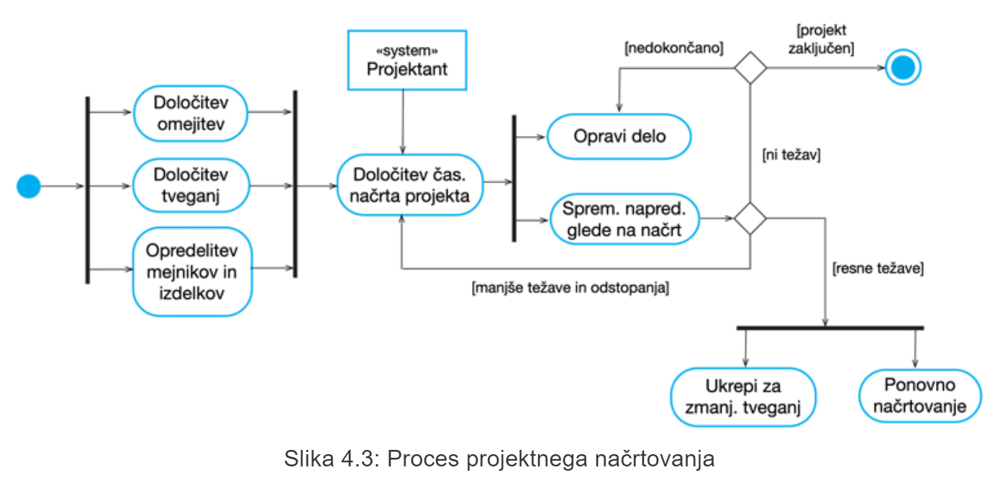

#### 3.3.1.1 Predpostavke pri načrtovanju
Predvsem moramo biti **realni** in **ne optimistični**.

#### 3.3.1.2 Zmanjševanje tveganja
Če obstajajo resne težave pri načrtovanju projekta je treba sprožiti ukrepe da jih omilimo. To lahko povzroči da je potrebno potrebno tudi ponovno načrtovanje projekta in ponovno posvetovanje z delodajalcem oz. stranko.

## 3.4 Časovno načrtovanje projekta
Pri časovnem načrtovanju moramo upoštevati, da za vsako aktivnost ocenimo, koliko časa bomo potrebovali, da jo dokončamo. Aktivnosti oz. naloge so lahko medseboj odvisne druga od druge, zato je potrebno določiti tudi v kakšnem časovnem zaporedju se bodo naloge izvajale. Oceniti je potrebno tudi vire, ki so potrebni za izvajanje vsake naloge in lahko vplivajo na časovno zahtevnost naloge. Za vsako aktivnost je treba dodeliti ljudi, ki bodo zanjo zadolženi.

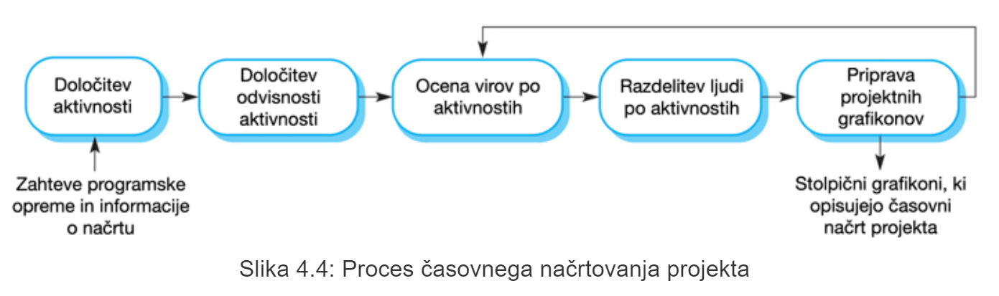

>vedno je pametno v časovno načrtovanje vključiti nekaj motečih faktorjev kot npr. nepredvidljivost, precenjena sposobnost skupine...

### 3.4.1 Predstavitev časovnega načrta
Časovni načrt ponavadi predstavimo s temu namenjenimi grafikoni, kjer se najpogosteje uporabljajo vizualizacije
- na podlagi koledarja - *stolpični diagrami, ki prikazujejo razpored aktivnosti glede na čas*
- z omrežjem aktivnosti - *prikazujemo odvisnosti aktivnosti*

### 3.4.2 **Projektne aktivnosti**
Projektne aktivnosti (naloge) so osnovni element načrtovanja. Vsako opredelimo z:
- trajanjem *(v koledarskih dneh ali mesecih)*
- oceno napora *(človek/dni ali človek/mesec)*
- rokom *(kdaj more bit končano)*
- določenim rezultatom *(lahko dokument, lahko sestanek, važen je pregled nad končanim delom)* - *to so ponavadi delovni izdelki, ki se dostavljajo naročniku, npr. dokument z zajetimi sistemskimi zahtevami*

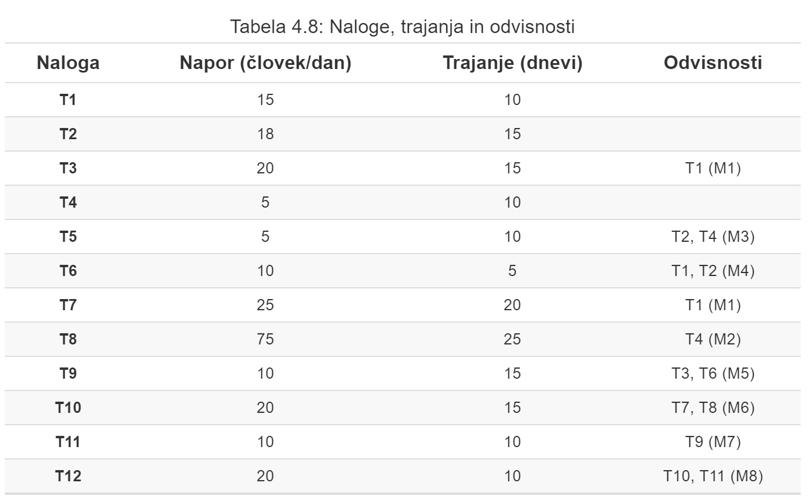
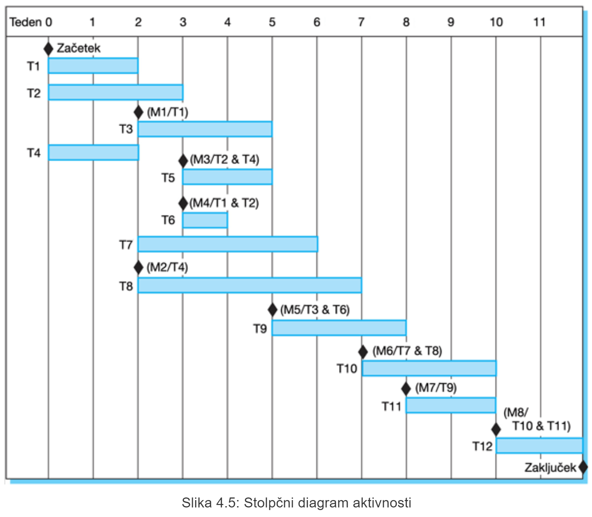
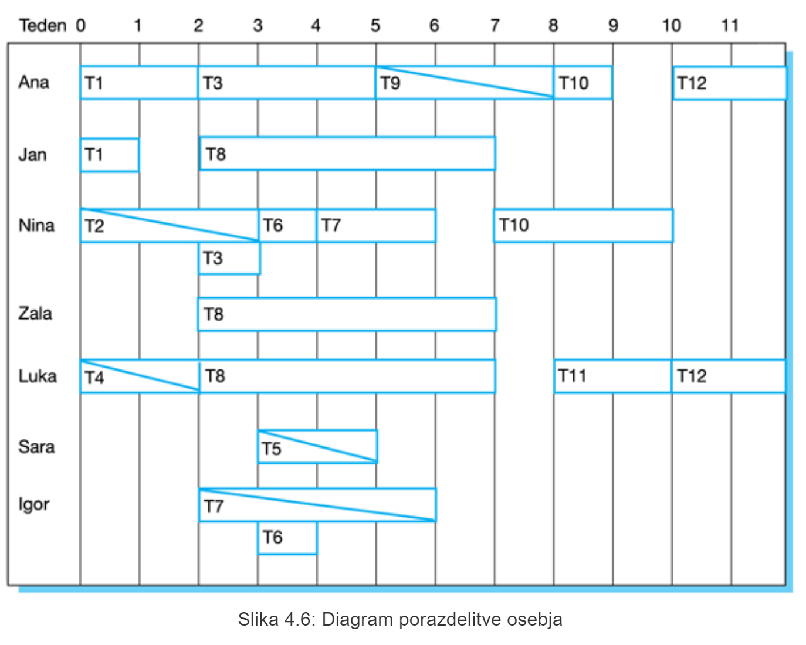

## 3.5 Agilno načrtoanje
To je iterativni pristop kjer je programska oprema razvita in dostavljena naročnikom **v iteracijah**. Kaj vključiti v posamezen **inkrement** je odvisno od napredka in prioritet stranke.

### 3.5.1 Faze agilnega načrtovanja
1. načrtovanje izdaje - *gledamo več mesecev v naprej in se odločamo o značilnostih, ki jih je potrebno vključiti v **izdajo sistema***
2. načrtovanje iteracije - *kratkoročen kontekst, kjer se osredotočamo na načrtovanje posameznega oz. **trenutnega inkrementa** projekta.

### 3.5.2 Pristopi agilnega načrtovanja
- **Scrum** - vodejne *preostalih* nalog pri projektu ("to-do board")
- **Igre načrtovanja** - prvotno kot del pristopa Extremnega programiranja (XP) in je odvisna od *uporabniških zgodb* in se uporablja kot merilo napredka projekta

### 3.5.3 Načrtovanje na podlagi uporabniških zgodb (**IGRA NAČRTOVANJA**)
**Igra načrtovanja** temelji na uporabniških zgodah, ki predstavljajo značilnosti, ki jih je treba vključiti v sistem.

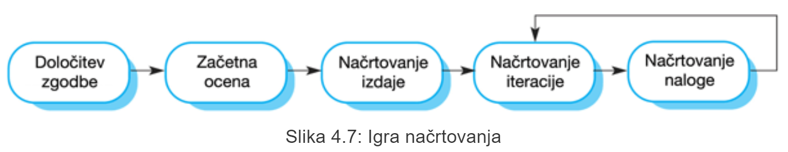

**Načrtovanje izdaje** vključuje:
- zajetje uporabniških zgodb, ki odražajo **značilnosti, ki jih je potrebno uvesti v izdajo sistema**
- **vrstni red implementacije** značilnosti (zgodb)

#### 3.5.3.1 Dodelitev nalog
v fazi načrtovanja nalog se uporabniške zgodbe razčlenijo v razvojne naloge, kjer velja:
- ena naloga traja približno od 4 do 16 ur
- razvijalci se sami javljajo, kere naloge bodo naredili
- vse naloge, o katerih se pogovarjamo so referencirane na trenutno iteracijo (morajo biti končane v trenutni iteraciji)

**prednosti pristopa**:
- ekipa dobi dober pregled nad delom, ki ga je treba narediti v tej iteraciji
- razvijalec ima občutek lastništva nad nalogo, kar ga dodatno motivira

#### 3.5.3.2 Dostava programske opreme
Časovni urnik inkrementa oz. časovni rok za dostavo **se nikoli ne podaljša** - če v zastavljenem časovnem obdovju ni mogoče narediti vseh nalog, enostavno prilagodimo obseh iteracije tako, da bomo uspeli končati v zastavljenem času.

#### 3.5.3.3 Težave agilnega načrtovanja
- odvisno je od vključenosti in razpoložljivosti stranke
- ne poznajo vse stranke koncepta agilnega načrtovanja, zato jih je težje vključiti v igro načrtovanja

#### 3.5.3.4 Prilagodljivost agilnega načrtovanja
- dobro deluje z majhnimi, stabilnimi razvojnimi skupinami  
- pri velikih ali geografsko razdeljenih skupinah ali kadar se članstvo v skupini pogosto spreminja, je agilno načrtovanje praktično nemogoče

## 3.6 Tehnike ocenjevanja
Ko rabimo ocenit stroške razvoja, lahko uporabimo različne tehnike,
- ki temeljijo na **izkušnjah** - *vodja projekta ma izkušnje z vodstvom in približno ve kako se obrača denar*
- ki temelijo na **algoritmičnem načrtovanju stroškov** - *uporabijo se pristopi z znanimi formulami in algoritmičnimi postopki*

pri obeh tehnikah je prisotno **široko območje napake**, če je začetna ocena `x` potem je lahko končna naprimer nekje med `4*x` ali pa `0.25*x`. Ocena postaja vse bolj točna ob napredovanju projekta in spremljanju okoliščin

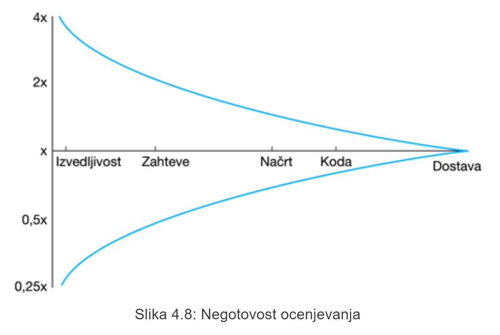

### 3.6.1 Tehnike, ki temeljijo na izkušnjah
Opirajo se na izkušnje vodje iz preteklih projektov, lahko so nenatančne in posledično nezanesljive, saj trenutni projekt morda nima veliko skupnega s prejšnjim.

### 3.6.2 Algoritmično načrtovanje stroškov
Stroški ocenjeni kot matematična funkcija (to računa vodja projekta):

**Napor** = A * ObsegB * M

> - **A** - *konstantni dejavnik, odvisen od lokalnih organizacijskih praks in vrste razvite programske opreme*
> - **Obseg** - ocena obsega izvorne kode 
> - **B** - predstavlja kompleksnost, ponavadi v intervalu `[1, 1.5]`
> - **M** - dejavnik, ki upošteva procesne, proizvodne in razvojne lastnosti.

Najpogosteje uporabljena lastnost izdelka za oceno stroškov je **obseg kode**.Večina modelov je med seboj podobnih, a večinoma uoprabljajo različne vrednosti za A,B in M

> B in M sta **subjektivni** oceni ocenjevalca (npr. vodje).

**Na točnost ocene vplivajo:**
- vključitev ponovno uporabljivih sistemov in komponent
- programski jezik 
- distribucija sistema

## 3.7 COCOMO načrtovanje stroškov
Je empirični model za načrtovanje stroškov. Razvil se je že 1981 in ima več modelov. trenutno je najbolj znaz **COCOMO II** model.

### 3.7.1 COCOMO II
vkljuluje modele, ki omogočajo bolj podrobne ocene programske opreme:
- **model sestave aplikacije**
- **zgodnji model načrta**
- **model ponovitve uporabe**
- **model po zasnovani arhitekturi** - *se uporabi, ko je zasnovana sistemska arhitektura in je na voljo več informacij o sistemu*

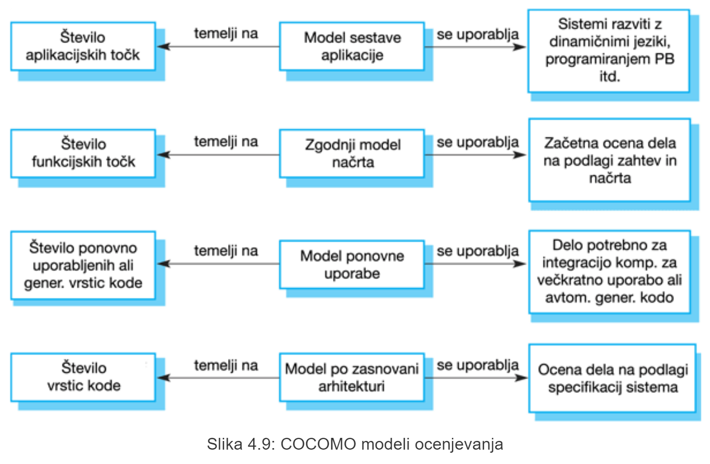

#### 3.7.1.1 Model sestave aplikacije
*se uporablja takrat **ko je programska oprema sestavljena iz obstoječih delov** in je v veliki meri prisotna ponovna uporaba*.
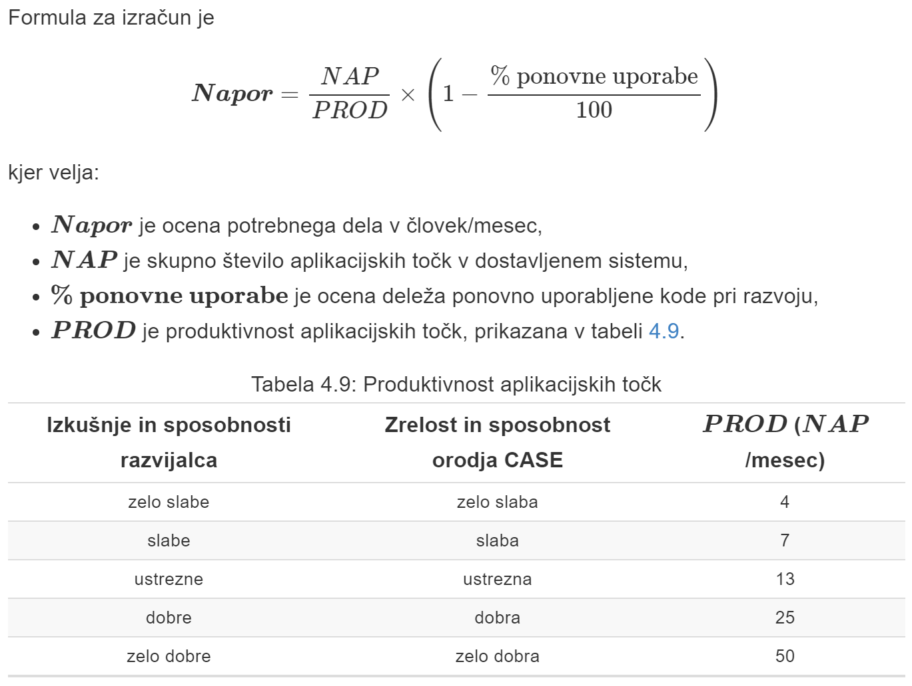

#### 3.7.1.2 Zgodnji model načrta
*ko so zahteve na voljo ampak **se načrtovanje še ni začelo***.
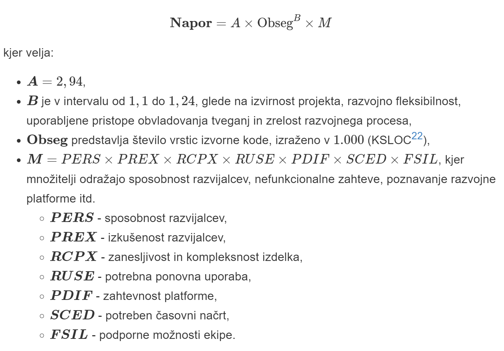

#### 3.7.1.3 Model ponovne uporabe
*se uporablja za izračun potrebnega dela **pri integraciji komponent za večkratno uporabo***. Upošteva se **izvorna koda**, ki se ponovno uporabi.

Poznamo dva pristopa in sicer:
- ponovna uporaba s pristopom črne škatle - *izvorna koda se ne spreminja in se izračuna ocena potrebnega dela*
- ponovna uporaba s pristopom bele škatle - *izvorna koda se spremeni in se izračuna ocena obsega, ki je enaka številu vrstic nove izvorne kode. Nato se prilagodi ocena nove izvorne kode*

##### 3.7.1.3.1 Pristop Črne škatle

##### 3.7.1.3.2 Pristop bele škatle
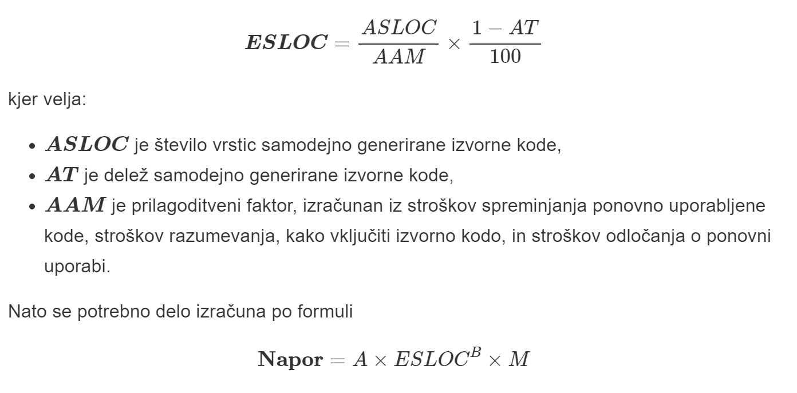

#### 3.7.1.4 Model po zasnovani arhitekturi
Uporablja enako formulo kot **zgodnji model načrta** ampak namesto 7 množiteljev za faktor M uporablja 17 povezanih množiteljev

**Obseg** je ocenjen kot:
- št vrstic kode, ki jih je treba razviti
- ocena enakovrednega tevila vrstic nove kode
- ocen števila vrstic kode, ki jih je treba spremeniti glede na spremembe zahtev

**B** je odvisen od 5 dejavnikov:
- arhitektura/odprava tveganj
- prilagodljivost razvoja
- precendenčnost
- zrelost procesa
- povezanost ekipe

ocene rangirajo od 1 do 5 kjer je 1 zelo visoka in 5 zelo nizka

**B** se nato izračuna po formuli:

( **seštevek ocen dejavnikov** / 100 ) + 1.01

množitelji faktorja **M**:
- atributi izdelka (zahtevane lastnosti izdelka)
- računalniški atributi (omejitve strojne platforme)
- atributi osebja (izkušnje in zmožnosti ljudi)
- atributi projekta (posebne lastnosti projekta)

#### 3.7.1.5 Trajanje projekta in osebje
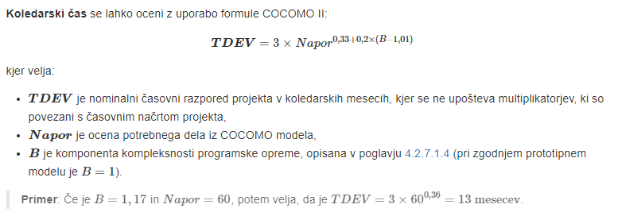
Potreben čas je neodvisen od števila ljudi, ki delajo na projektu.